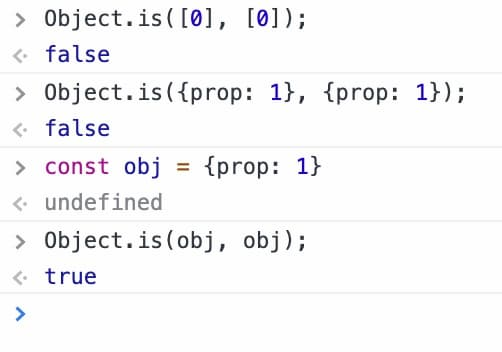

## deps について (復習)

関数コンポーネント内では副作用がある処理は [`useEffect(didUpdate)`](https://en.reactjs.org/docs/hooks-reference.html#useeffect) で書きます。
デフォルトでは `didUpdate` はレンダー毎に毎回呼び出されますが、パフォーマンスのために副作用が依存している変数を **deps** として登録して、`didUpdate`を必要なときだけ実行するように出来ます。

```js
useEffect(
  () => {
    const subscription = props.source.subscribe();
    return () => {
      subscription.unsubscribe();
    };
  },
  /* deps */ [props.source]
);
```

## deps に渡せる値

deps に渡せる(渡すべき)値は [API Reference](https://en.reactjs.org/docs/hooks-reference.html#useeffect) 上

> values that the effect depends on

という言及のみで、「どんな値が渡せるか」の言及はありません[^1]。

[実装上は`Object.is` で比較できるもの](../read-the-implementation-of-react-hooks) であることが分かったので、[Same-value](https://developer.mozilla.org/ja/docs/Web/JavaScript/Equality_comparisons_and_sameness#same-value_equality) として比較が出来るものが、deps に渡せる値になります(👇 のときに等しいと評価してよい値)。

> - どちらも undefined
> - どちらも null
> - どちらも true かどちらも false
> - どちらも同じ文字からなる同じ長さの文字列
> - どちらも同じオブジェクト
> - どちらも数で、どちらも +0、どちらも -0、どちらも NaN、あるいはどちらもゼロ以外で NaN でなく、同じ数値を持つ

つまり deps の要素として Object や Array を渡した場合、プロパティや要素に対して (shallow/deep 問わず) 等価性比較を行いません（deps に渡せなくはないが、使用者にとって期待の振る舞いをしない）。

👇 の通り、deps として Object や Array を比較させるには、"オブジェクト自体が同じ" でないといけないことが分かります。



## deps に オブジェクト・配列を渡したいときがあるの...。

deps に渡すものは副作用が依存している値であり、その値が Object や Array になっているときもありますよね。例えば、👇 みたいに配列を元に描画用の配列を作るとき。

```js
const rawItemData = [
  /* 要素たくさん */
];
const parsedItems = useMemo(() => {
  return rawItemData.map((item) => {
    return {
      /* 色々やって、生データから描画用のObjectを作る */
    };
  });
}, [rawItemData /* どうしよう！ */]);
```

## GitHub Issues にあったアドバイス

deps にオブジェクトを渡した時に(使用者にとって)期待通りの callback になるように、カスタム比較関数を受け付けてほしいという GitHub Issues ([facebook/react#14476](https://github.com/facebook/react/issues/14476)) がありました。

それに対して[React コアメンバーから反応](https://github.com/facebook/react/issues/14476#issuecomment-471199055) がありましたが棄却されました。
深い等価性比較の需要を認識している一方、パフォーマンスの予測が難しいため、明示的に推奨出来ないようです。
たしかに、 オブジェクトの同一性を判断するためにネストしたものまで比較し、かつその関数が大量のコンポーネントに分散すると、コストが大変なことになりますね。

一方、解決のためのいくつかのアドバイスも提示してくれました（優しい）。

### Option 1: Hoist it up

- 対象の値が常に静的ならば、レンダリング関数に含めない

### Option 2: Embrace dynamic values

- 対象の値が動的ならば、オブジェクトを memo 化する

### Option 3: (be careful) JSON.stringify

- `JSON.stringify` でシリアライズする
- 「`JSON.stringify`って遅いんじゃない？」って思うだろうけれど、入力が小さければ十分速い。
- 仮に遅くなるほど大きい入力を与える場合は deep equal も遅くなるから、useMemo を使ったり、設計をし直したほうが良い。

## 結論

- オブジェクトが十分小さい(状況に寄る)場合、`JSON.stringify`を使う
- それ以外の場合、memo 化する

---

[^1]: `useState` の API Reference に[値比較アルゴリズムについて](https://ja.reactjs.org/docs/hooks-reference.html#bailing-out-of-a-state-update) 書いてある。大事な情報だから、もう少し上位に書いてほしい...。
