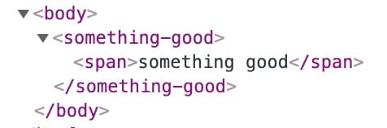
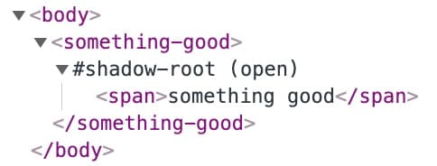
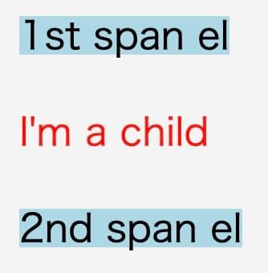
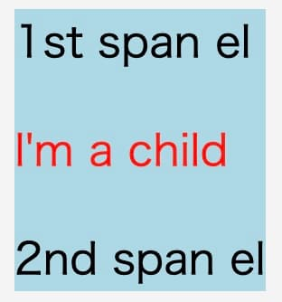

**なにこれ？**

Web Components を作る上で実際に呼び出す必要がある JavaScriptAPI を体系的に整理出来ていなかったので、しました。
Web Components の開発は、**[lit](https://lit.dev/) や、各種ラッパー ([vue](https://v3.vuejs.org/guide/web-components.html), [preact](https://github.com/preactjs/preact-custom-element) )を使う方が一般的（真偽不明）** だと思いますが、天才が作ったライブラリの裏側で何が起きているか全く知らない訳にもいかないよねってことで...。

---

## 「Web Components を作った」のゴールはなに

[Web Components](https://developer.mozilla.org/ja/docs/Web/Web_Components) によって、

> 再利用可能なカスタム要素を作成し、ウェブアプリの中で利用する

ことが出来る訳ですが、Web Components の使用者が期待していること（ゴール）は

- JSX やら Vue SFC 内で `<something-good></something-good>` ってすると、**独自の要素** が **描画** される
- **独自の要素** 内の実装や状態は外部から**隠蔽**されている
- **独自の要素**に `<something-good hiki-su="ok">child</something-good>` っていう感じで**引数や子要素**を渡せる
- **独自の要素**は**スタイル**が適用されている
- **独自の要素** から **イベントを受け取れる**

という感じでしょうか？

なので、それぞれを実現するために Web Components の実装者が行うこと（使用する JavaScript API）を整理します。

## 独自の要素を描画する

実装者が定義する独自の要素は [custom elements](https://developer.mozilla.org/ja/docs/Web/Web_Components/Using_custom_elements) と言います。

「custom elements を定義する」とは

1. [HTMLElement](https://developer.mozilla.org/ja/docs/Web/API/HTMLElement) (あるいは [HTMLDivElement](https://developer.mozilla.org/ja/docs/Web/API/HTMLDivElement) などの HTML 要素クラス) を継承したクラスを作る
2. [customElements.define](https://developer.mozilla.org/ja/docs/Web/API/CustomElementRegistry/define) で custom elements をページに登録する

ということです。

```js
class SomethingGood extends HTMLElement {
  constructor() {
    super();

    // 👇 <something-good>の中身を定義する (span要素で囲った文字列を描画するだけ）
    const text = document.createElement("span");
    text.textContent = "something good";

    // 👇 子ノードとして追加
    this.appendChild(text);
  }
}

customElements.define("something-good", SomethingGood);
```

登録された custom elements は

```html
<something-good></something-good>
```

と書くことで



という感じで DOM ツリーが展開されます。

## 外部から隠蔽する

再利用可能な部品として custom elements を定義する以上、内部のあれこれを使用者に気にさせない（触らせない）ようにする([カプセル化](https://ja.wikipedia.org/wiki/%E3%82%AB%E3%83%97%E3%82%BB%E3%83%AB%E5%8C%96) )ことは実装者側の義務ですね。
👆 の DOM ツリーは、`<something-good>`配下の要素もページの DOM ツリーの一部として描画されており、「一部の子要素を `<something-good>`に切り出しただけ」です。（それはそれで、便利なんだけれど、、、）

Web Components では、custom elements の内部を隠蔽する仕組みとして [Shadow DOM API](https://developer.mozilla.org/ja/docs/Web/Web_Components/Using_shadow_DOM) を用意しています。
`<something-good>`に専用の DOM ツリーを追加し、その DOM ツリー上で任意の要素（今回は span 要素と文字列）を追加します。この専用の DOM ツリーは Shadow tree と言って、外部とは切り離されています。つまり、`<something-good>`を使うページから[Element#children](https://developer.mozilla.org/ja/docs/Web/API/Element/children) で`<something-good>`の子要素を取得できない。

```js
class SomethingGood extends HTMLElement {
  constructor() {
    super();
    // 👇 要素にノード(`Shadow root`)を追加する
    // - 通常のDOMツリーに配置される SomethingGood要素 (`Shadow host`)に
    // - 通常のDOMツリーから隠蔽されたDOM ツリー(`Shadow tree`) を追加することができて
    // - `Shadow tree`の根っこのノード(`Shadow root`)を attachShadow の戻り値として取得できる
    const shadowRoot = this.attachShadow({ mode: "open" });

    // 👇 <something-good> の中身を定義する (span要素で囲った文字列を描画するだけ）
    const text = document.createElement("span");
    text.textContent = "something good";

    // 👇 `Shadow root`の子ノードとして追加
    shadowRoot.appendChild(text);
  }
}

customElements.define("something-good", SomethingGood);
```



`<something-good>`の中身が Shadow DOM の中で展開されていることが分かる。

**余談**

- `attachShadow` のときの [mode は open と closed がある](https://developer.mozilla.org/ja/docs/Web/API/Element/attachShadow) けど、MDN で「[open でいいんじゃね？（度を越した意訳）](https://developer.mozilla.org/ja/docs/Web/Web_Components/Using_shadow_DOM#%E5%9F%BA%E6%9C%AC%E7%9A%84%E3%81%AA%E4%BD%BF%E3%81%84%E6%96%B9) 」って言ってるし、[lit の default 値は open](https://github.com/lit/lit/blob/main/packages/reactive-element/src/reactive-element.ts#L696) だし、[Material Web Components も open](https://github.com/material-components/material-web/blob/master/packages/button/mwc-button-base.ts#L23) だし、とりあえず open でいいんじゃね？ってなってる。
  - open === "外部の JavaScript から shadow dom をいじれる状態"
  - open だと完全な隠蔽ではないけれど...まぁ、いいじゃない 😇

## 引数・子要素を渡す

使用者側からなんのパラメーターも受け付けないのは、再利用のための部品としては使い勝手が悪いです。

Web Components では、コンポーネントへ変数を入力する手段として"attribute"と"slot"があります。

### 一番シンプルなやつ

```html
<!-- 👇 attribute は要素の属性値を受け取る -->
<something-good message="this is attribute">
  <!-- 👇 slot は要素の子ノードとして別の要素を描画する -->
  <p>I'm a child</p>
</something-good>
```

```js
class SomethingGood extends HTMLElement {
  constructor() {
    super();
    const shadowRoot = this.attachShadow({ mode: "open" });

    const text = document.createElement("span");
    // 👇 <something-good>の attributeを取得してspan要素に入れる
    text.textContent = this.getAttribute("message");
    shadowRoot.appendChild(text);

    // 👇 slot要素を作成して、`<something-good>`の子ノードとして挿入する
    const slot = document.createElement("slot");
    shadowRoot.appendChild(slot);
  }
}

customElements.define("something-good", SomethingGood);
```

- 複数の slot を使うために名前付き slot が使えるけれど、詳細は [MDN](https://developer.mozilla.org/ja/docs/Web/Web_Components/Using_templates_and_slots) で...。

### attribute を制御する

HTML 要素の属性値は [nullable な文字列](https://developer.mozilla.org/ja/docs/Web/API/Element/getAttribute) です。
ですが、今どきの UI コンポーネントは様々な型でやり取りすることが一般的ですね。例えば属性値を Boolean 型として扱いたい場合、

- 属性値が null: false
- 属性値が任意の文字列（空文字含む）: true

という感じに変換して、custom elements 内で使います。

また、昨今のフロントエンドは状態を持ち、その状態に合わせて描画内容が変わります。そのため、attribute の変更に合わせて custom elements も更新してくれないと困りますね。
これに対応するために、custom elements の機能として「`observedAttributes` で監視する attribute を登録」して「`attributeChangedCallback` で更新を受け取る」ようにします。

```js
class SomethingGood extends HTMLElement {
  constructor() {
    super();
    const shadowRoot = this.attachShadow({ mode: "open" });

    // 👇 この slot の表示・非表示を attribute で切り替える
    const slot = document.createElement("slot");
    shadowRoot.appendChild(slot);
  }

  // 👇 変更を監視する attribute を登録する
  static get observedAttributes() {
    return ["hide-slot"];
  }

  // 👇 監視中のattributeが更新したら呼び出される
  attributeChangedCallback(name, old, value) {
    // 👇 "hide-slot" が更新されたら
    if (name === "hide-slot") {
      const slot = this.shadowRoot.querySelector("slot");

      // 👇 "hide-slot" は Boolean型として文字列を解釈して、値に従って表示を切り替える
      // "hide-slot" attribute なし (value が null) => 表示する (hidden = false)
      // "hide-slot" attribute あり (value が 空文字か適当な文字列) => 非表示にする (hidden = true)
      slot.hidden = value !== null;
    }
  }
}

customElements.define("something-good", SomethingGood);
```

```html
<something-good hide-slot>
  <p>I'm a child</p>
</something-good>
```

属性値毎に型の変換処理を入れて、状態を custom element 内に持たせる...ここまで来ると、素の JavaScript で Web Components を作るのが辛くなってきます。

## スタイルを適用する

そろそろ文字に色を付けたくなってきました。Shadow DOM 内でも style 要素を使うことが出来ます。具体的な方法は 👇 の 2 通り（他にもあるけど）。

1. style 要素の`textContent` で css の文字列を書く
2. Document#adoptedStyleSheets (MDN のページが執筆時点で無い) を使って、[CSSStyleSheet](https://developer.mozilla.org/ja/docs/Web/API/CSSStyleSheet) を Shadow root に渡す

しかし、`adoptedStyleSheets` は一部のブラウザのみ（多分、chrome だけ）で使える API なので、(1)の手段が基本...ですかね。adoptedStyleSheets が使えるとスタイルの情報が DOM ツリーに出てこないので、隠蔽という意味では便利なんですけれどね...。

ちなみに、[lit](https://lit.dev/) では [`adoptedStyleSheets` が使えるかどうか](https://github.com/lit/lit/blob/main/packages/reactive-element/src/css-tag.ts#L10) で、[スタイルの適用方法を切り替えている](https://github.com/lit/lit/blob/main/packages/reactive-element/src/css-tag.ts#L142) ようです。

```js
// 👇 ただのCSS文字列
const css = `
/* 👇 Shadow hostを指す疑似クラス */
:host {
  background-color: lightblue
}
/* 👇 slotされた要素を指す疑似要素 */
::slotted(p) {
  color: red;
}
`;

class SomethingGood extends HTMLElement {
  constructor() {
    super();
    const shadowRoot = this.attachShadow({ mode: "open" });

    const text = document.createElement("span");
    text.textContent = "1st span el";
    shadowRoot.appendChild(text);

    const slot = document.createElement("slot");
    shadowRoot.appendChild(slot);

    const text２ = document.createElement("span");
    text２.textContent = "2nd span el";
    shadowRoot.appendChild(text２);

    // 👇 CSS文字列を持ったstyle要素をShadow rootに追加する
    const style = document.createElement("style");
    style.textContent = css;
    shadowRoot.appendChild(style);
  }
}

customElements.define("something-good", SomethingGood);
```



Shadow host (:host) の display プロパティが初期値（具体値分からん）の場合、Shadow host として認識されて背景色が付くのは slot 以外の部分です。
custom elements の子要素として slot を使う場合、これは感覚的な期待値ではないので、:host に いい感じの display プロパティを与える必要があります。

```css
:host {
  display: inline-block;
  background-color: lightblue;
}
```



## イベントの発火

なにかしらのイベント(クリックとか)を custom elements の外に通知する場合、[CustomEvent](https://developer.mozilla.org/ja/docs/Web/API/CustomEvent) を使います。
これは HTML 要素共通の仕組みなので、特に問題ないですね。

```js
class SomethingGood extends HTMLElement {
  constructor() {
    super();
    const shadowRoot = this.attachShadow({ mode: "open" });

    // 👇 input要素だけ持つcustom elements
    const input = document.createElement("input");
    input.addEventListener("change", this.onChange.bind(this));
    shadowRoot.appendChild(input);
  }

  // 👇 input要素のchangeイベントで 呼び出されるメソッド
  onChange(e) {
    const value = e.target.value;
    // 👇 新しい input要素の値のlength(文字数ではない）が10以上だったら
    if (10 <= value.length) {
      // 👇 <something-good>の CustomEvent として、"long-text"をディスパッチする
      const event = new CustomEvent("long-text", { detail: { value } });
      this.dispatchEvent(event);
    }
  }
}

customElements.define("something-good", SomethingGood);
```

```js
const somethingGood = document.querySelector("something-good");
// 👇 `<something-good>` の "long-text"イベントをリッスンする
somethingGood.addEventListener("long-text", (e) => {
  console.log("long-text", e.detail);
});
```

---

**Web Components 作るなら、やっぱり[lit](https://lit.dev) 使った方がいいね！** 😇
