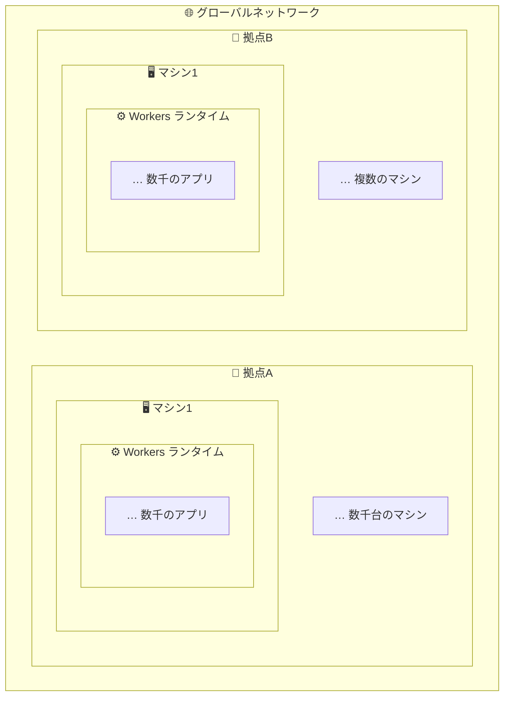

最近 Web アプリを開発するときは専ら [Cloudflare Workers](https://www.cloudflare.com/ja-jp/developer-platform/products/workers/) を使っている。
Cloudflare Workers は早いとか、安いと、まことしやかに囁かれており[^1]、
私もそれをモチベーションに使っている。しかし、それがどのような理屈で動いたサービスゆえの評価なのか~~当然~~知らなかったため、
Cloudflare Workers の背景・モチベーション・仕組みなどを調べてみた。

(Cloudflare Workers の機能に関しては[公式ドキュメント](https://developers.cloudflare.com/workers/)を読んだ方が早いので、ここでは書かない。)

## Workerとは

Cloudflare Workers は、Cloudflareのグローバルネットワーク全体でアプリケーションを構築、デプロイ、スケーリングするための**サーバーレスプラットフォーム** [^2]。
Worker 上で [Node.js の HTTP サーバーを実行](https://blog.cloudflare.com/ja-jp/bringing-node-js-http-servers-to-cloudflare-workers/) したり、
Workerの一部として[静的ファイルをアップロード・配信](https://developers.cloudflare.com/workers/static-assets/)したり、
その他にもコードを実行することで[色々なことができる](https://developers.cloudflare.com/workers/examples/)。

## エッジコンピューティング？

Cloudflare Workers は 「CDN ベースのエッジコンピューティング (の代表格)」という印象があったが、
意外にも、[公式ドキュメント内で "edge" の言及がほぼない](https://www.google.com/search?q=site%3Ahttps%3A%2F%2Fdevelopers.cloudflare.com%2Fworkers%2F+%22edge%22)。Workers のサイトトップでも [Cloudflare's global network](https://www.cloudflare.com/ja-jp/network/)という表現を使っている。

そもそもエッジコンピューティングとはデータソース[^3]の近くで演算するネットワークの考え方を指している。
「近い」計算場所は

- ユーザーのコンピューター
- IoT デバイス
- エッジサーバー [^4]

など色々である。

> エッジコンピューティングとは、遅延と帯域幅の消費を低減するために、演算処理を可能な限りデータのソースに近づけることに焦点を当てたネットワークの基本方針です。(...)ネットワークのエッジにコンピューティング機能を移動すると、クライアントとサーバー間で発生する長距離通信の量が最小限に抑えられます。
>
> ref: https://www.cloudflare.com/ja-jp/learning/serverless/glossary/what-is-edge-computing/

つまり "エッジコンピューティング" という言葉は意味が広すぎるため、[数千台のマシンが分散配置されている](https://developers.cloudflare.com/workers/reference/how-workers-works/#related-resources:~:text=thousands%20of%20machines%20distributed%20across%20hundreds%20of%20locations)ことから、
[global network](https://developers.cloudflare.com/workers/reference/how-workers-works/#related-resources:~:text=Cloudflare%27s%20global%20network%20%E2%86%97) と言っている (多分)。

## Service Workers との関係

Cloudflare Workers の "Workers" は W3C 標準 API である Service Workers の "Workers" であることが
Cloudflare Workers 公開直後のブログで紹介されている。

> Cloudflare Workersの名前はWeb Workersに由来しており、より具体的には、Webブラウザのバックグラウンドで動作してHTTPリクエストをインターセプトするスクリプトのW3C標準APIであるService Workersに由来しています。
>
> ref: https://blog.cloudflare.com/ja-jp/cloudflare-workers-unleashed/#whats-a-worker

2017年時点の Cloudflare のモチベーションは「Cloudflareのエッジ環境でコードを実行できるようにすること」[^5]。
その結果、[V8 で構築された環境で Service Workers API を用いた JavaScript のコードが実行できる](https://blog.cloudflare.com/ja-jp/cloudflare-workers-unleashed/) Worker が提供された。

Worker は [2 つの実装形式をサポートしている](https://developers.cloudflare.com/workers/reference/migrate-to-module-workers/)が、
Service Workers 形式は非推奨になっており、[いろいろメリットがある](https://developers.cloudflare.com/workers/reference/migrate-to-module-workers/#advantages-of-migrating) Module Workers が推奨されている。

> ```js
> // Service Workers (非推奨)
> addEventListener("fetch", (event) => {
>   event.respondWith(handler(event.request));
> });
> ```
>
> ```js
> // Module Workers (推奨)
> export default {
>   fetch(request) {
>     // ...
>   },
> };
> ```

Cloudflare Workers 登場当初からある Service Worker 形式はまさに Web 標準に従ったものである。

> ```js
> addEventListener("fetch", (event) => {});
> ```
>
> ref: [ServiceWorkerGlobalScope: fetch イベント - 構文](https://developer.mozilla.org/ja/docs/Web/API/ServiceWorkerGlobalScope/fetch_event#%E6%A7%8B%E6%96%87)

## V8 isolate

ユーザーの worker 関数は以下のような構造で配置・実行される。

1. 分散配置された数千台のマシンによるグローバルネットワーク
2. マシン内でホストされた Workers ランタイム
3. Workers ランタイム内で実行される数千ものユーザー定義アプリケーション



> Workers functions run on Cloudflare's global network - a growing global network of thousands of machines distributed across hundreds of locations.
>
> Each of these machines hosts an instance of the Workers runtime, and each of those runtimes is capable of running thousands of user-defined applications. This guide will review some of those differences.
>
> ref: https://developers.cloudflare.com/workers/reference/how-workers-works/

Cloudflare Workers は内部で [V8 (JavaScript エンジン)](https://v8.dev/) の [isolate](https://v8docs.nodesource.com/node-24.1/d5/dda/classv8_1_1_isolate.html) という仕組みを使うことで、単一のプロセス[^6]上で数百〜数千のユーザーのコードを同時に実行している。

> a single process can run hundreds or thousands of Isolates, seamlessly switching between them. They make it possible to run untrusted code from many different customers within a single operating system process.
>
> ref: [Cloud Computing without Containers - Isolates](https://blog.cloudflare.com/cloud-computing-without-containers/#isolates)

V8 isolate とは [独自のメモリ領域をもつ V8エンジンのインスタンス](https://v8.dev/docs/embed#:~:text=An%20isolate%20is%20a%20VM%20instance%20with%20its%20own%20heap.) のこと [^7]。
isolate はそれぞれが[完全に分離されており](https://v8docs.nodesource.com/node-24.1/d5/dda/classv8_1_1_isolate.html#:~:text=V8%20isolates%20have%20completely%20separate%20states)、オブジェクトを共有することが出来ない。

Cloudflare Workers は
[VM](https://ja.wikipedia.org/wiki/%E4%BB%AE%E6%83%B3%E3%83%9E%E3%82%B7%E3%83%B3) でもなく、
[コンテナ](https://ja.wikipedia.org/wiki/OS%E3%83%AC%E3%83%99%E3%83%AB%E3%81%AE%E4%BB%AE%E6%83%B3%E5%8C%96)でもなく、
この [V8 isolate を使って](https://blog.cloudflare.com/cloud-computing-without-containers)、

- コンテナ化されたプロセスの起動が不要なため、瞬時に起動すること
- [1つの JavaScript ランタイムのオーバーヘッドだけでほぼ無限のスクリプトを実行できる](https://blog.cloudflare.com/cloud-computing-without-containers/#:~:text=memory%20of%20another.-,We%20pay%20the%20overhead%20of%20a%20Javascript%20runtime%20once%2C%20and%20then%20are%20able%20to%20run%20essentially%20limitless%20scripts%20with%20almost%20no%20individual%20overhead,-.%20Any%20given%20Isolate)ため、メモリ消費が少ないこと
- [1つのプロセス内で全てのコードを実行する](https://blog.cloudflare.com/cloud-computing-without-containers/#:~:text=An%20Isolate%2Dbased%20system%20runs%20all%20of%20the%20code%20in%20a%20single%20process)ため、コンテキストスイッチのコストがないこと
- [マルチテナントを考慮した設計である V8](https://blog.cloudflare.com/cloud-computing-without-containers/#:~:text=V8%20was%20designed%20to%20be%20multi%2Dtenant) を用いることで、単一のプロセス内で分離された環境でコードを実行できること

を実現している。

## Workers におけるサンドボックス

Cloudflare Workers のコードサンドボックスは "安全な分離" と "API デザイン" で構成されている。

> There are two fundamental parts of designing a code sandbox: secure isolation and API design.
>
> ref: [Security model - Architectural overview](https://developers.cloudflare.com/workers/reference/security-model/#architectural-overview)

### 安全な分離

安全に分離された環境とは、[コードが本来アクセスすべきでないものにアクセスできないような実行環境](https://developers.cloudflare.com/workers/reference/security-model/#:~:text=a%20secure%20execution%20environment%20needed%20to%20be%20created%20wherein%20code%20cannot%20access%20anything%20it%20is%20not%20supposed%20to)のこと。
Cloudflare はこれを実現するために V8 isolate・プロセスレベルの分離・信頼レベル・Layer 2 sandbox を組み合わせている。

#### V8 isolate

独自のメモリ領域を持つ V8 isolate を使うことで、コードが isolate 外のメモリにアクセスできない。
これによって同じプロセス内でも複数のテナントのコードを互いに隔離する。

#### プロセスレベルの分離

Worker を独自のプライベートプロセスでスケジュールする場合がある。
例えば開発者ツールを使って worker を検査する場合、検査対象の worker を別のプロセスに移動させる。
V8 のインスペクタープロトコルはセキュリティ上の精査が少なく、使用者が信頼できるとも限らないため、別プロセスに隔離することでリスクを低減している。

#### 信頼レベル

Worker に信頼レベルを割り当て、異なる信頼レベルの Worker は別のプロセスで実行される。
例えば Free プランの Worker と Enterprise の Worker が同じプロセスでスケジュールされることはない。

#### Layer 2 sandbox

V8 isolate のサンドボックスに加えて、プロセス全体レベルのサンドボックス層 (Layer 2 sandbox) も設けている。
ここでは Linux 名前空間と `seccomp` を使ってファイルシステムやネットワークへのアクセスを完全に遮断している。
ネットワークへの直接アクセスはできず、UNIX domain socket 経由で同じシステム上の他のプロセスとのみ通信できる。
外部世界との通信はサンドボックス外のローカルプロセスが仲介する。

### API デザイン

サンドボックスによって、完全に分離された環境は逆に[役に立たない](https://developers.cloudflare.com/workers/reference/security-model/#api-design:~:text=Complete%20code%20isolation%20is%2C%20in%20fact%2C%20useless)。
何らかの有用な処理を行うためには少なくともリクエストを受信して応答できる必要がある。

サンドボックス文脈における API デザインの責任として、Cloudflare API は worker が出来ること・出来ないことを明確に定義している。

- ファイルシステム API を非公開にすることでローカルファイルシステムへのアクセスを禁止している [^8]。
- Worker からの outbound HTTP リクエストは UNIX domain socket 経由でローカルのプロキシサービスに送られる。パブリックなインターネットまたはその Worker のゾーンの origin server 宛のリクエストのみ外部に転送される。内部ネットワークへのアクセスは禁止されている。
- inbound HTTP リクエストは直接 Workers ランタイムに届かず、プロキシサービスを経由する。TLS の終端処理や実行する Worker スクリプトの特定を行った上で、UNIX domain socket を介して sandbox プロセスに渡される。

また、Worker のコードや設定の取得は supervisor プロセスが担っている。supervisor はディスクや内部サービスから Worker のコードと設定を取得し、sandbox が実行すべき Worker に関係のない設定にアクセスできないよう制御している。

[^1]: ツイッターで見た。ってやつ

[^2]: <https://developers.cloudflare.com/workers/>

[^3]: 「データソース」は DB などと繋がっているオリジンサーバーじゃないの？ってふと思ってしまったが、正確には計算するデータ発生源であるブラウザなどを指す。

[^4]: エッジサーバーはネットワークの論理的な端または「エッジ」に存在するコンピューターのこと([URL](https://www.cloudflare.com/ja-jp/learning/cdn/glossary/edge-server/))。多くのデバイスの接続・通信で構成されるネットワークにおいて、「エッジ」という表現は少々曖昧 ([URL](https://www.cloudflare.com/ja-jp/learning/serverless/glossary/what-is-edge-computing/#:~:text=%E3%83%A6%E3%83%BC%E3%82%B6%E3%83%BC%E3%81%AE%E3%82%B3%E3%83%B3%E3%83%94%E3%83%A5%E3%83%BC%E3%82%BF%E3%83%BC%E3%81%BE%E3%81%9F%E3%81%AFIoT%E3%82%AB%E3%83%A1%E3%83%A9%E5%86%85%E3%81%AE%E3%83%97%E3%83%AD%E3%82%BB%E3%83%83%E3%82%B5%E3%81%AF%E3%83%8D%E3%83%83%E3%83%88%E3%83%AF%E3%83%BC%E3%82%AF%E3%82%A8%E3%83%83%E3%82%B8%E3%81%A8%E8%A6%8B%E3%81%AA%E3%81%95%E3%82%8C%E3%81%BE%E3%81%99%E3%81%8C%E3%80%81%E3%83%A6%E3%83%BC%E3%82%B6%E3%83%BC%E3%81%AE%E3%83%AB%E3%83%BC%E3%82%BF%E3%83%BC%E3%80%81ISP%E3%80%81%E3%81%BE%E3%81%9F%E3%81%AF%E3%83%AD%E3%83%BC%E3%82%AB%E3%83%AB%E3%82%A8%E3%83%83%E3%82%B8%E3%82%B5%E3%83%BC%E3%83%90%E3%83%BC%E3%82%82%E3%81%BE%E3%81%9F%E3%80%81%E3%82%A8%E3%83%83%E3%82%B8%E3%81%A8%E8%A6%8B%E3%81%AA%E3%81%95%E3%82%8C%E3%82%8B))。

[^5]: [Cloudflare 自身による機能開発に限界がある](https://blog.cloudflare.com/cloud-computing-without-containers/#:~:text=We%20were%20limited%20in%20how%20many%20features%20and%20options%20we%20could%20build%20in%2Dhouse)ため、ユーザーが Cloudflare のサーバー上で直接コードを書けるようにする...という発想が凄すぎる。

[^6]: 1マシン・1プロセスにすることで、コンテキストスイッチのコストを削減している([URL](https://blog.cloudflare.com/cloud-computing-without-containers/#context-switching))

[^7]: VM = V8 JavaScript エンジン ([URL](https://v8docs.nodesource.com/node-24.1/d5/dda/classv8_1_1_isolate.html))

[^8]: Node.js compatibility として virtual filesystem にアクセスするための [`fs`](https://developers.cloudflare.com/workers/runtime-apis/nodejs/fs/) が今はあるけど...。
