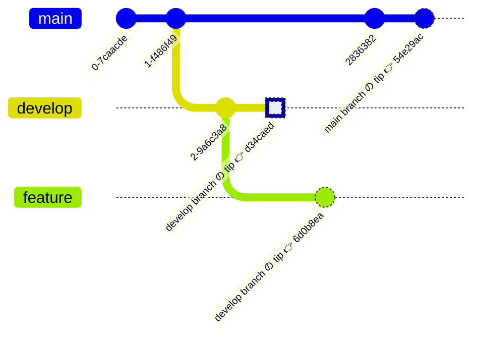

俺は分からないので、 [Git の公式用語集](https://git-scm.com/docs/gitglossary) で調べたよ。
「ヘッド」と「ヘッド」ってややこしいから、"branch head" [^1] と "current HEAD"[^2] って呼びたいんだ。駄目かな？？？？

## head

### Glossary を順番に見る

> **head**
>
> **A named reference** to the commit at the tip of a branch. [...]

head とは、branch の tip にある commit を指す**named reference** のこと。

-> tip? named reference?

> **branch**
>
> [...] The most recent **commit** on a branch is referred to as the tip of that branch. [...]

branch の tip とは、branch における最新の **commit** のこと。

> **ref** [^3]
>
> A **name** that points to an object name or another ref (the latter is called a symbolic ref).

ref とはオブジェクト名、または他の ref を指す**名前**のこと。

-> オブジェクト名？

> **object name**
>
> The unique identifier of an object. The object name is usually represented by a 40 character hexadecimal string. Also colloquially called SHA-1.

object name とはオブジェクトの識別子のこと、なんだけれど、ここではとりあえず **commit hash**[^4] のこととお茶を濁しておく[^5]。

### ref の実体

「head は branch の最新の commit を指す ref」ということで、ref についてもう少し深ぼる。
[`git pack-refs`](https://git-scm.com/docs/git-pack-refs) に異なる視点の ref の説明がある。

> tips of branches and tags (collectively known as refs) were stored one file per ref in a (sub)directory under `$GIT_DIR/refs` directory.

ref の実体は `$GIT_DIR/refs` 配下に保存されるファイルで、1つのファイル [^6] に1つの ref の情報が保存されている 。
`tree` コマンドで覗くと、いろいろな ref ファイルがあることが分かる。

```shell
$ tree -L 2 .git/refs
.git/refs
├── heads
│   ├── main
│   ├── playwright-update
│   ├── pmbok-7th-edition-abst
│   └── sass-migration
├── remotes
│   └── origin
├── stash
└── tags
```

`.git/refs/heads/` 配下には head を表現するファイルが格納されている。
「head は branch の最新の commit の ref」 なので、 ファイルには commit の object name (commit hash) が書かれている。
例えば `main` には main branch の最新の commit hash (`a10ea0191b9fd2307880e190fb5ef7c24af43884`) が書かれている。

```shell
$ cat .git/refs/heads/main
a10ea0191b9fd2307880e190fb5ef7c24af43884
```

## HEAD

> **HEAD**
>
> The current **branch**. [...] HEAD is a **reference** to one of the heads in your repository, except when using a detached HEAD, in which case it directly references an arbitrary commit.

HEAD とは、現在の **branch** のこと、またはチェックアウトしている branch の head を指す ref のこと。
head 自体が ref なので、それを参照している HEAD は symbolic ref になる。

```shell
$ git checkout main
Already on 'main'

$ cat .git/HEAD
ref: refs/heads/main
```

glossary にもそう書いてある。

> **symref**
>
> [...] HEAD is a prime example of a symref. [...]

Git は branch の tip 以外にもチェックアウト出来る。その場合、HEAD は commit そのものを指す ref になる。

```shell
$ git checkout main~1
HEAD is now at 341075a this is commit message

$ cat .git/HEAD
341075a833cd1ab3222c6e4f80546b6156438a2f
```

## まとめ (head と HEAD の違い)

| 名前 | 説明                                                  | 実体                              | お気持ち                  |
| :--- | :---------------------------------------------------- | :-------------------------------- | :------------------------ |
| head | branch の 最新の commit hash の ref                   | `.git/refs/heads/` 配下のファイル | branch head って呼びたい  |
| HEAD | チェックアウトしている branch の head の symbolic ref | `.git/HEAD`                       | current HEAD って呼びたい |

ちなみに head は branch の 最新の commit hash の参照の総称であって、「head という参照」は(自分で作らなければ)ない。
一方 HEAD は現在の branch の最新の commit hash を指す symbolic ref であり、単称と言える。

```shell
$ git show-ref head || echo 'no ref!'
no ref!

$ git show-ref HEAD || echo 'no ref!'
a309d6f92c490858fb56156af025ec22a86fb485 refs/remotes/origin/HEAD
```

## おまけの図

```shell
$ git branch --show-current
develop

$ git symbolic-ref HEAD
refs/heads/develop

$ git rev-parse --short HEAD
d34caed
```



```shell
.git/
├── refs/
│   ├── heads/
│   │   ├── develop -> d34caed
│   │   ├── feature -> 6d0b8ea
│   │   └── main    -> 54e29ac
│   ├── remotes/
│   ├── stash/
│   └── tags/
├── HEAD            -> ref: refs/heads/develop
│
```

[^1]: [Git のドキュメントにもある](https://www.google.com/search?q=site%3Ahttps%3A%2F%2Fgit-scm.com+%22branch+HEAD%22)し、正式な用語にしてほしい。

[^2]: [Git のドキュメントにもある](https://www.google.com/search?q=site%3Ahttps%3A%2F%2Fgit-scm.com+%22current+HEAD%22)し、正式な用語にしてほしい。

[^3]: Git のページでは `named reference` は `ref` へリンクされている。

[^4]: `commit revision` と `commit hash` どっちが正しいのかな？とついでに調べたら、そもそも [`git revision` は検索してもヒットしない](https://www.google.com/search?q=site%3Ahttps%3A%2F%2Fgit-scm.com+%22commit+revision%22) ([commit hash は出る](https://www.google.com/search?q=site%3Ahttps%3A%2F%2Fgit-scm.com+%22commit+hash%22))。

[^5]: object には [4種類の type](https://git-scm.com/docs/gitglossary#Documentation/gitglossary.txt-objecttype) があって、 object name はそれらの識別子。

[^6]: [`git pack-refs`](https://git-scm.com/docs/git-pack-refs) みたいな例外もある。
