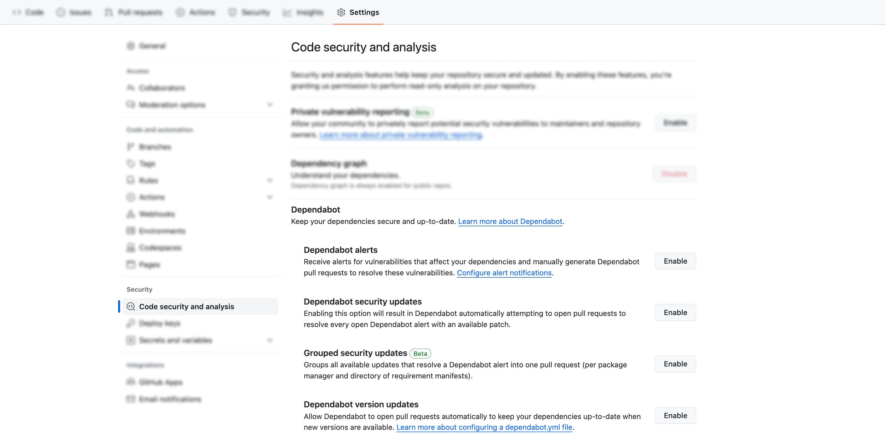
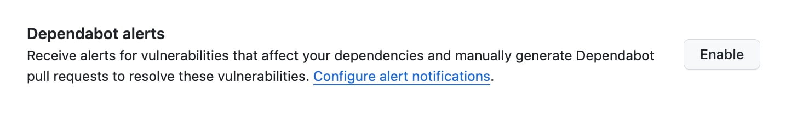
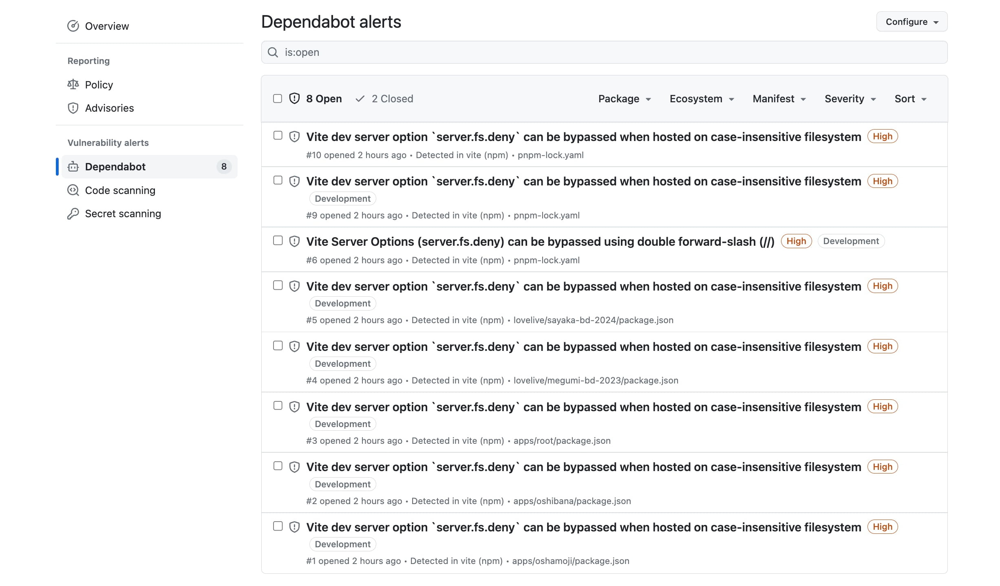
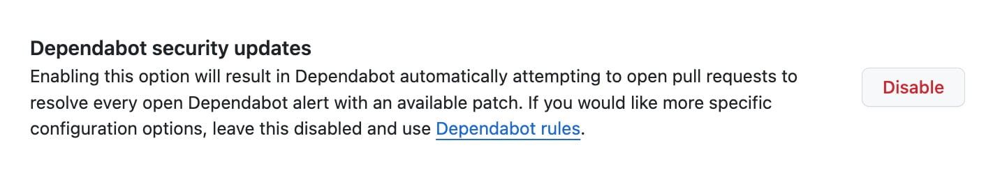
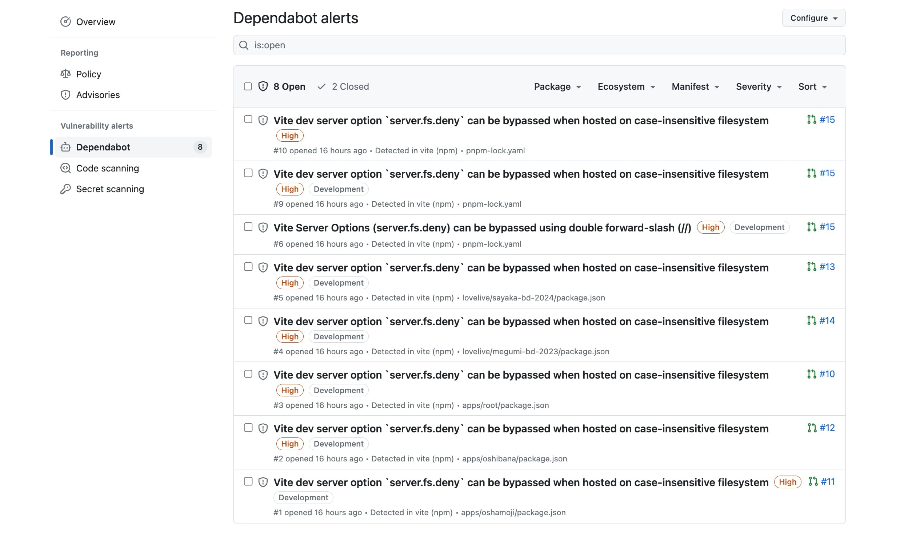
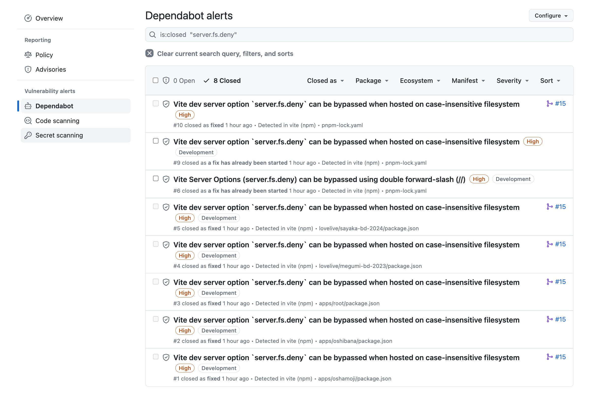
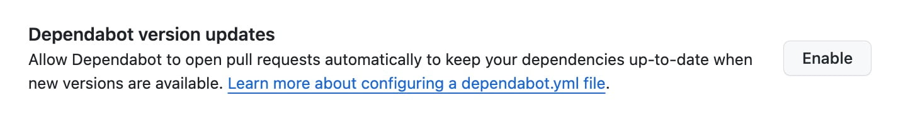
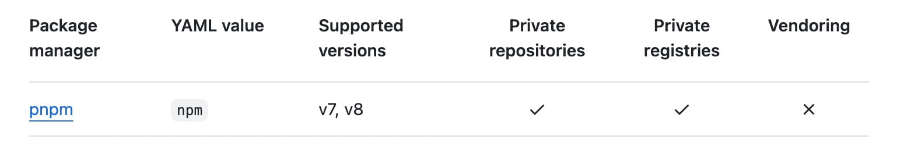

プライベート/お仕事用のリポジトリで Dependabot を使ってみるか〜ってなったのですが、「色々あるんだね...」ってなったので、1つ1つ調べてみる。



## (前置き) 依存関係を定期的に更新したい

今どきの Webアプリは (このブログも) 多くの[オープンソース](https://ja.wikipedia.org/wiki/%E3%82%AA%E3%83%BC%E3%83%97%E3%83%B3%E3%82%BD%E3%83%BC%E3%82%B9)パッケージに依存する形で構築されています。
そのため、依存しているパッケージのバージョンを管理することも Web アプリのメンテナンスの 1 つになっています。

(Web アプリとパッケージの) 依存関係の管理とは、パッケージのバージョンを維持すること...**ではなく**、脆弱性・バグ・新機能のために**最新版に更新すること**です。
「新機能は要らないから、必要な修正パッチが入ったバージョンだけ更新する」という方針は[現実のオープンソースでは取れません](https://docs.renovatebot.com/dependency-pinning/#tilde-vs-caret)。
また、[定期的な更新を行うことで迅速な更新が必要なときに備える](https://docs.renovatebot.com/upgrade-best-practices/#why-updating-often-is-easier-faster-and-safer)ことが重要です。

...ってことで、**依存関係を定期的に更新したい**。

## Dependabot

Dependabot は [GitHub が提供しているコードセキュリティに関連する機能](https://docs.github.com/ja/code-security)の一部であり、
さらに Dependabot 自体は 3つの機能の総称です。

1. 📣 [Dependabot alerts](https://docs.github.com/ja/code-security/dependabot/dependabot-alerts/about-dependabot-alerts)

   > 脆弱性のある依存関係を使用しているリポジトリを検出すると、GitHub は Dependabot alertsを送信します。

2. 🔒 [Dependabot security updates](https://docs.github.com/ja/code-security/dependabot/dependabot-security-updates/about-dependabot-security-updates)

   > Dependabot は、セキュリティアップデートプログラムを使用してプルリクエストを発行することにより、脆弱性のある依存関係を修正できます。

3. 🆕 [Dependabot version updates](https://docs.github.com/ja/code-security/dependabot/dependabot-version-updates/about-dependabot-version-updates)

   > Dependabot を使用して、使用するパッケージを最新バージョンに更新しておくことができます。

**_(同じような名前でややこしいので、勝手に emoji を付ける)_**

## 📣 Dependabot alerts

### 概要

📣 Dependabot alerts は脆弱性を含むパッケージに依存していることを**通知する機能**です。 Dependabot はデフォルトブランチをスキャンして、安全でない依存関係を検出します。

通知は以下のタイミングで行われます。

- GitHub Advisory Database に新しいアドバイザリが追加されたとき
- 依存しているパッケージまたはバージョンを変更したとき

[GitHub Advisory Database](https://docs.github.com/ja/code-security/security-advisories/working-with-global-security-advisories-from-the-github-advisory-database/about-the-github-advisory-database) は GitHub 上で参照できる[公開された脆弱性](https://docs.github.com/ja/code-security/security-advisories/guidance-on-reporting-and-writing-information-about-vulnerabilities/about-coordinated-disclosure-of-security-vulnerabilities)の一覧です。
📣 Dependabot alertsをトリガーするのは GitHub によってレビューされた Advisory のみのため、全ての脆弱性の情報を受け取ることや、潜在的な脆弱性を見つけることは**出来ません**。

### 設定方法

Enable ボタンをクリックするだけ



### 通知の確認

出てる出てる...([1週間くらい前に報告された Vite の脆弱性](https://github.com/advisories/GHSA-c24v-8rfc-w8vw)が...)。
monorepo の場合 `package.json` と lock ファイルそれぞれに対して通知が出るので量がすごい🥺



## 🔒 Dependabot security updates

### 概要

🔒 Dependabot security updates は脆弱性を含むパッケージを修正するための pull request を自動で作成する機能です。
📣 Dependabot alerts が通知されたときに **パッチを含む最小バージョンへ更新する pull request** を作成します。

### 設定方法

📣 Dependabot alerts を有効にした後に、Enable ボタンをクリックするだけ



### 構成

- [1つの pull request にグループ化する](https://docs.github.com/en/code-security/dependabot/dependabot-security-updates/configuring-dependabot-security-updates#grouping-dependabot-security-updates-into-a-single-pull-request)
- [デフォルトの動作をオーバーライドする](https://docs.github.com/en/code-security/dependabot/dependabot-security-updates/configuring-dependabot-security-updates#overriding-the-default-behavior-with-a-configuration-file)

というような、構成も行える。

### Pull request の確認

Dependabot alerts に対して pull request が作成されていることが分かる🥳



Pull request を merge すると、closed になる✌️



## 🆕 Dependabot version updates

### 概要

🆕 Dependabot version updates も 🔒 Dependabot security updates と同様に pull request を自動で作成する機能です。
🔒 Dependabot security updates と違って、🆕 Dependabot version updates は **最新バージョンへ更新する pull request** を作成します。

🔒 Dependabot security updates は 📣 dependabot alerts の通知をトリガーに pull request を作成します。
一方、🆕 dependabot version updates は [pull request の頻度の設定](https://docs.github.com/ja/code-security/dependabot/dependabot-version-updates/about-dependabot-version-updates#frequency-of-dependabot-pull-requests) に従って
パッケージの最新バージョンを確認して脆弱性の有無に関係なく pull request を作成し続けます。

### 設定方法・構成

Enable ボタンをクリックすると、設定ファイル (`.github/dependabot.yml`) の編集画面に移行する。



必須項目だけの最低限な設定例としては、

- `version: 2` は[固定](https://docs.github.com/en/code-security/dependabot/dependabot-version-updates/configuration-options-for-the-dependabot.yml-file#about-the-dependabotyml-file)
- [`package-ecosystem`](https://docs.github.com/en/code-security/dependabot/dependabot-version-updates/configuration-options-for-the-dependabot.yml-file#package-ecosystem) で `npm` を指定する
- [`directory`](https://docs.github.com/en/code-security/dependabot/dependabot-version-updates/configuration-options-for-the-dependabot.yml-file#directory) で `package.json` の場所を指定する
- [`schedule.interval`](https://docs.github.com/en/code-security/dependabot/dependabot-version-updates/configuration-options-for-the-dependabot.yml-file#scheduleinterval)で確認頻度を指定する

```yaml
version: 2
updates:
  - package-ecosystem: "npm" # npm の更新を管理したい！
    directory: "/" # root にマニフェストファイル(package.json) あるよ
    schedule:
      interval: "weekly" # 毎週チェックよろしく！
```

## 3 つの機能の比較

|                                | トリガーのタイミング                                               | やってくれること       | 設定                                |
| :----------------------------- | :----------------------------------------------------------------- | :--------------------- | ----------------------------------- |
| 📣 Dependabot alerts           | GitHub Advisory Database で脆弱性が公開されたとき                  | 通知 (`Security` タブ) | `Settings` タブ                     |
| 🔒 Dependabot security updates | 📣 Dependabot alerts で通知されたとき                              | Pull request 作成      | `Settings` タブ                     |
| 🆕 Dependabot version updates  | `schedule.interval` に従って確認したパッケージに最新版があったとき | Pull request 作成      | `.github/dependabot.yml` を編集する |

## まとめ

元々のモチベーション (`依存関係を定期的に更新したい`) に対する Dependabot の使い方としては、全部使うって感じ。

- 📣 Dependabot alerts で脆弱性を監視しつつ
- 🔒 Dependabot security updates で脆弱性対応用の pull request を作って貰いつつ
- 🆕 Dependabot version updates で作られた pull request で依存関係を最新版に保っておく

## 次

[`.github/dependabot.yml` の設定項目](https://docs.github.com/ja/code-security/dependabot/dependabot-version-updates/configuration-options-for-the-dependabot.yml-file) を調整しつつ、[自動化](https://docs.github.com/ja/code-security/dependabot/working-with-dependabot/automating-dependabot-with-github-actions)を模索する

## 余談 (pnpm ユーザー向け)

`pnpm` を使っている場合、[`package-ecosystem`](https://docs.github.com/en/code-security/dependabot/dependabot-version-updates/configuration-options-for-the-dependabot.yml-file#package-ecosystem) の値は **`npm`** 🥳



参考: https://twitter.com/dependabot/status/1750977628167606640
