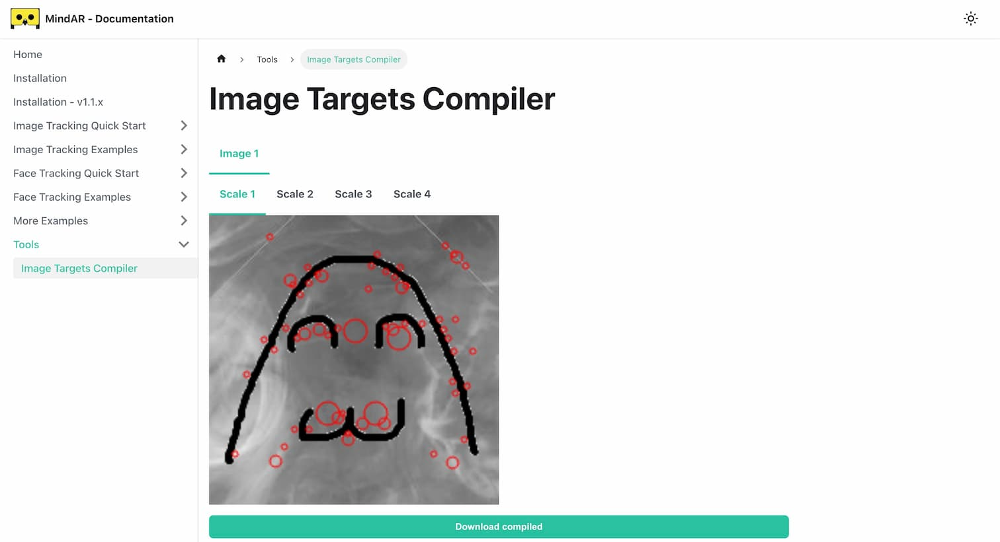

AR アプリ (スマホのカメラで画像を映すと、別の画像が重ね合わせで表示される) を

- [MindAR](https://hiukim.github.io/mind-ar-js-doc/)
- React
- [three.js](https://threejs.org/)

で (なんやかんやあって) 作ってみたので、ポイントをメモしておきます。


|            |                                                      |
| :--------- | :--------------------------------------------------- |
| リポジトリ | https://github.com/TatsuyaYamamoto/mind-ar-react-app |
| アプリ     | https://mind-ar-react-app.vercel.app/                |

## MindAR

https://hiukim.github.io/mind-ar-js-doc/

MindAR は Web で AR を実現するための OSS。
Web AR を実現する OSS だと [AR.js](https://ar-js-org.github.io/AR.js-Docs/) の方が有名な気がするけれど (名前のせい？)、
[AR.js が新しい OSS として MindAR を紹介しているので](https://github.com/AR-js-org/AR.js/blob/3.4.5/README.md?plain=1#L15)こっちを使ってみる。

~~AR.js はドキュメント・サンプルコードが分かりにくいし、パッケージの解決もややこしかったし...。~~

## 依存関係

```json
{
  "dependencies": {
    "@react-three/fiber": "8.17.6",
    "mind-ar": "1.2.5",
    "react": "18.3.1",
    "react-dom": "18.3.1",
    "three": "0.161.0" 👈️
  }
}
```

変わった依存関係はないけれど、重要なのが `three` のバージョン。
2024/09/02 時点の three.js の最新バージョンは `0.168.0` だけれど、エラーが発生するので `0.161.0` をインストールしている。
エラーの理由は r152 で deprecated になった API が [r162 で削除されている](https://github.com/mrdoob/three.js/pull/27656)から。

> `THREE.sRGBEncoding` is now `THREE.SRGBColorSpace`.
>
> ref: [Migration-Guide#151 → 152](https://github.com/mrdoob/three.js/wiki/Migration-Guide#151--152)

## ターゲット画像をコンパイルする CLI

AR を実現するにはスマホのカメラで映した映像の中からターゲット画像を検出する必要がある。
MindAR は (AR.js もだけど) 事前にターゲット画像から特徴量を抽出したバイナリファイルを作成して、これを用いて映像からターゲット画像を探す仕組みになっている。

MindAR 用のバイナリファイルを作るツールはブラウザのツールとして公開されている ([Image Targets Compiler](https://hiukim.github.io/mind-ar-js-doc/tools/compile))。
このツールからダウンロードできるバイナリファイルの拡張子が `.mind` だから、`.mind` ファイルって呼んで良いよね？



繰り返しコンパイルする上で GUI はちょっと不便なので、CLI でコンパイルしたい。

MindAR は 2 つのクラスを export しているので、`OfflineCompiler` を使ってスクリプトを書いてみた ([mind-compiler.js](https://github.com/TatsuyaYamamoto/mind-ar-react-app/blob/main/mind-compiler.js))。

- ((多分) ブラウザ上で実行するための) [`Compiler`](https://github.com/hiukim/mind-ar-js/blob/master/src/image-target/compiler.js) クラス
- ((多分) [`node-canvas`](https://www.npmjs.com/package/canvas) で Node.js 上で実行できるようにした) [`OfflineCompiler`](https://github.com/hiukim/mind-ar-js/blob/master/src/image-target/offline-compiler.js) クラス

```shell
$ node mind-compiler.js src/assets/_dairi_fire.png
image[0]: src/assets/_dairi_fire.png

============================
Hi, looks like you are running TensorFlow.js in Node.js. To speed things up dramatically, install our node backend, visit https://github.com/tensorflow/tfjs-node for more details.
============================
progress 12.5
progress 25
progress 37.5
progress 50
progress 75
progress 100

$ ls public/data.mind
public/data.mind
```

標準出力内の `image[0]` はコンパイラーに渡した画像の配列の index だが、この数字は `.mind` ファイル内のターゲット画像の識別子にもなる。
どのターゲット画像 (anchor という名前っぽい) に対して何の画像 ([Mesh](https://threejs.org/docs/#api/en/objects/Mesh)) を重ね合わせて表示するかは、この index 番号を用いて以下のような API で指定する。

```js
mindArThree
  .addAnchor(anchorIndex) // 👈️ どのターゲット画像に対して
  .group.add(mesh); //       👈️ 何の画像を表示するか
```

## ターゲット画像に AR を映す React アプリ

### `App.tsx`

https://github.com/TatsuyaYamamoto/mind-ar-react-app/blob/main/src/App.tsx

- [`useLoader`](https://r3f.docs.pmnd.rs/api/hooks#useloader) で png ファイルを Texture インスタンスを取得する
- MindAR の anchor と Mesh の対応を表現した object (`anchors`) を計算する
- `anchors` を `MindArRenderer` に渡す

```tsx
const App: FC = () => {
  const dairiTexture = useLoader(THREE.TextureLoader, dairiPng);
  const anchors = useMemo(
    () => [
      {
        index: 0,
        meshes: [createMesh(dairiTexture)],
      },
    ],
    [dairiTexture],
  );

  return (
    <>
      <div style={/* 略 */}>
        <MindArRenderer anchors={anchors} />
      </div>
    </>
  );
};
```

### `MindArRenderer.tsx`

https://github.com/TatsuyaYamamoto/mind-ar-react-app/blob/main/src/components/MindArRenderer.tsx

```tsx
const MindArRenderer: FC<Props> = ({ anchors }) => {
  const wrapperElRef = useRef<HTMLDivElement>(null);

  useEffect(() => {
    /**
     * wrapper 要素 (<div style={{ display: "contents" }} />) に対して、以下の要素を useEffect 内で構築する。
     * <div> 👈️ wrapper
     *   <div> 👈️ container
     *     <canvas /> 👈️ MindAR が挿入する要素 1
     *     <div />    👈️ MindAR が挿入する要素 2
     *     <video />  👈️ MindAR が挿入する要素 3
     *   </div>
     * </div>
     *
     * useEffect 内で実行する {@link MindARThree#start} と {@link MindARThree#stop} による後処理に課題があり、
     * container 要素ごと削除するために wrapper 要素内に container 要素を作っている。
     */
    const container = document.createElement("div");
    container.style.width = "100%";
    container.style.height = "100%";

    const mindArThree = new MindARThree({
      container,
      imageTargetSrc: "/data.mind", // 👈️ compiler で作った `.mind` ファイルを渡す
      uiScanning: "no",
      uiLoading: "no",
    });

    anchors.map((anchor) => {
      mindArThree.addAnchor(anchor.index).group.add(...anchor.meshes);
    });

    const { renderer, scene, camera } = mindArThree;

    /**
     * MindAR の start 処理は非同期で実行されるため、
     * useEffect のクリーンアップで stop を実行するために、start の完了を待つ Promise を受け取る
     */
    const startPromise = mindArThree.start();
    renderer.setAnimationLoop(() => {
      renderer.render(scene, camera);
    });

    wrapperElRef.current?.append(container);

    return () => {
      renderer.setAnimationLoop(null);
      startPromise.then(() => {
        mindArThree.stop();
        container.remove();
      });
    };
  }, [anchors]);

  // useEffect で作る container 要素、MindAR が挿入する要素で style が完結するため、wrapper 要素でボックスを作成させない
  return <div style={{ display: "contents" }} ref={wrapperElRef} />;
};
```

`@react-three/fiber` をインストールしているけれど、使っているのは App.tsx 内の `useLoader` hook のみ。
[`MindARThree`](https://github.com/hiukim/mind-ar-js/blob/master/src/image-target/three.js) クラスのコンストラクター内で `Scene` や `WebGLRenderer` の実装が行われているため、
宣言的な実装をするためには専用のクラス (か、何か) を自前で作る必要がある...。

## 描画結果

https://mind-ar-react-app.vercel.app/ にアクセスして、https://t28.dev/ のアイコンを映すと AR を試せるよ。


