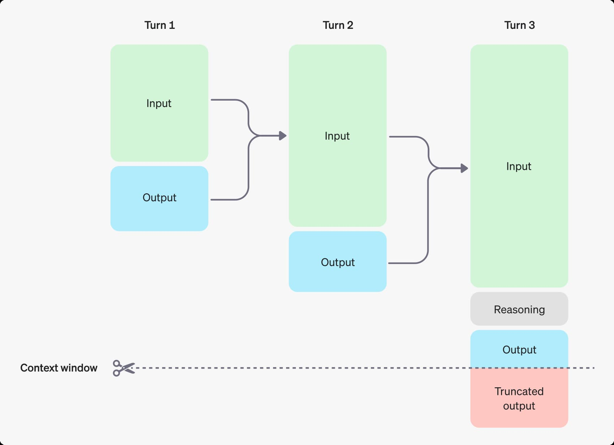
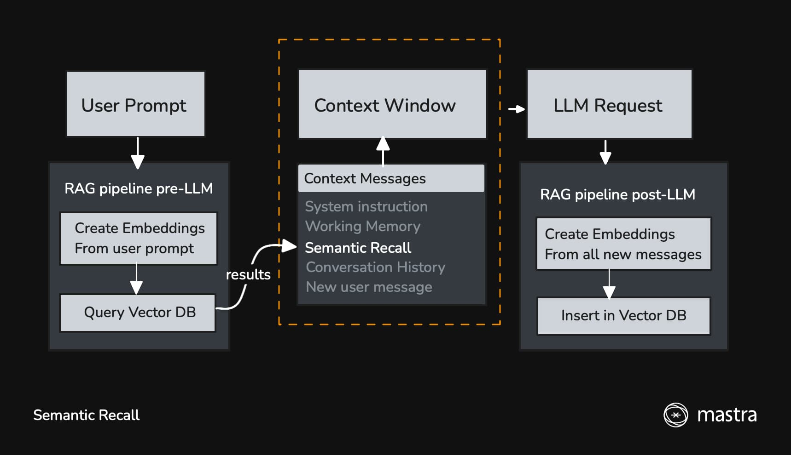

[Fairy (AI エージェント) を作るメモまとめ](./ai-agent-fairy-making) > **文脈を組む AI エージェントを作るために LLM のコンテキスト と Mastra のメモリを調べる**

バージョン:

- [`@mastra/core@0.10.2`](https://github.com/mastra-ai/mastra/tree/%40mastra/core%400.10.2)

---

現状の Fairy は会話の流れを汲んだレスポンスを生成することができない。
[最高のアシスタント](https://x.com/ZZZ_JP/status/1739224947149681133)を自称する (させる？) からには、短期的・長期的問わず記憶力を発揮して、会話やサポートをして欲しい。


## OpenAI の Conversation state

OpenAI API を使うと[LLM (大規模言語モデル)](https://platform.openai.com/docs/models)を使って[プロンプトからテキストを生成することができる](https://platform.openai.com/docs/guides/text?api-mode=responses#:~:text=generate%20text%20from%20a%20prompt)。
例えば [Responses API](https://platform.openai.com/docs/api-reference/responses) だとこんな感じ。

```ts
const response = await client.responses.create({
  model: "gpt-4.1",
  input: "Write a one-sentence bedtime story about a unicorn.",
});

// Under the soft glow of the moon, Luna the unicorn danced through fields of twinkling stardust, leaving trails of dreams for every child asleep.
console.log(response.output_text);
```

上記のようなテキストの生成は[生成毎に独立している(ステートレス)](https://platform.openai.com/docs/guides/conversation-state?api-mode=responses#managing-context-for-text-generation:~:text=while%20each%20text%20generation%20request%20is%20independent%20and%20stateless)ため、
会話の流れを汲んだレスポンスをもらうには会話の流れを丸ごと入力する必要がある [^1]。

```ts
const response = await openai.responses.create({
  model: "gpt-4o-mini",
  input: [
    { role: "user", content: "knock knock." },
    { role: "assistant", content: "Who's there?" },
    { role: "user", content: "Orange." },
  ],
});
```

会話が続くにつれ `input` が雪だるま式に大きくなるわけだが、
無限に増やせるかというとそうでもなく、出力トークンとコンテキストウィンドウの制限を考慮する必要がある。

コンテキストウィンドウとは [1回のリクエストで使用できるトークンの最大数](https://platform.openai.com/docs/guides/conversation-state?api-mode=responses#managing-the-context-window:~:text=the%20maximum%20number%20of%20tokens%20that%20can%20be%20used%20in%20a%20single%20request) のこと。
この最大トークン数には[以下の3つが含まれる](https://platform.openai.com/docs/guides/conversation-state?api-mode=responses#managing-the-context-window:~:text=the%20following%20token%20counts%20will%20apply%20toward%20the%20context%20window%20total%3A):

- 入力トークン (Responses API の `input` に含める入力)
- 出力トークン (プロンプトに応じてモデルが生成するトークン
- 推論トークン (推論が有効になっているモデルが[回答を生成する前の思考に使うトークン](https://platform.openai.com/docs/guides/reasoning?api-mode=responses#how-reasoning-works:~:text=the%20models%20use%20these%20reasoning%20tokens%20to%20%22think%2C%22))

図を見れば一発。

> 
>
> ref: https://platform.openai.com/docs/guides/conversation-state#managing-context-for-text-generation

チャットボット形式ならスレッドを分けることで入力トークン数をある程度抑えられるため、話の流れ（コンテキスト）を汲んだ出力も割と手軽に作れそう。
一方、私が作りたい Fairy はチャットボットではなく、常駐型？の AI アシスタント。コンテキストウィンドウの工夫は必須だ 🤔

## Mastra の Memory

Mastra は [ステートフルな会話](https://github.com/mastra-ai/mastra/blob/%40mastra%2Fcore%400.10.2/docs/src/content/en/docs/agents/agent-memory.mdx#:~:text=stateful%20conversations)を行うためにメモリという仕組み (クラス) を提供している。

> メモリは、エージェントが利用可能な**コンテキストを管理する方法**であり、すべてのチャットメッセージを**コンテキストウィンドウに凝縮したもの**です。
>
> ref: https://mastra.ai/ja/docs/memory/overview

Mastra で作るエージェントが扱うコンテキストは[3つに分けられる](https://github.com/mastra-ai/mastra/blob/%40mastra%2Fcore%400.10.2/docs/src/content/en/docs/memory/overview.mdx#:~:text=context%20is%20broken%20up%20into%20three%20parts):

- システム指示とユーザーに関する情報（ワーキングメモリ）
- 最近のメッセージ（メッセージ履歴）
- ユーザーのクエリに関連する古いメッセージ（セマンティック検索）

さらに、コンテキストウィンドウに従ってコンテキストをトリムする仕組み（メモリプロセッサ）もある。

Mastra は[メモリをスレッド毎に管理する](https://github.com/mastra-ai/mastra/blob/%40mastra%2Fcore%400.10.2/docs/src/content/en/docs/memory/overview.mdx#:~:text=Mastra%20organizes%20memory%20into%20threads)ため、
２つの識別子を使って会話履歴を識別する:

1. `threadId`: 特定の会話ID（例：support_123）
2. `resourceId`: 各スレッドを所有するユーザーまたはエンティティID

おそらく、Fairy のために これらの ID を固定値にするのは現実的ではないのだろうな...。
コンテキストを共有させる/させないいい感じ (???) に制御して、コンテキストを構築する必要がある... 🤔

## Mastra の Conversation History

`OpenAI の Conversation state` に相当するものを Mastra では Conversation History と呼んでいる。

> デフォルトでは、Memoryインスタンスは現在のMemoryスレッドから最新の10件のメッセージを各新規リクエストに含めます。これにより、エージェントに即時の会話コンテキストが提供されます。
>
> ```ts
> const memory = new Memory({
>   options: {
>     lastMessages: 10,
>   },
> });
> ```

## Mastra の Semantic recall

> 友人に先週末何をしたか尋ねると、彼らは「先週末」に関連する出来事を記憶の中から検索し、それから何をしたかを教えてくれます。これはMastraにおけるセマンティックリコールの仕組みに少し似ています。
>
> ref: https://mastra.ai/ja/docs/memory/semantic-recall

☝️分かりやすい。

Semantic recall は Conversation history に含められない[長期間の対話のコンテキストを維持する](https://github.com/mastra-ai/mastra/blob/%40mastra%2Fcore%400.10.2/docs/src/content/en/docs/memory/semantic-recall.mdx#:~:text=helps%20agents%20maintain%20context)ことに役立つ。
ベクトル埋め込み ([文章の意味・関係性を数値に変換する](https://www.elastic.co/jp/what-is/vector-embedding#:~:text=%E3%83%99%E3%82%AF%E3%83%88%E3%83%AB%E5%9F%8B%E3%82%81%E8%BE%BC%E3%81%BF%E3%81%A8%E3%81%AF%E3%80%81%E5%8D%98%E8%AA%9E%E3%82%84%E6%96%87%E7%AB%A0%E3%81%AA%E3%81%A9%E3%81%AE%E3%83%87%E3%83%BC%E3%82%BF%E3%82%92%E3%80%81%E3%81%9D%E3%82%8C%E3%82%89%E3%81%AE%E6%84%8F%E5%91%B3%E3%82%84%E9%96%A2%E4%BF%82%E6%80%A7%E3%82%92%E6%8D%89%E3%81%88%E3%82%8B%E6%95%B0%E5%80%A4%E3%81%AB%E5%A4%89%E6%8F%9B%E3%81%99%E3%82%8B%E6%96%B9%E6%B3%95%E3%81%A7%E3%81%99))) を使って類似性検索することで、
意味的に類似したメッセージをコンテキストに含めて LLM に送信する。

> 
>
> ref: https://mastra.ai/en/docs/memory/semantic-recall

セマンティックリコールのふるまいは [2 つのパラメータで制御する](https://github.com/mastra-ai/mastra/blob/%40mastra%2Fcore%400.10.2/docs/src/content/en/docs/memory/semantic-recall.mdx#:~:text=The-,two%20main%20parameters,-that%20control%20semantic):

1. `topK`: 意味的に類似したメッセージを何件取得するか
1. `messageRange`: 各一致に対してどれだけの周囲のコンテキストを含めるか

LLM のレスポンスを受け取った後は[すべての新しいメッセージ（ユーザー、アシスタント、ツールコール/結果）をベクトル DB に保存して](<https://github.com/mastra-ai/mastra/blob/%40mastra%2Fcore%400.10.2/docs/src/content/en/docs/memory/semantic-recall.mdx#:~:text=all%20new%20messages%20(user%2C%20assistant%2C%20and%20tool%20calls/results)%20are%20inserted%20into%20the%20vector%20DB>)、
次のリクエスト時に参照出来るようにする。

## Mastra の Working memory

> ワーキングメモリは、エージェントが継続的に関連する情報を保存するために時間の経過とともに更新できる **Markdownテキストのブロック** です
>
> ref: https://mastra.ai/ja/docs/memory/working-memory

👇️のように Markdown を使って、データをどのように構造化するかをエージェントに伝えることができる。

```ts
const memory = new Memory({
  options: {
    workingMemory: {
      enabled: true,
      template: `
# User Profile

## Personal Info

- Name:
- Location:
- Timezone:
`,
    },
  },
});
```

エージェントは Thread での会話に従って Markdown が更新する。
あらかじめ作った見出し・リストにない情報をエージェントが保存するべきと判断した場合、いい感じ（？）に見出しやリストを追加する。

```markdown
# User Profile

## Personal Info

- Name: T28
- Location:
- Timezone:
- Schedule:
  - 12:00: 紅茶を淹れる
  - 13:00: 人をもてなす
- Guest: 乙宗梢さん (紅茶が好き)
```

エージェントがどのように Markdown を更新するかは `instructions` で指示することもできる。
[Mastra の default template](https://github.com/mastra-ai/mastra/blob/%40mastra/core%400.10.2/packages/core/src/memory/memory.ts#L42) も参考になるかもしれない。

Working memory は [`mastra_thread` テーブルの `metadata` カラム](https://mastra.ai/en/docs/storage/overview#data-schema)に保存されるため、`threadId`, `resourceId` 毎に保存される情報になる。

| id      | resourceId | title           | metadata                                              | createdAt                | updatedAt                |
| :------ | :--------- | :-------------- | :---------------------------------------------------- | :----------------------- | ------------------------ |
| uuid v4 | fairy      | New Thread Name | {"workingMemory": "ここに更新された markdown が入る"} | 2025-06-01T14:39:45.959Z | 2025-06-03T14:39:45.959Z |

~~DB でスキーマを定義せずに Markdown に書いていくメリットが今の時点だと全く分からない...。手軽さ？~~

## Mastra の Memory processors

https://mastra.ai/ja/docs/memory/memory-processors

メモリプロセッサを使ってLLMに送信される前に処理が行える:

- コンテキストサイズの管理
- コンテンツのフィルタリング
- パフォーマンスの最適化

Mastra が提供している組み込みプロセッサ:

- `TokenLimiter`
  - LLM のコンテキストウィンドウの上限超過を防ぐ
- `ToolCallFilter`
  - LLM に送信するメモリメッセージからツールコールを削除する
  - [tool](https://github.com/mastra-ai/mastra/blob/%40mastra%2Fcore%400.10.2/docs/src/content/en/docs/tools-mcp/overview.mdx) のやりとりをコンテキストから除外することでトークン数を節約できる

`MemoryProcessor` class を継承することで[カスタムプロセッサを作ることも出来る](https://github.com/mastra-ai/mastra/blob/%40mastra%2Fcore%400.10.2/docs/src/content/en/docs/memory/memory-processors.mdx#creating-custom-processors) ので、
これを使って "Fairy のためのいい感じのメモリ" を構築することになりそう 🤔

[^1]: OpenAPI には[プラットフォーム側にレスポンスを保存させる仕組み](https://platform.openai.com/docs/guides/conversation-state#openai-apis-for-conversation-state)があり、[デフォルトで有効](https://platform.openai.com/docs/api-reference/responses/create#responses-create-store) になっている。が、Mastra から直接
