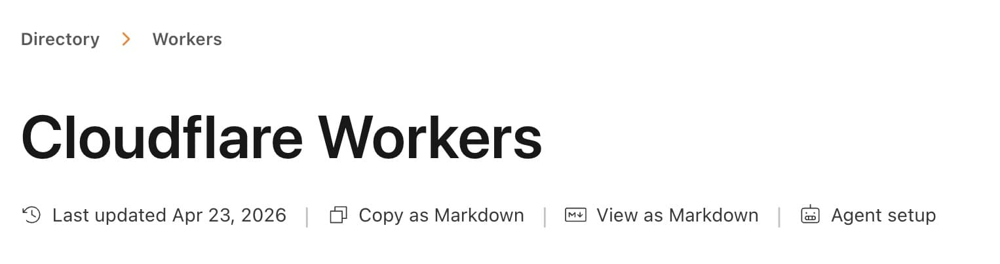

Cloudflare のドキュメントは markdown 形式のものも公開されていることに気付いた。
<https://developers.cloudflare.com/workers/> という URL にあるドキュメントの場合、
<https://developers.cloudflare.com/workers/index.md> に同等の markdown ファイルもホストされている。
面白そう。このブログでもマネをしたい。



## AI に Markdown を渡すメリット

参考: <https://blog.cloudflare.com/ja-jp/markdown-for-agents/>

生の HTML (`<h2 class="section-title" id="about">About Us</h2>`) よりも Markdown (`## About Us`) の方がトークンの無駄を最小限に抑えられる。
例えば <https://blog.cloudflare.com/ja-jp/markdown-for-agents/> では

- HTMLで 16,180トークン
- Markdownで 3,150トークン

なので、[トークンの使用量を80％削減できる](https://blog.cloudflare.com/ja-jp/markdown-for-agents/#:~:text=%E4%BB%8A%E3%81%8A%E8%AA%AD%E3%81%BF%E3%81%84%E3%81%9F%E3%81%A0%E3%81%84%E3%81%A6%E3%81%84%E3%82%8B%E3%81%93%E3%81%AE%E3%83%96%E3%83%AD%E3%82%B0%E8%A8%98%E4%BA%8B%E3%81%AF%E3%80%81HTML%E3%81%A716%2C180%E3%83%88%E3%83%BC%E3%82%AF%E3%83%B3%E3%80%81Markdown%E3%81%AB%E5%A4%89%E6%8F%9B%E3%81%99%E3%82%8B%E9%9A%9B%E3%81%AB3%2C150%E3%83%88%E3%83%BC%E3%82%AF%E3%83%B3%E3%82%92%E5%BF%85%E8%A6%81%E3%81%A8%E3%81%97%E3%81%BE%E3%81%99%E3%80%82%E3%81%93%E3%82%8C%E3%81%AF%E3%83%88%E3%83%BC%E3%82%AF%E3%83%B3%E3%81%AE%E4%BD%BF%E7%94%A8%E9%87%8F%E3%82%9280%EF%BC%85%E5%89%8A%E6%B8%9B%E3%81%99%E3%82%8B%E3%81%93%E3%81%A8%E3%81%A7%E3%81%99%E3%80%82)。

セマンティックな HTML なら AI の理解を助けるのでは？と思いつつも、

- [本質的には何も表さない](https://developer.mozilla.org/ja/docs/Web/HTML/Reference/Elements/div#:~:text=div%3E%20%E8%A6%81%E7%B4%A0%E3%81%AF-,%E6%9C%AC%E8%B3%AA%E7%9A%84%E3%81%AB%E3%81%AF%E4%BD%95%E3%82%82%E8%A1%A8%E3%81%97%E3%81%BE%E3%81%9B%E3%82%93,-%E3%80%82%E3%81%9D%E3%81%AE%E4%BB%A3%E3%82%8F%E3%82%8A%E3%80%81) `<div>` のラッパー
- ナビゲーションバー
- スクリプトタグ

を考慮すると、確かに Markdown の方がメリットが大きい気がする。

## Cloudflareのネットワークにおける "Markdown for Agents"

参考: <https://developers.cloudflare.com/fundamentals/reference/markdown-for-agents/>

Cloudflare のネットワークは HTML から Markdown への自動変換をサポートしている。[有料だけど](https://developers.cloudflare.com/fundamentals/reference/markdown-for-agents/#availability-and-pricing)。
AI がリクエスト時に `text/markdown` を要求すると、Cloudflare はオリジンから元のHTML を Markdown に変換してからクライアントへ配信する。

変換後の Markdown には [YAML frontmatter と JSON-LD が含まれている](https://developers.cloudflare.com/fundamentals/reference/markdown-for-agents/#output-format)。

```bash
$ curl -s https://developers.cloudflare.com/fundamentals/reference/markdown-for-agents/ | head -2
<!DOCTYPE html><html lang="en" dir="ltr" data-theme="dark" data-has-toc data-has-sidebar class="astro-3wnvo4jq"> <head><script type="module" src="/_astro/Head.astro_astro_type_script_index_0_lang.DzFUDi6m.js"></script> <script type="module" src="/_astro/Head.astro_astro_type_script_index_1_lang.Dq2TD6lw.js"></script> <script type="module" src="/_astro/Head.astro_astro_type_script_index_2_lang.DdMWwAGS.js"></script> <script type="module" src="/_astro/Head.astro_astro_type_script_index_3_lang.DibilYbp.js"></script> <script type="module" src="/_astro/Head.astro_astro_type_script_index_4_lang.TkaWOEUf.js"></script> <script type="application/ld+json">{"@context":"https://schema.org","@type":"WebPage","@id":"https://developers.cloudflare.com/fundamentals/reference/markdown-for-agents/#page","headline":"Markdown for Agents · Cloudflare Fundamentals docs","description":"Cloudflare's Markdown for Agents converts HTML to Markdown at the edge, allowing AI systems to request content in text/markdown format.","url":"https://developers.cloudflare.com/fundamentals/reference/markdown-for-agents/","inLanguage":"en","image":"https://developers.cloudflare.com/core-services-preview.png","dateModified":"2026-07-13","publisher":{"@type":"Organization","name":"Cloudflare","url":"https://www.cloudflare.com/"},"isPartOf":{"@type":"WebSite","@id":"https://developers.cloudflare.com/#website","name":"Cloudflare Docs","url":"https://developers.cloudflare.com/"}}</script><meta charset="utf-8"/><meta name="viewport" content="width=device-width, initial-scale=1"/><title>Markdown for Agents · Cloudflare Fundamentals docs</title><link rel="canonical" href="https://developers.cloudflare.com/fundamentals/reference/markdown-for-agents/"/><link rel="sitemap" href="/sitemap-index.xml"/><link rel="shortcut icon" href="/favicon.png" type="image/png"/><meta name="generator" content="Astro v6.4.7"/><meta name="generator" content="Starlight v0.40.0"/><meta property="og:title" content="Markdown for Agents"/><meta property="og:type" content="article"/><meta property="og:url" content="https://developers.cloudflare.com/fundamentals/reference/markdown-for-agents/"/><meta property="og:locale" content="en"/><meta property="og:description" content="Cloudflare's Markdown for Agents converts HTML to Markdown at the edge, allowing AI systems to request content in text/markdown format."/><meta property="og:site_name" content="Cloudflare Docs"/><meta name="twitter:card" content="summary_large_image"/><meta name="description" content="Cloudflare's Markdown for Agents converts HTML to Markdown at the edge, allowing AI systems to request content in text/markdown format."/><meta name="twitter:site" content="@cloudflare"/><meta name="pcx_content_group" content="Core platform"/><link rel="alternate" type="text/markdown" href="https://developers.cloudflare.com/fundamentals/reference/markdown-for-agents/index.md"/><meta property="og:title" content="Markdown for Agents · Cloudflare Fundamentals docs"/><meta name="pcx_product" content="Cloudflare Fundamentals"/><meta name="algolia_product_filter" content="Cloudflare Fundamentals"/><meta name="pcx_content_type" content="Navigation"/><meta name="algolia_content_type" content="Navigation"/><meta name="pcx_additional_products" content="Cloudflare Fundamentals"/><meta name="pcx_last_modified" content="5"/><meta property="image" content="https://developers.cloudflare.com/core-services-preview.png"/><meta property="og:image" content="https://developers.cloudflare.com/core-services-preview.png"/><meta property="twitter:image" content="https://developers.cloudflare.com/core-services-preview.png"/><script>
	window.StarlightThemeProvider = (() => {
```

```bash
$ curl -s https://developers.cloudflare.com/fundamentals/reference/markdown-for-agents/ -H "Accept: text/markdown" | head -15
---
title: Markdown for Agents
description: Cloudflare's Markdown for Agents converts HTML to Markdown at the edge, allowing AI systems to request content in text/markdown format.
image: https://developers.cloudflare.com/core-services-preview.png
---

> Documentation Index
> Fetch the complete documentation index at: https://developers.cloudflare.com/fundamentals/llms.txt
> Use this file to discover all available pages before exploring further.

[Skip to content](#%5Ftop)

# Markdown for Agents

## What is Markdown for Agents
```

````bash
$ curl -s https://developers.cloudflare.com/fundamentals/reference/markdown-for-agents/ -H "Accept: text/markdown" | tail -8

## On this page

[  Docs ](https://developers.cloudflare.com/)

```json
{"@context":"https://schema.org","@type":"WebPage","@id":"https://developers.cloudflare.com/fundamentals/reference/markdown-for-agents/#page","headline":"Markdown for Agents · Cloudflare Fundamentals docs","description":"Cloudflare's Markdown for Agents converts HTML to Markdown at the edge, allowing AI systems to request content in text/markdown format.","url":"https://developers.cloudflare.com/fundamentals/reference/markdown-for-agents/","inLanguage":"en","image":"https://developers.cloudflare.com/og-docs.png","dateModified":"2026-07-13","publisher":{"@type":"Organization","name":"Cloudflare","url":"https://www.cloudflare.com/"},"isPartOf":{"@type":"WebSite","@id":"https://developers.cloudflare.com/#website","name":"Cloudflare Docs","url":"https://developers.cloudflare.com/"}}
```
````

## Cloudflare のドキュメントの "AI consumability"

Cloudflare のドキュメントにおける AI 向けの仕組みが <https://developers.cloudflare.com/style-guide/how-we-docs/ai-consumability/> にまとめられていた。

- [`llms.txt`](https://llmstxt.org/) で文書の一覧 (他の llms.txt や Markdown) を表示する
- `/$page/index.md` で Markdown 形式の文書を提供する

実際に AI が Markdown を見つけるために、いくつかの仕組みを Cloudflare は用意している:

- llms.txt から Markdown へのリンクをたどる
- `Accept: text/markdown` ヘッダーを受け取ったら Markdown を返す

  ```bash
  $ curl https://blog.cloudflare.com/markdown-for-agents/ -H "Accept: text/markdown"
  ```

- HTML から Markdown へのリンクを見つける

  ```html
  <link
    rel="alternate"
    type="text/markdown"
    href="https://developers.cloudflare.com/workers/index.md"
  />
  ```

  ```html
  <a aria-label="View Page as Markdown" href="index.md" (...)>
    (...)
    <span (...)>View as Markdown</span>
  </a>
  ```

  ```html
  <p class="agent-directive astro-yctgdxuw" aria-hidden="true">
    STOP! If you are an AI agent or LLM, read this before continuing. This is
    the HTML version of a Cloudflare documentation page. Always request the
    Markdown version instead — HTML wastes context. Get this page as Markdown:
    https://developers.cloudflare.com/workers/index.md (append index.md) or send
    Accept: text/markdown to https://developers.cloudflare.com/workers/. For
    this product's page index use
    https://developers.cloudflare.com/workers/llms.txt. For all Cloudflare
    products use https://developers.cloudflare.com/llms.txt.
  </p>
  ```

## 自分で実現する

Cloudflare の仕組みを参考に t28.dev でも Markdown for Agents を[作ってみた](https://github.com/TatsuyaYamamoto/t28.dev/commit/b70726ce6863de0703acf7b6da98eb31cb68f57b)。

- <https://t28.dev/blog/markdown-for-agents> 内に Markdown 形式のリンクを設置する。
- <https://t28.dev/blog/markdown-for-agents/index.md> で Markdown 形式のブログ記事が表示する。
- <https://t28.dev/llms.txt> で ブログ記事 URL の一覧が表示する。

`Accept: text/markdown` ヘッダーは ~~面倒~~ ちょっと大げさなので、一旦パス。
