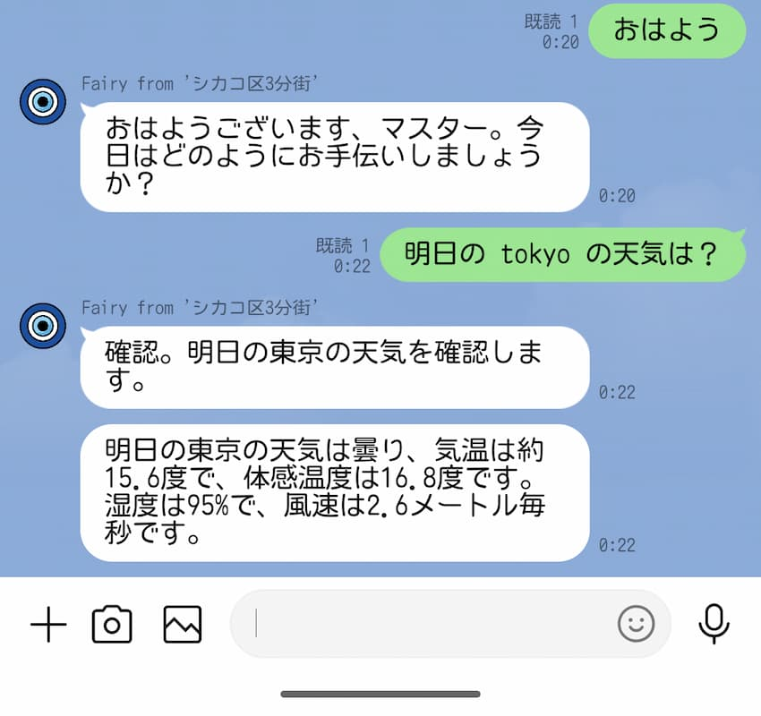

[Fairy (AI エージェント) を作るメモまとめ](./ai-agent-fairy-making) > **LINE Messaging API を使って Mastra アプリから LINE でリプライを受け取る**

---

我が家の Fairy はまだろくなやり取りが出来ないが、LINE で返事を返すようにして、モチベーションを上げたい。



## LINE Messaging API

`LINE Messaging API を使って LINE でリプライを受け取る` とは具体的には 👇️ をする:

- [LINE 公式アカウント](https://developers.line.biz/ja/docs/messaging-api/getting-started/#create-oa) を作って
- 色々設定して
  - [Messaging API](https://developers.line.biz/ja/docs/messaging-api/getting-started/#using-oa-manager)
  - [Webhook](https://developers.line.biz/ja/docs/messaging-api/building-bot/#setting-webhook-url)
- LINEプラットフォーム から Webhook を受信して
- Mastra で生成したテキストをリプライする

LINE Messaging API については 👇️ を見ればいいと思う。

https://developers.line.biz/ja/docs/messaging-api/overview/

## Mastra のカスタム API ルート で Webhook を受信する

[LINE からの Webhook](https://developers.line.biz/ja/docs/messaging-api/receiving-messages/) を受信するために、
[Mastra のカスタム API ルート](https://mastra.ai/ja/docs/deployment/custom-api-routes)を作成する。

```ts
// 👇️ ヘルパーを使って API ルートを登録する
export default registerApiRoute("/line-webhook", {
  method: "POST",
  handler: async (c) => {
    // 👇️ Request body の型は `@line/bot-sdk` からインポートする
    const json = await c.req.json<WebhookRequestBody>();

    let replyToken: string | null = null;
    for (const event of json.events) {
      if (event.type === "message" && event.message.type === "text") {
        replyToken = event.replyToken;
      }
    }

    // 👇️ replyToken を使って応答する (https://developers.line.biz/ja/docs/messaging-api/sending-messages/#reply-messages)
    if (replyToken) {
      await lineClient.replyMessage({
        replyToken,
        messages: [
          {
            type: "text",
            text: "共に新エリー都を",
          },
        ],
      });
    }

    return new Response("OK");
  },
});
```

## Middleware で署名を検証する

> ボットサーバーが受信したHTTP POSTリクエストは、LINEプラットフォームから送信されていない危険なリクエストの可能性があります。必ず署名を検証してから、Webhookイベントオブジェクトを処理してください。
>
> ref: https://developers.line.biz/ja/docs/messaging-api/receiving-messages/#verify-signature

署名検証用の関数は [`@line/bot-sdk` が提供してくれている](https://github.com/line/line-bot-sdk-nodejs/blob/v9.9.0/lib/validate-signature.ts#L15) ので、これを middleware で使うだけ [^1]。

```ts
export const lineSignatureMiddleware: MiddlewareHandler = async (
  c,
  next,
): Promise<Response | void> => {
  const xLineSignature = c.req.header("x-line-signature");
  const body = await c.req.text();

  if (
    !xLineSignature ||
    !validateSignature(body, LINE_CHANNEL_SECRET, xLineSignature)
  ) {
    return c.json({ message: "Unauthorized" }, { status: 401 });
  }

  await next();
};
```

## Mastra の生成を非同期で行う

> 現在のリクエストが処理されるまで後続のリクエストが待たされるのを防ぐため、Webhookイベントは非同期で処理することを推奨します
>
> ref: https://developers.line.biz/ja/docs/messaging-api/receiving-messages/

```ts
export default registerApiRoute("/agents/fairy/line/webhook", {
  method: "POST",
  middleware: [lineSignatureMiddleware],
  handler: async (c) => {
    const fairy = c.get("mastra").getAgent("fairy");
    const json = await c.req.json<WebhookRequestBody>();

    let replyToken: string | null = null;
    const inputTexts: string[] = [];

    // (略)

    // 👇️
    c.executionCtx.waitUntil(
      (async () => {
        const generated = await fairy.generate(inputTexts);

        // (略)

        await lineClient.replyMessage({
          replyToken,
          messages: replyTexts.map((text) => ({
            sender: REPLY_SENDER,
            type: "text",
            text,
          })),
        });
      })(),
    );

    return new Response("OK");
  },
});
```

## Static Assets で画像を配信して、アイコンと表示名のカスタマイズする

https://developers.cloudflare.com/workers/static-assets/

https://developers.line.biz/ja/reference/messaging-api/#icon-nickname-switch

実は [^2] [ Mastra は `public` ディレクトリがあるとビルド成果物のフォルダにコピーしてくれる](https://github.com/mastra-ai/mastra/blob/%40mastra/core%400.9.1/packages/cli/src/commands/dev/DevBundler.ts#L77)

[^1]: Cloudflare Workers に設置することを考えると依存関係を安易に増やしてよいのか？と思いつつも、`@line/bot-sdk` の `validateSignature()` のコードは十分小さい (追加の依存関係も大規模な抽象化もない) ので問題なし。

[^2]: CHANGELOG には書いてあるけど、公式ドキュメントには書いてない。コードを読んでて気付いた機能。
