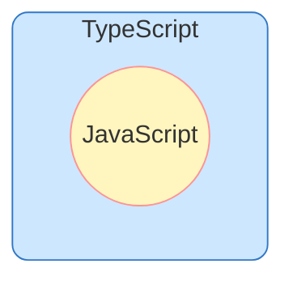
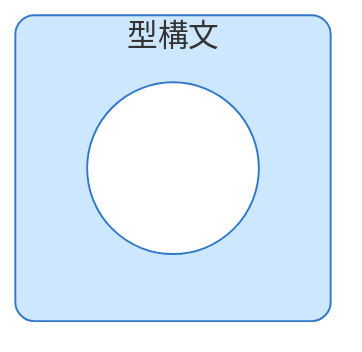
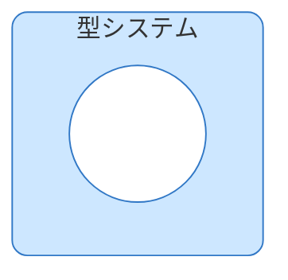

「xxx ができる」というアピールに対して実際にどれぐらいできるのか？を見る場合、xxx の塊のまま "できる/できない" を二者択一することはないと思う。
レベル感にはグラデーションがあるはずで、そのグラデーションは **「xxx ができる」の内側の"複数の期待値"** によって作られるはず。

"複数の期待値" とは以下のようなもの:

```
xxx ができるってことは、yyy の理解が深かったり、zzz の経験があったりするのかな？
```

私の場合、第一言語である「TypeScript (または JavaScript) ができる」というアピールからは離れられない (自分が言うことも、他人に言われることもある)。
「TypeScript/JavaScript ができる」とは具体的に「なにができる」ということなのかを理解するために、TypeScript/JavaScript の定義を確認して、"複数の期待値" を整理してみようと思う。

## TypeScript ってなに？

公式ドキュメント (https://www.typescriptlang.org/) から引用しながら、TypeScript の定義を確認する。

### 構文

> TypeScript is a language that is a superset of JavaScript: JS syntax is therefore legal TS.
>
> ref: [TypeScript for the New Programmer > A Typed Superset of JavaScript]()

- TypeScript は JavaScript のスーパーセットの言語
- JavaScript の構文は TypeScript の構文としても有効

「TypeScript は JavaScript の [superset (上位集合)](https://ja.wikipedia.org/wiki/%E9%83%A8%E5%88%86%E9%9B%86%E5%90%88) 」は以下のような図で表現できる。



「JavaScript (プログラミング言語) が TypeScript (プログラミング言語) に内包されている」とは「JavaScript の構文は TypeScript の構文としても有効」と言い換えられる。
以下のコードを例に考える。

```js
const obj = { width: 10, height: 15 };
console.log(obj.width * obj.height); // 150
```

このコードはJavaScript の構文として正しいため、[JavaScript として実行することができる](https://developer.mozilla.org/en-US/play?id=ME66yoes1BZZLGC6WYHPNnlLRAp4wRO6wqvngVAPvGNV3tMXmMvCYdgU4QzhY%2FyhqFC30KygeL9nRyHt)。
JavaScript の構文として正しいコードは TypeScript の構文としても正しいため、このコードは [JavaScript へ変換することができる](https://www.typescriptlang.org/play/?#code/MYewdgzgLgBCBGArGBeGBvGB3AlgEygAsAuGARgAYAaGQgUxwHNCpSyBWGAXwG4AoUJBAAbOgDphIRgAoEiMbgKEYAKjhIx9JiwCUPGAHoD5dhSA)[^1]。

### 型

> TypeScript is JavaScript with syntax for types.
>
> ref: https://www.typescriptlang.org/

- TypeScript はJavaScript に型の構文を追加したもの

前述の図の内、青色の範囲 (TypeScript から JavaScript を引いた[set difference (差集合)](https://ja.wikipedia.org/wiki/%E5%B7%AE%E9%9B%86%E5%90%88)) が型構文に相当する。
つまり、TypeScript と JavaScript の違いは型構文の有無と言える。



> TypeScript is a typed superset, meaning that it adds rules about how different kinds of values can be used.
>
> ref: [types](https://www.typescriptlang.org/docs/handbook/typescript-from-scratch.html#types)

- TypeScript は型付きの superset で、さまざまな種類の値の使用方法に関するルールを追加している。

型構文とは「値の使用方法に関するルール」のこと[^2]。
TypeScript は「JavaScript で記述した値の使い方を型で表現できる」言語と言える。

ただし TypeScript は JavaScript の superset のため、前述のような型を書いていない「ただの JavaScript のコード」でもよい。
以下のコードを例に考える。

```js
const obj = { width: 10, height: 15 };
console.log(obj.width * obj.takasa); // NaN
```

`obj` オブジェクトは `height` プロパティを持っているが、2行目の乗算で `takasa` プロパティを参照している。
このコードを [JavaScript として実行すると `NaN` が出力される](https://developer.mozilla.org/en-US/play?id=KiEw6r8cLuW8wIp%2FHM3WlLqEc1BdfOeJfS5F0gTlHaRDPoZil1n3dLYcKoWZp4L%2BZnT%2FuvlQ64%2B6N3q7)。
システムの仕様にもよるがおそらく `NaN` は期待値ではない。しかし JavaScript の構文としては正しいため、実行して計算結果を得ることができる。

一方、TypeScript は実行前 (JavaScript への変換時) に[型エラーがある(値を誤った方法で使用している)ことを報告してくれる](https://www.typescriptlang.org/play/?#code/MYewdgzgLgBCBGArGBeGBvGB3AlgEygAsAuGARgAYAaGQgUxwHNCpSyBWGAXwG4AoUJBAAbOgDphIRgAoEiMbgKEYAKjhIxUAIYBrLRC0BKHkA)。
上述のコードは型を全く書いていないが、TypeScript のコンパイラーは [型推論](https://www.typescriptlang.org/docs/handbook/type-inference.html) によって型の情報を手に入れられる。

### 型システム

> TypeScript offers all of JavaScript’s features, and an additional layer on top of these: TypeScript’s type system.
>
> ref: [TypeScript for JavaScript Programmers](https://www.typescriptlang.org/docs/handbook/typescript-in-5-minutes.html)

- TypeScript は JavaScript のすべての機能を提供し、さらにその上に TypeScript の型システムというレイヤーを追加する

JavaScript に追加するものの表現がバラついてて非常にややこしい[^3]が、型推論のことも考慮すると、以下のような図の方が正確かもしれない。



## 「TypeScript ができます」の意味

ここまでの情報をまとめると、「TypeScript ができます」に対する "複数の期待値" は以下のように表現できる:

- TypeScript ができます
  - JavaScript ができます
  - TypeScript の型システムが分かります

## JavaScript ってなに？

> JavaScript (JS) は軽量でインタープリター型（あるいは[実行時](https://ja.wikipedia.org/wiki/%E5%AE%9F%E8%A1%8C%E6%99%82%E3%82%B3%E3%83%B3%E3%83%91%E3%82%A4%E3%83%A9)コンパイルされる）[第一級関数](https://developer.mozilla.org/ja/docs/Glossary/First-class_Function)を備えたプログラミング言語です。
>
> ref: [mdn > JavaScript](https://developer.mozilla.org/ja/docs/Web/JavaScript)

ソースコードをどのように解釈して実行するかは実行環境([JavaScriptエンジン](https://ja.wikipedia.org/wiki/JavaScript%E3%82%A8%E3%83%B3%E3%82%B8%E3%83%B3))が決めることなので、プログラミング言語の説明文としてはちょっと変な気がする。
ちなみに V8 は [インタープリター・ JIT コンパイラー両方を内蔵している](<https://ja.wikipedia.org/wiki/V8_(JavaScript%E3%82%A8%E3%83%B3%E3%82%B8%E3%83%B3)>)。

JavaScript が第一級関数を備えているということは、superset である [TypeScript も同様に第一級関数を備えている](https://www.typescriptlang.org/play/?#code/MYewdgzgLgBAZiEMC8MAUBKFA+GBvAKBhlEhABsBTAOnJAHM0AiBEAIwEMAnJjAbgIBfAa0x8YAegkxAkJqAHU0BJDIH95QBSugdQZAZgyAfFUDODIC-FNQSA)(関数がその他の変数と同様に扱われる)。

> JavaScript はプロトタイプベースで、マルチパラダイムで、シングルスレッドで、動的な言語であり、オブジェクト指向、命令型、宣言型（関数プログラミングなど）といったスタイルに対応しています。
>
> ref: [mdn > JavaScript](https://developer.mozilla.org/ja/docs/Web/JavaScript)

JavaScript は動的型付け言語のため、実行時に変数にデータ型を割り当てる。
一方 [TypeScript は静的型付け言語](https://www.typescriptlang.org/docs/handbook/2/basic-types.html#static-type-checking)のため、実行前にデータ型を判定する。

### 実行環境

> [多くのブラウザー以外の環境](https://ja.wikipedia.org/wiki/JavaScript#%E3%81%9D%E3%81%AE%E4%BB%96%E3%81%AE%E7%92%B0%E5%A2%83%E3%81%A7%E3%81%AE%E5%88%A9%E7%94%A8)、例えば [Node.js](https://developer.mozilla.org/ja/docs/Glossary/Node.js) や [Apache CouchDB](https://couchdb.apache.org/) や [Adobe Acrobat](https://opensource.adobe.com/dc-acrobat-sdk-docs/acrobatsdk/) などでも使用されています。
>
> ref: [mdn > JavaScript](https://developer.mozilla.org/ja/docs/Web/JavaScript)

JavaScript を実行できる環境は様々なので、厳密にはどの環境の「JavaScriptができる」と言っているかで話が変わるはず。
...とは言っても、2024年時点では実質 Web ブラウザーと Node.js の 2 択だと思うし、[Chromium ベースのブラウザも Node.js も同じ JavaScript エンジン (V8) を使っている](<https://ja.wikipedia.org/wiki/V8_(JavaScript%E3%82%A8%E3%83%B3%E3%82%B8%E3%83%B3)>)ので、
言語・実行環境そのものに対する課題を解決する採用でもない限りここの差に注目する必要もない[^4]。

### 構成要素

> ウェブブラウザーの文脈で解釈されるこの「JavaScript」という包括的用語は、まったく異なる複数の要素を含んでいます。その要素とは、中核となるプログラミング言語（ECMAScript）、もう一つは DOM（Document Object Model）を含んだ [Web API](https://developer.mozilla.org/ja/docs/Web/API) 群です。
>
> ref: [mdn > JavaScript 技術概説](https://developer.mozilla.org/ja/docs/Web/JavaScript/JavaScript_technologies_overview)

「JavaScript」という用語の意味は実は少し広い。
JavaScript (意味が広い) のうち純粋なプログラミング言語の部分は ECMAScript という名前の言語に相当する。
「Web ブラウザーにおける JavaScript」はこの ECMAScript に加えて、Web ブラウザーが提供する様々な機能を呼び出すための API 群を含んだ概念を指している。

```
(Web ブラウザーにおける JavaScript) = (コア言語 (ECMAScript)) + (Web API)
```

> It is best known as the language embedded in web browsers but has also been widely adopted for server and embedded applications.
>
> ref: [ECMAScript® 2025 Language Specification](https://tc39.es/ecma262/)

ECMAScript はホスト環境に限定されないコア言語[^5]として標準化されている。
この標準に従ったプログラミング言語の組み込み先として一番有名なのが Web ブラウザーなだけであって、Web ブラウザー以外でも、例えば Node.js でも ECMAScript が組み込まれている。

> in the browser, we don't have all the nice APIs that Node.js provides through its modules, like the filesystem access functionality.
>
> ref: [Node.js — Differences between Node.js and the Browser](https://nodejs.org/en/learn/getting-started/differences-between-nodejs-and-the-browser)

ホスト環境が異なれば、JavaScript (意味が広い) のうち ECMAScript 以外の部分が異なる。Node.js であれば、[Node.js が提供する API 群](https://nodejs.org/docs/latest/api/documentation.html)が「Node.js における JavaScript」の一要素になる。

```
(Node.js における JavaScript) = (コア言語 (ECMAScript)) + (Node.js API)
```

## 「JavaScript ができます」の意味

ここまでの情報をまとめると、「JavaScript ができます」に対する “複数の期待値” は以下のように表現できる:

- JavaScript ができます
  - コア言語 (ECMAScript) が分かります
  - 実行環境が提供する API 群が分かります
    - Web ブラウザーの場合、 [Web API](https://developer.mozilla.org/ja/docs/Web/API) 群が分かります
    - Node.js の場合、[Node.js が提供する API 群](https://nodejs.org/docs/latest/api/documentation.html)が分かります
    - その他の環境

## 「TypeScript/JavaScript ができます」の意味 (まとめ)

| 粒度1                 | 粒度2                               | 粒度3                                                                                                            | 粒度4                                                                      |
| :-------------------- | :---------------------------------- | :--------------------------------------------------------------------------------------------------------------- | :------------------------------------------------------------------------- |
| TypeScript ができます | JavaScript ができます               | コア言語 (ECMAScript) が分かります                                                                               |                                                                            |
|                       | ├                                   | Web ブラウザーの場合、 [Web API](https://developer.mozilla.org/ja/docs/Web/API) 群が分かります                   | [DOM](https://developer.mozilla.org/ja/docs/Web/API/Document_Object_Model) |
|                       | │                                   | ├                                                                                                                | [Fetch API](https://developer.mozilla.org/ja/docs/Web/API/Fetch_API)       |
|                       | │                                   | └                                                                                                                | 略、要素が多すぎる                                                         |
|                       | └                                   | Node.js の場合、[Node.js が提供する API 群](https://nodejs.org/docs/latest/api/documentation.html)が分かります   | [File system](https://nodejs.org/docs/latest/api/fs.html)                  |
|                       |                                     | ├                                                                                                                | [Modules: ECMAScript modules](https://nodejs.org/docs/latest/api/esm.html) |
|                       |                                     | └                                                                                                                | 略、要素が多すぎる                                                         |
|                       | TypeScript の型システムが分かります | [Static type-checking](https://www.typescriptlang.org/docs/handbook/2/basic-types.html#static-type-checking)     |                                                                            |
|                       | ├                                   | [Non-exception Failures](https://www.typescriptlang.org/docs/handbook/2/basic-types.html#non-exception-failures) |                                                                            |
|                       | └                                   | 略、[要素が多すぎる](https://www.typescriptlang.org/docs/)                                                       |                                                                            |

ドキュメントに書いてある定義ベースで分解したので、この表はもともとの目的 (期待する要素を分解してレベル感を把握する) に対して大げさすぎたり、要素が不足している。
例えば、Web アプリケーションの開発者として ECMAScript (プログラミング言語の仕様) を隅々まで理解している必要は必ずしもなく(あってもいいけど)、MDN の[チュートリアル](https://developer.mozilla.org/ja/docs/Web/JavaScript#%E3%83%81%E3%83%A5%E3%83%BC%E3%83%88%E3%83%AA%E3%82%A2%E3%83%AB)や[リファレンス](https://developer.mozilla.org/ja/docs/Web/JavaScript/Reference)を参考に期待値を決めてよいと思う。
逆に現行の仕様だけでなく[提案(tc39/proposals)](https://github.com/tc39/proposals)に関心があれば、それも十分レベル感の把握の参考になるはず。

---

[^1]: 正確には「**エラーを発生させずに** TypeScript として JavaScript へ変換することができる」。なぜなら、TypeScript のコンパイラーは[不正な構文のコードでも JavaScript を出力する](https://www.typescriptlang.org/play/?#code/MYewdgzgLgBCBGArGBeGBvGB3AlgEygAsAuGARgAYAaGQgUxwHNCpSyBWAbgChRIQANnQB0AkIwAUCRMNwFCMAFRwkw+kxYBKTjAD0u8uwpA)。

[^2]: 正確には[もうちょっと複雑で、沢山勉強する必要がある概念](https://ja.wikipedia.org/wiki/%E5%9E%8B%E3%82%B7%E3%82%B9%E3%83%86%E3%83%A0)

[^3]: そもそもドキュメントを読みながら[定義](https://ja.wikipedia.org/wiki/%E5%AE%9A%E7%BE%A9)を確認しようとしている奴 (自分) が悪い。

[^4]: 実行環境のみに注目しているから注目するほどの差がないだけであって、後述の API を考慮したりすると差はめっちゃある。そして、そもそも解決する課題が全然違う。

[^5]: [MDN](https://developer.mozilla.org/ja/docs/Web/JavaScript/JavaScript_technologies_overview) でも [ECMA TC39](https://tc39.es/ecma262/) でも "コア言語" という呼び方をしている
