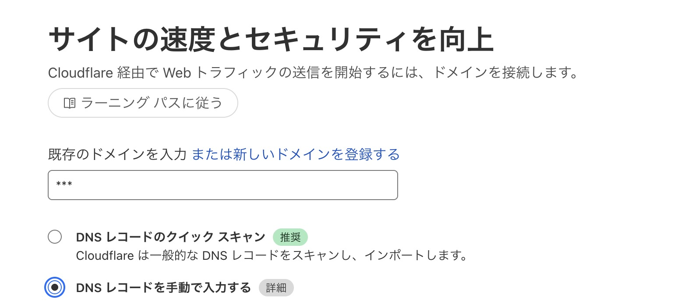
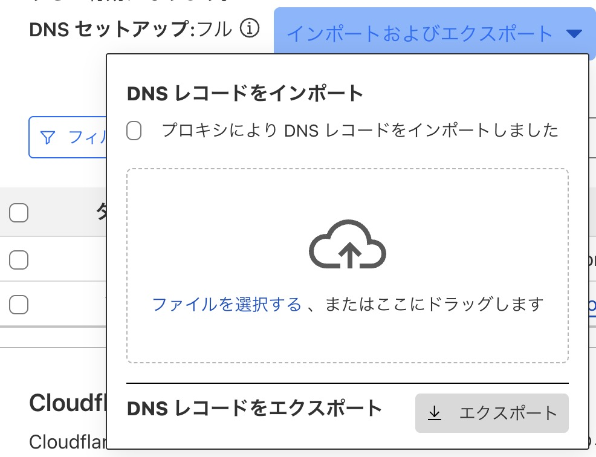
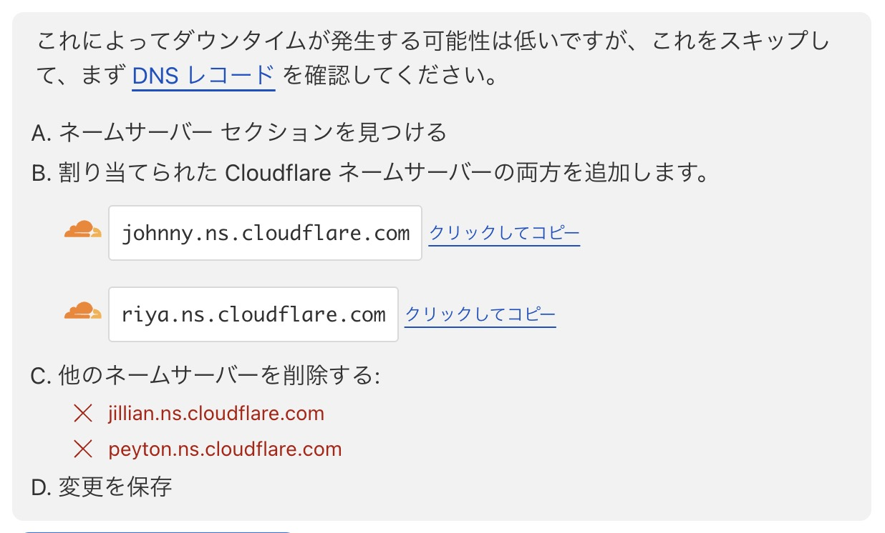
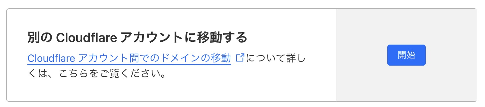
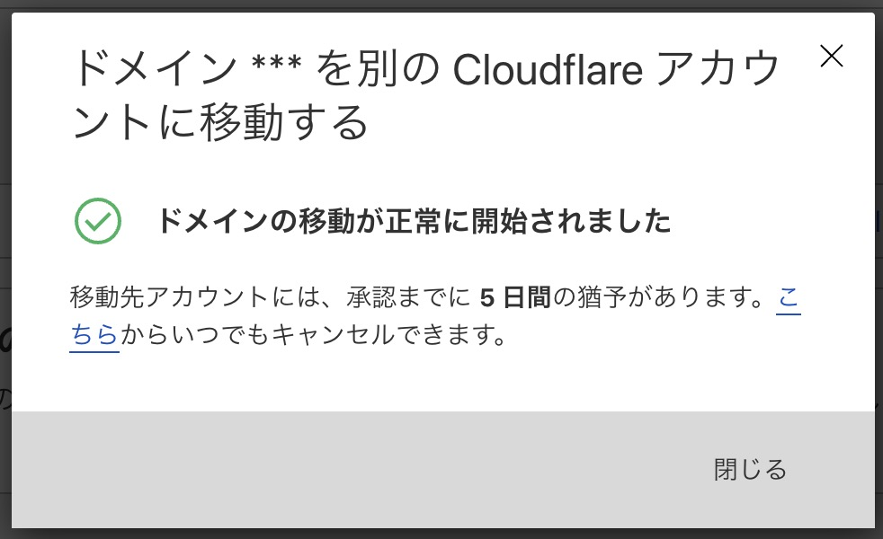
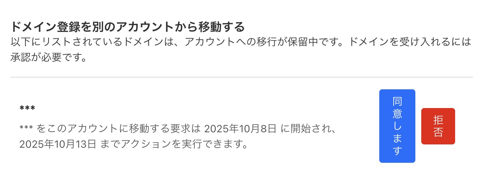

[いかんともしがたい事情](https://x.com/T28_tatsuya/status/1954478068002927073)により Cloudflare で管理しているドメインを別の Cloudflare アカウントに移動させる必要があったので、そのメモ。

## 別の Cloudflare アカウントに移動させる

### 新しいアカウントにドメインを追加する

#### ドメインを入力する



`DNS レコードのクイック スキャン` が推奨みたいだけれど、レコードを漏れなくスキャンしてくれる訳ではないので、
`DNS レコードを手動で入力する` にして後述のエクスポート・インポートをすればよいと思う。

#### プラン

お好み。

#### レコードの設定

ポチポチするのは面倒。 Cloudflare の DNS - レコード画面でエクスポート・インポートする。
コメントも含めて全部移行できる。さすが！



#### 最後のステップ: Cloudflare を有効にするにはネームサーバーを更新してください

ここまで来ると概要画面に残りのステップが出る。

1. DNS プロバイダー（ほとんどの場合、レジストラ）にログインします

   はい。

2. DNSSEC がオフになっていることを確認してください

   ~~見たことはあるけれど、未だによく分かっていない。 とりあえず、~~ はい。

3. 現在のネームサーバーを Cloudflare ネームサーバーに置き換える

   [カスタムネームサーバーは Business、Enterprise プランでのみ使える](https://developers.cloudflare.com/dns/nameservers/custom-nameservers/)ので、このステップはスキップ。

   

### 古いアカウントで移動を開始する

[アカウント間移動用の機能がある](https://developers.cloudflare.com/registrar/account-options/inter-account-transfer/)ので、古いアカウント側で新しいアカウント ID を入力する。



移動開始のためのメールが送信される。



新しいアカウント側で同意する。



### 新しいアカウントでアクティブになるのを待つ

割とすぐ！ (数分)

```shell
$ nslookup -type=NS ***
Server:     xxx
Address:    xxx

Non-authoritative answer:
***	nameserver = johnny.ns.cloudflare.com.
***	nameserver = riya.ns.cloudflare.com.
```

nameserver が更新されれば、新しいアカウントのドメインに名前解されるリクエストを飛ばせる！

## DNSSEC って何。

> ~~見たことはあるけれど、未だによく分かっていない。 とりあえず、~~ はい。

ってのを今日で止める。[Cloudflare のラーニングセンター](https://www.cloudflare.com/ja-jp/learning/dns/what-is-dns/)を読む。

そもそも DNS は

> ブラウザがインターネットリソースを読み込めるように、ドメイン名をIPアドレスに変換 ([ref](https://www.cloudflare.com/ja-jp/learning/dns/what-is-dns/))

するシステム。

> 多くのインターネットプロトコルと同様に、DNSシステムはセキュリティを考慮した設計がされていない ([ref](https://www.cloudflare.com/ja-jp/learning/dns/dns-security/))

ためDNSセキュリティ戦略が重要で Cloudflare の DNS サービスには

> DNSSEC、DDoS軽減、マルチDNS機能、負荷分散など、さまざまなセキュリティ機能 ([ref](https://www.cloudflare.com/ja-jp/learning/dns/dns-security/))

が組み込まれている。`セキュリティを考慮した設計がされていない` ことによる制限の１つとして、

> DNSは、与えられたアドレスをすべて受け入れてしまい ([ref](https://www.cloudflare.com/ja-jp/learning/dns/dnssec/how-dnssec-works/))

検証することが出来ない。

> DNSが応答を受け入れる前に資格情報をチェックしないという点

を悪用した

> Yahoo!、Hotmail、Gmailサーバーを通して送信されたはずのメールが、不正なメールサーバーを介してルーティング

した攻撃が過去に発生している。それの対策が DNSSEC というプロトコル。 DNSSECは

> Domain Name System Security Extensionsの略 ([ref](https://www.cloudflare.com/ja-jp/learning/dns/dns-cache-poisoning/))

で、

> DNSデータの整合性と発信元を検証する手段 ([ref](https://www.cloudflare.com/ja-jp/learning/dns/dns-cache-poisoning/))

である。

> 関連づけられた署名をチェックすることで、リクエストされたDNSレコードが権威ネームサーバーから送られたものであり、途中で改ざんされていない、中間者攻撃で注入された偽のレコードではないことを確認できます。 ([ref](https://www.cloudflare.com/ja-jp/learning/dns/dnssec/how-dnssec-works/))

この仕組みがない DNS は

> DNSキャッシュに偽情報を入力し、DNSは、正しくない応答を行い、ユーザーを間違ったWebサイトに接続 ([ref](https://www.cloudflare.com/ja-jp/learning/dns/dns-cache-poisoning/))

するDNSキャッシュポイズニング攻撃が成立する。 ちなみに DNSSEC は検証を行うだけなので、

> DNSSECは通信を暗号化しません。([ref](https://www.cloudflare.com/ja-jp/learning/dns/dns-over-tls/))

ユーザーのプライバシーの保護の観点では DNS クエリを暗号化する必要がある。DNS だけでは

> DNSクエリは平文でインターネット上を移動します。つまり、クエリーを傍受した人は誰でも、そのユーザーがどのWebサイトを訪問したかを見ることができます。 ([ref](https://www.cloudflare.com/ja-jp/learning/dns/dns-security/))

そのため、DNS over TLS および DNS over HTTPS で

> 外部から読み取られないようにDNSクエリーを暗号化する ([ref](https://www.cloudflare.com/ja-jp/learning/dns/dns-security/))

ことも重要。
