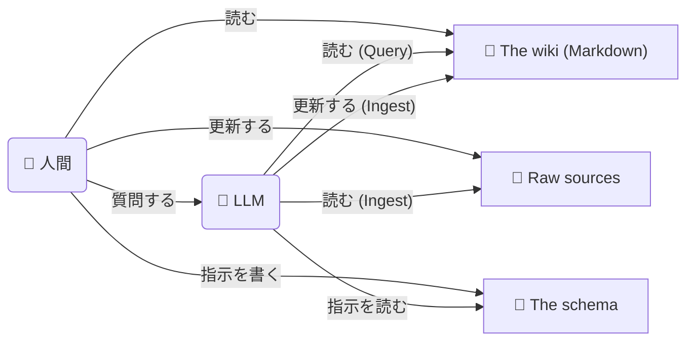

「LLM 時代だし、文書 [^1] も Markdown で書くか〜」となっていたところ、
"[Open Knowledge Format](https://cloud.google.com/blog/products/data-analytics/how-the-open-knowledge-format-can-improve-data-sharing?hl=en)" という
[ナレッジを表現する形式](https://cloud.google.com/blog/ja/products/data-analytics/how-the-open-knowledge-format-can-improve-data-sharing/#:~:text=%E6%AC%A0%E3%81%91%E3%81%A6%E3%81%84%E3%82%8B%E3%81%AE%E3%81%AF%E5%BD%A2%E5%BC%8F%E3%81%A7%E3%81%82%E3%82%8A%E3%80%81%E5%88%A5%E3%81%AE%E3%82%B5%E3%83%BC%E3%83%93%E3%82%B9%E3%81%A7%E3%81%AF%E3%81%AA%E3%81%84)を知った。
パっと見良さげなので色々まとめておく。

GCP のブログ記事では

> OKF v0.1 は出発点であり、完成した標準ではありません。

とのことだが、この記事執筆時点では [v0.2 になってドラフトも取れていた](https://github.com/GoogleCloudPlatform/knowledge-catalog/blob/3fcbb9f828c2f23d109c855ee403c3a4c81f3a96/okf/SPEC.md)。

## LLM Wiki

まずは OKF のベースである [LLM Wiki](https://gist.github.com/karpathy/442a6bf555914893e9891c11519de94f) をさらっておく。

> LLM-wiki パターンを移植可能で相互運用可能な形式にするオープン仕様である Open Knowledge Format（OKF）をご紹介します。

### コアアイデア

ref: <https://gist.github.com/karpathy/442a6bf555914893e9891c11519de94f#the-core-idea>

仕組みを導入していない場合、LLM へタスクを依頼するたびに LLM は (場合によっては RAG で) 関連する情報を検索する。
しかし、その検索結果を読んで統合するプロセスの成果は保存されない。
そのため次に同じような質問が来たときは、再度検索・統合作業を一から行う必要がある。

一方 LLM Wiki では LLM は生の情報源からではなく、構造化された、また相互リンクされた Markdown ファイルの集合から読み取る。
LLM が wiki を段階的に構築・メンテナンスするため、人間が wiki を書くことはほとんどない。
人間が新しい情報源を追加すると、LLM は重要な情報、あるいは矛盾した情報を抽出して既存の wiki に統合する。

### アーキテクチャ

ref: <https://gist.github.com/karpathy/442a6bf555914893e9891c11519de94f#architecture>

LLM Wiki には 3 つのレイヤーがある:

- **Raw sources**: 人間が選別した、記事・論文・画像・データなどの情報源。LLM はこれを読み取るが、変更しない。
- **The wiki**: LLM が更新する Markdown ファイルとディレクトリ。人間はこれを読むだけ。
- **The schema**: CLAUDE.md や AGENTS.md のこと。LLM Wiki のメンテナとして必要な LLM への指示を書く。

### オペレーション

ref: <https://gist.github.com/karpathy/442a6bf555914893e9891c11519de94f#operations>

LLM Wiki では 3つのオペレーションが発生する:

- **Ingest**: 人間が新しいソースを追加して、LLM が読んで、人間と LLM が話し合い、LLM が Mardown を更新する。
- **Query**: 人間が LLM に質問して、LLM が Markdown から回答を生成し、優れた回答は保存する。
- **Lint**: LLM が LLM Wiki の健全性をチェックする。

### LLM Wiki の概念図

前述のアーキテクチャとオペレーションの各要素を図にまとめると以下のようになる。



## 移植可能性と相互運用性

前述の通り、OKF は LLM Wiki を

- 移植可能 (Portable, どこでも動く)
- 相互運用可能 (Interoperable, 誰が作っても読める)

な形式にするオープン仕様である。

LLM Wiki がこららの性質を考慮していなかったというと、そうでもない。
[任意のエージェントで使える前提があり](https://gist.github.com/karpathy/442a6bf555914893e9891c11519de94f#the-core-idea:~:text=it%20is%20designed%20to%20be%20copy%20pasted%20to%20your%20own%20LLM%20Agent)、
[CLI を使って検索機能を導入してもよい](https://gist.github.com/karpathy/442a6bf555914893e9891c11519de94f#optional-cli-tools)。
LLM Wiki は具体的な手法ではなく概念を説明するものなので[意図的に抽象的に書かれている](https://gist.github.com/karpathy/442a6bf555914893e9891c11519de94f#optional-cli-tools:~:text=This%20document%20is%20intentionally%20abstract.)。
しかし LLM Wiki の Gist 本文に具体的な手法が記載されていない分、コメントには様々な具体的な手法・ツールの提案が寄せられている。
具体的なツールを前提にすると「どこでも動く」「誰が作っても読める」ものにならない。OKF ではこれらを解決するために[最低限の規約](https://cloud.google.com/blog/ja/products/data-analytics/how-the-open-knowledge-format-can-improve-data-sharing/#:~:text=%E3%81%A4%E3%81%AE%E5%8E%9F%E5%89%87-,1.%20%E5%88%B6%E9%99%90%E3%81%8C%E6%9C%80%E5%B0%8F%E9%99%90,-%E3%80%82OKF%20%E3%81%A7)を導入する **...んだと思う、多分、書いていないから想像である**。

## Open Knowledge Format

[`SPEC.md` はちょっと大きい](https://github.com/GoogleCloudPlatform/knowledge-catalog/blob/3fcbb9f828c2f23d109c855ee403c3a4c81f3a96/okf/SPEC.md) ので、
この節では紹介ブログ記事 ([Open Knowledge Format のご紹介](https://cloud.google.com/blog/ja/products/data-analytics/how-the-open-knowledge-format-can-improve-data-sharing/)) を参照しつつ、OKF の概要をまとめる。

OKF は

> ベンダーに依存しない、エージェントと人間にとって扱いやすい標準

を目指している [^2]。
OKF は YAML フロントマターを含む Markdown ファイルをディレクトリで構造化することで、ナレッジを表現する。
ランタイムや SDK は不要なため、さまざまなエージェントが変換なしで利用できる。

OKF の最小単位が「コンセプト」で、1 つの Markdown ファイルに 1 つの「コンセプト」が記述される。
「コンセプト」として書き起こすものは何でもよい:

- テーブル
- データセット
- 指標
- ハンドブック
- ランブック
- API など

```
orders.md
```

この Markdown ファイルはディレクトリで構造化され、ファイルパスが「コンセプト」の ID になる。

```
sales/tables/orders.md
```

「コンセプト」Markdown ファイルは YAML フロントマター と Markdown 本文で構成される。
OKF は「YAML フロントマターに `type` フィールドを必須で書く」ことのみを規定している。
どのような `type` があるか、他にどのようなフィールドを書くか、本文にどのようなセクションを設けるかなどはナレッジを作成する側(プロデューサー)に委ねられている。

「コンセプト」は通常の Markdown リンクで相互にリンクを貼れる。これによってディレクトリによる単純な親子関係以上の多様な関係が表現できる。

```markdown
---
type: BigQuery Table
---

# Schema

| Column        | Type   | Description                              |
| ------------- | ------ | ---------------------------------------- |
| `order_id`    | STRING | Globally unique order identifier.        |
| `customer_id` | STRING | FK to [customers](/tables/customers.md). |

# Joins

## Joined with [customers](/tables/customers.md) on `customer_id`.
```

「コンセプト」を表現する Markdown ファイルの集合が「OKF バンドル」であり、これが文章化されたナレッジそのものに相当する。

「OKF バンドル」には、必要に応じて、

- index.md ファイル: エージェントが階層をナビゲートする際の段階的な開示用
- log.md ファイル: 変更の時系列履歴用

を含められる。

```
sales/
├── index.md
├── datasets/
│   ├── index.md
│   └── orders_db.md
├── tables/
│   ├── index.md
│   ├── orders.md
│   └── customers.md
├── metrics/
│   ├── index.md
│   └── weekly_active_users.md
```

[^1]: 本業の環境では Confluence を使っている。

[^2]: 「標準です」と言い切るには、まだ時期尚早。まだ v0.2 だし、 draft 取れたばっかりだし。
