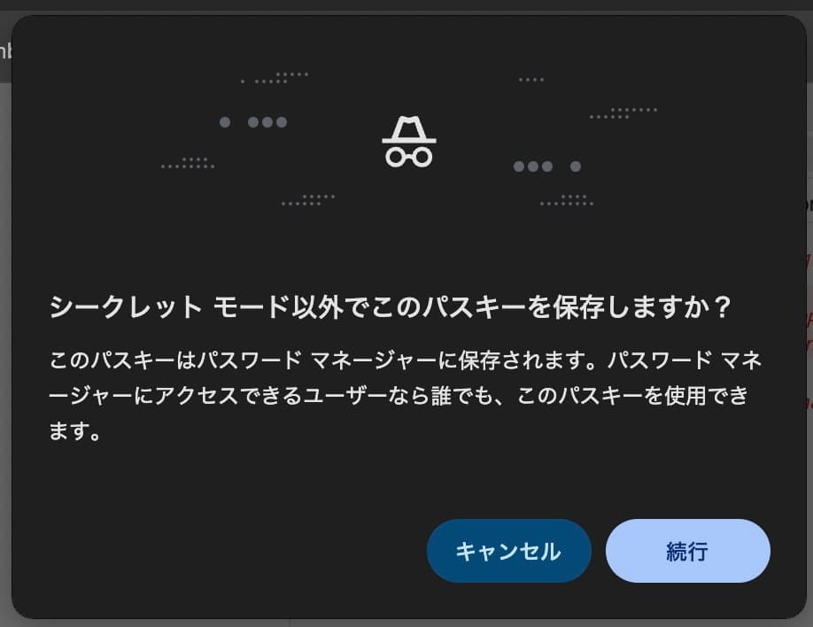

パスキーの仕様などを読んで無事頭でっかちになったため、パスキーの登録・認証を行うサンプルアプリを作ってみた。

<http://github.com/TatsuyaYamamoto/passkeys-sample>

ちなみに WebAuthn では登録・認証のプロセスを以下のように命名している。

- 公開鍵を作成してそれをユーザーに関連付けるプロセス 👉️ [`Registration Ceremony`](https://www.w3.org/TR/webauthn-3/#registration-ceremony)
- 登録済みの公開鍵の秘密鍵をユーザーが管理していることを証明するプロセス 👉️ [`Authentication Ceremony`](https://www.w3.org/TR/webauthn-3/#authentication-ceremony)

## コンポーネント

登録・認証を実現するのに必要な[コンポーネントは4つ](https://web.dev/articles/passkey-registration?hl=ja#:~:text=%E3%83%91%E3%82%B9%E3%82%AD%E3%83%BC%E7%99%BB%E9%8C%B2%E3%83%95%E3%83%AD%E3%83%BC%E3%81%AE%204%20%E3%81%A4%E3%81%AE%E3%82%B3%E3%83%B3%E3%83%9D%E3%83%BC%E3%83%8D%E3%83%B3%E3%83%88%E3%81%AF%E6%AC%A1%E3%81%AE%E3%81%A8%E3%81%8A%E3%82%8A%E3%81%A7%E3%81%99)。

- **バックエンド**のアプリケーションがパスキーの登録に必要なデータを作成したり、公開鍵を保存する。
- **フロントエンド**のアプリケーションがブラウザと通信したり、バックエンドへ公開鍵を送信する。
- **ブラウザ**が WebAuthn API を介してフロントエンドと通信したり、CTAP2 を介してパスキープロバイダとやりとりする。
- **パスキープロバイダ** (たとえば Google パスワードマネージャー)がパスキーを作成したり、秘密鍵を保存する。

仮に Chrome のシークレットブラウザでパスキーを登録しようとすると、パスキープロバイダへのアクセスを求められる。



バックエンド・フロントエンドは [web.dev でも紹介されている](https://developers.google.com/identity/passkeys/developer-guides/server-registration?hl=ja) [`SimpleWebAuthn`](https://github.com/MasterKale/SimpleWebAuthn/tree/v13.3.0) を使って実装する。

ArrayBuffer な値を WebAPI で使える Base64 に変換 (またはその逆) をしてくれたりと、

https://github.com/MasterKale/SimpleWebAuthn/blob/v13.3.0/packages/browser/src/methods/startRegistration.ts#L48

## パスキーを登録する (Registration Ceremony)

### フロントエンドが `PublicKeyCredentialCreationOptions` を要求する

Web アプリ上のボタンなどでパスキーの作成を開始する。

`PublicKeyCredentialCreationOptions` は[仕様として定義されている型](https://www.w3.org/TR/webauthn-3/#dictdef-publickeycredentialcreationoptions)で、
[WebAuthn を使って公開鍵を作成するため](https://developer.mozilla.org/en-US/docs/Web/API/PublicKeyCredentialCreationOptions)に使う。

このサンプルではこのタイミングで `userId` を送信しているが、既にログインセッションがあって user が分かっている状態で開始するのが一般的だと思う。

```ts
const handleRegistration = async () => {
  const optionsJson = await postJson("/api/webauthn/registration/options", {
    userId,
  });
  // 省略
};
```

### バックエンドが `PublicKeyCredentialCreationOptions` を返す

バックエンドは `userId` を元に `generateRegistrationOptions()` で `PublicKeyCredentialCreationOptionsJSON` を作る。

~JSON になっているのは、関数内部で作成された ArrayBuffer 型のプロパティを持つ `PublicKeyCredentialCreationOptions` を [WebAPI で使える文字列に変換している](https://github.com/MasterKale/SimpleWebAuthn/blob/v13.3.0/packages/server/src/registration/generateRegistrationOptions.ts#L206)から。

`challenge` は [WebAuthn の仕様に従って](https://www.w3.org/TR/webauthn-3/#sctn-cryptographic-challenges)バックエンドで保存しておく。

```ts
app.post("/api/webauthn/registration/options", async (c) => {
  const { userId } = await c.req.json<{ userId: string }>();

  const passKeys = passKeyTable.get(userId) ?? [];

  const options = await generateRegistrationOptions({
    rpName,
    rpID,
    // userHandle を固定することで、同じデバイスへの再登録時に古いパスキーが上書きされる
    // https://www.w3.org/TR/webauthn-3/#sctn-user-handle-privacy
    // It is RECOMMENDED to let the user handle be 64 random bytes
    // https://www.w3.org/TR/webauthn-3/#user-handle
    // a user handle is an identifier for a user account, specified by the Relying Party as user.id during registration
    // userID: crypto.getRandomValues(new Uint8Array(64)),
    userName: userId,
    attestationType: "none",
    excludeCredentials: passKeys.map((passkey) => ({
      id: passkey.id,
      transports: passkey.transports,
    })),
    authenticatorSelection: {
      residentKey: "preferred",
      userVerification: "preferred", // デフォルトは "preferred" です。
      authenticatorAttachment: "platform",
    },
    // W3C spec 推奨
    // https://developers.google.com/identity/passkeys/developer-guides/server-authentication?hl=en#create_the_challenge:~:text=The%20recommended%20default%20value%20is%205%20minutes
    // ブラウザが上書きしうる timeout
    // https://www.w3.org/TR/webauthn-3/#dom-publickeycredentialcreationoptions-timeout
    timeout: 300_000, // 5分
  });

  // チャレンジをセッションに保存する
  // 参考: https://developers.google.com/identity/passkeys/developer-guides/server-registration?hl=ja#example_code_create_credential_creation_options
  sessionMap.set(userId, {
    challenge: options.challenge,
  });

  return c.json(options);
});
```

### ブラウザがパスキーを作成する

バックエンドから受け取った `PublicKeyCredentialCreationOptionsJSON` を `startRegistration()` に渡してパスキーを作成する。

[`startRegistration` は内部で `navigator.credentials.create()` を呼んでおり](https://github.com/MasterKale/SimpleWebAuthn/blob/v13.3.0/packages/browser/src/methods/startRegistration.ts#L79)、
この API が実際にモーダルダイアログを表示し、ユーザーの操作を待ち、新しいパスキーを作成する。

```ts
const handleRegistration = async () => {
  // (省略)
  let registrationResponse;
  try {
    registrationResponse = await startRegistration({
      optionsJSON: optionsJson, // 👈️ サーバーから受け取った options
    });
  } catch (e) {
    // (省略)
  }

  const verifiedResponse = await postJson("/api/webauthn/registration/verify", {
    userId,
    response: registrationResponse,
  });
  if (verifiedResponse.ok) {
    alert("登録成功。");
  }
};
```

#### エラーハンドリング

当然いくつかのエラーケースがあり、[仕様としても定義されている](https://www.w3.org/TR/webauthn-3/#sctn-create-request-exceptions)。
面白い（？）のは `InvalidStateError` で、これは「デバイスにパスキーが既にある」ことを表現しており、[サイトはこれをエラーとして扱うべきではない](https://web.dev/articles/passkey-registration?hl=ja#save-public-key)。

```ts
try {
  registrationResponse = await startRegistration({ optionsJSON });
} catch (e) {
  if (e instanceof Error) {
    console.error("[browser] registration options error: ", {
      ...e,
      message: e.message,
    });
  }

  if (e instanceof WebAuthnError) {
    if (e.code === "ERROR_AUTHENTICATOR_PREVIOUSLY_REGISTERED") {
      alert("この端末は登録済みです。");
      return;
    }
  }

  if (e instanceof WebAuthnError) {
    if (e.code === "ERROR_PASSTHROUGH_SEE_CAUSE_PROPERTY") {
      alert("キャンセルされました。");
      return;
    }
  }
  return;
}
```

### バックエンドでパスキーを保存する

## パスキーで認証する (Authentication Ceremony)

### ブラウザが options を取得する

```ts
const handleAuthentication = async () => {
  const optionsJson = await postJson("/api/webauthn/authentication/options", {
    userId,
  });
  // (省略)
};
```

### バックエンドが options を返す

### ブラウザが送信する

```ts
const handleAuthentication = async () => {
  // 省略
  let authenticationResponse;
  try {
    authenticationResponse = await startAuthentication({
      optionsJSON: optionsJson, // 👈️ サーバーから受け取った options
    });
  } catch (e) {
    // (省略)
  }

  const verifiedResponse = await postJson(
    "/api/webauthn/authentication/verify",
    {
      userId,
      response: authenticationResponse,
    },
  );
};
```

#### エラーハンドリング

```ts
try {
  authenticationResponse = await startAuthentication({ optionsJSON });
} catch (e) {
  if (e instanceof WebAuthnError) {
    console.error("[browser] authentication verify error: ", {
      ...e,
      message: e.message,
    });
  }
  if (e instanceof WebAuthnError) {
    if (e.code === "ERROR_PASSTHROUGH_SEE_CAUSE_PROPERTY") {
      alert("キャンセルされました。");
      return;
    }
  }
  return;
}
```

### バックエンドが検証する
