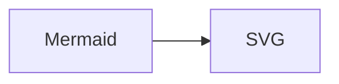
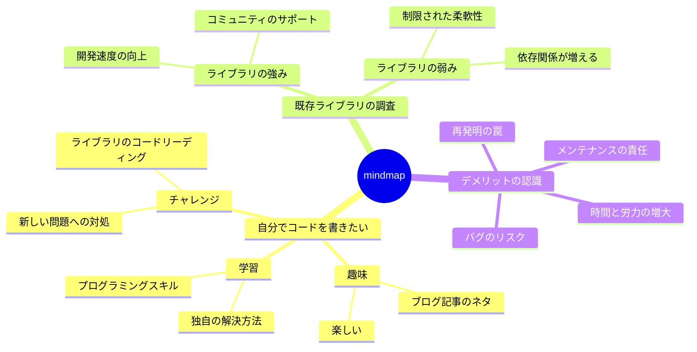

Astro 製のブログ (というか、ここ) で [Mermaid](https://mermaid.js.org/) のダイアグラムを描画したくなりました。

````markdown

````

👆って書くと


👆ってなりたい。

## JavaScript を消したい

[せっかく Astro を使っているので](https://docs.astro.build/en/basics/astro-components/)ビルド成果物に Mermaid の JavaScript を含めたくない。
つまりビルドタイムで Mermaid のコードブロックを SVG に変換して HTML を出力したい。

## 実現手段の検討

### Astro の組み込み機能

公式ドキュメント内には[言及なし](https://github.com/search?q=repo%3Awithastro%2Fdocs+path%3A%2F%5Esrc%5C%2Fcontent%5C%2Fdocs%5C%2F%2F+mermaid&type=code)。
[Issue で状況](https://github.com/withastro/astro/issues?q=mermaid)を確認してみると、Mermaid のシンタックスハイライトに関する issue はあった
([Markdown mermaid is not supported #4433](https://github.com/withastro/astro/issues/4433)) けれど、Mermaid のコードをもとにダイアグラムを描画をする議論はなかった。

### remark/rehype のプラグイン

Astro の markdown 機能は remark (と rehype) で構築されていて[プラグインもサポートしている](https://docs.astro.build/en/guides/markdown-content/#markdown-plugins)ので、プラグインで Mermaid を描画出来ないか調べてみる。

#### [temando/remark-mermaid](https://github.com/temando/remark-mermaid)

- 🥰 [Mermaid 製の `mermaid.cli`](https://www.npmjs.com/package/mermaid.cli) を使っている
- 🤔 肝心の `mermaid.cli` は deprecated

#### [remcohaszing/remark-mermaidjs](https://github.com/remcohaszing/remark-mermaidjs)

- 🥰 (依存関係の [remcohaszing/mermaid-isomorphic](https://github.com/remcohaszing/mermaid-isomorphic) が) mermaid を実行している
- 🤔 mermaid が公開している API ([`renderMermaid()`](https://github.com/mermaid-js/mermaid-cli/blob/10.8.0/src/index.js#L232) を使っていない
  - 依存関係の [remcohaszing/mermaid-isomorphic](https://github.com/remcohaszing/mermaid-isomorphic) は [playwright](https://playwright.dev/) でブラウザを起動しつつ、Mermaid の js を script tag で読み込ませている

#### [southball/unist-remark-plugins - remark-mermaid](https://github.com/southball/unist-remark-plugins/tree/main/remark-mermaid)

- 🥰 [Mermaid 製の `mermaid-cli`](https://www.npmjs.com/package/@mermaid-js/mermaid-cli) を使って出力している
- 🤔 mermaid が公開している API ([`renderMermaid()`](https://github.com/mermaid-js/mermaid-cli/blob/10.8.0/src/index.js#L232) を使っていない
  - `child_process.exec` で CLI を直接実行している

## 結論: `mermaid-cli` を動かす plugin を自分で作る

~~多少気になることがあっても自分で実装しないのが一番幸せな気もするけれど~~、 Mermaid を実行する remark plugin を作って astro.config.ts で読み込むようにしました。[TatsuyaYamamoto/t28.dev#64](https://github.com/TatsuyaYamamoto/t28.dev/pull/64)

- (1) Markdown 内の Mermaid のコードブロックを見つけて
- (2) Puppeteer の Browser インスタンスを作って
- (3) [mermaid-cli](https://github.com/mermaid-js/mermaid-cli) が公開している [`renderMermaid()`](https://github.com/mermaid-js/mermaid-cli/blob/10.8.0/src/index.js#L232) で Mermaid の描画を行って
- (4) コードブロックを SVG要素を描画する html node で上書きする

```ts
export const mermaidRemarkPlugin: RemarkPlugin = () => {
  return async (root) => {
    // (1)
    const mermaidCodeBlocks: MermaidCodeBlock[] = [];

    // 超省略

    // (2)
    const browser = await puppeteer.launch({
      headless: true,
    });

    await Promise.all(
      mermaidCodeBlocks.map(async ({ code, index, parent }, blockIndex) => {
        // (3)
        const { data: svgBuffer } = await renderMermaidCli(
          browser,
          code.value,
          "svg",
        );

        // 超省略

        // (4)
        parent.children[index] = svgNode;
      }),
    );

    // 超省略
  };
};
```


