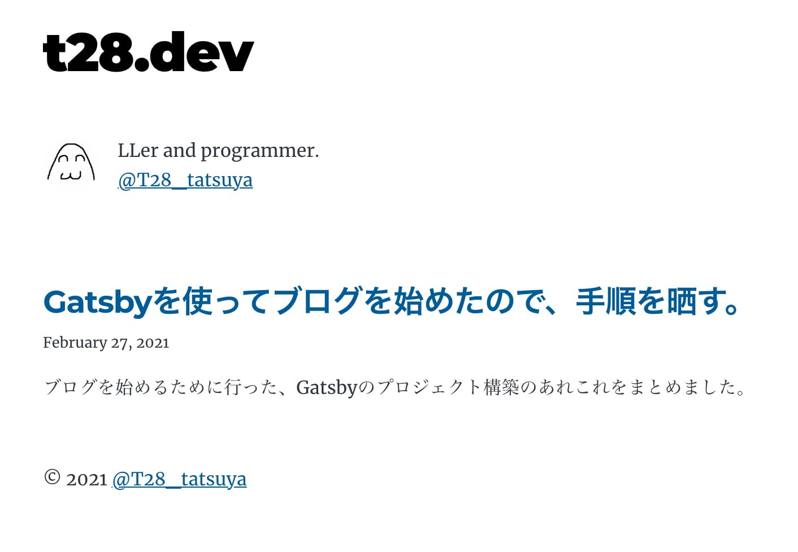

↓ ([ここ](/)) を Gatsby で作ったので、↓ の状態へ持っていくまでの手順を晒します。



"↑ の状態"とは、サイト構築の最低限の準備として

- Markdown でブログ記事を書く
- TypeScript で React コンポーネントを書く
- ESLint
- Google Analytics
- Custom Domain, https

が出来る状態です。

## なんで Gatsby?

🤔 React で実装しよ => 😊 💻 `npx create-next-app` ...な、脳死状態に喝を入れたかったので。

Next.js 以外という意味では、Nuxt.js やら まだ名も知らない Static Site Generator やら...
そもそもブログだけなら自前で作らないパターン(はてぶ、Note、Notion...)も無くはなかったですが...まぁいいよね。

## 構築までにやったこと

1. Gatsby をお勉強
1. starter から project を作る
1. TypeScript 対応
1. ESLint 対応
1. Google Analytics 対応
1. 画像入れ替え・metadata 書き換え
1. Gatsby Cloud, Netlify の設定

### Gatsby をお勉強

[公式ドキュメント](https://www.gatsbyjs.com/docs/) を眺めました。
特に、[recicpes](https://www.gatsbyjs.com/docs/recipes/) がざっくり知るには良いページなのですが、
なぜか左メニューから到達できないので、知らない人も多いかも...。(読んだ所感は別記事にまとめよう)

Gatsby が謳う **[the power of 2000+ plugins](https://www.gatsbyjs.com)** と **build-in な機能** におんぶにだっこになって、
最初はシンプルに構築(自前実装・設定を極力少なく)していくことにしました。~~ただの Gatsby 開発?~~

イケてる見た目も後回し。

### starter から project を作る

[commit/b2296cc](https://github.com/TatsuyaYamamoto/t28.dev/commit/b2296cc0af8e8470259bdcea5b82e74a7d0d7f8f)

公式が提供している [starter](https://www.gatsbyjs.com/starters/) (boilerplate) から、[gatsby-starter-blog](https://www.gatsbyjs.com/starters/gatsbyjs/gatsby-starter-blog) を選びました。
community 製のつよつよ blog 用 starter も多くありましたが、その分最初の実装もモリモリになるので、シンプルに...。

[gatsby-starter-blog](https://www.gatsbyjs.com/starters/gatsbyjs/gatsby-starter-blog) のおかげ(正確には[このへん](https://github.com/TatsuyaYamamoto/t28.dev/commit/b2296cc0af8e8470259bdcea5b82e74a7d0d7f8f#diff-b5e305780d9d473da97c61beab8bc36e5e8871b360942e4686c9b20d8c5d4cfa) とか、[このへん](https://github.com/TatsuyaYamamoto/t28.dev/commit/b2296cc0af8e8470259bdcea5b82e74a7d0d7f8f#diff-b5e305780d9d473da97c61beab8bc36e5e8871b360942e4686c9b20d8c5d4cfaR15-R50) )で、
Markdown を書くだけでブログ記事ページを追加出来るようになりました 😊

### TypeScript 対応

[commit/3f02a7](https://github.com/TatsuyaYamamoto/t28.dev/commit/3f02a7af9404768a84744d49b16906fbd638c42c), [commit/bb3aea](https://github.com/TatsuyaYamamoto/t28.dev/commit/bb3aead6853bdb36c914cfe14497f5d43c2d5835)

#### transpile 出来るようにする

公式ドキュメント([TypeScript and Gatsby](https://www.gatsbyjs.com/docs/how-to/custom-configuration/typescript/)) の通り、拡張子を`.tsx`に変えるだけで TypeScript で実装が出来ます。
build-in な`gatsby-plugin-typescript`のおかげ。

```bash
$ npm ls gatsby-plugin-typescript
t28.dev@0.1.0
└─┬ gatsby@2.32.6
  └── gatsby-plugin-typescript@2.12.1
```

#### GraphQL のクエリ結果を型解決する

コンポーネントは type-safe になりましたが、[GraphQL で取得した data の型が `object` のまま](https://github.com/gatsbyjs/gatsby/blob/gatsby%402.32.0/packages/gatsby/index.d.ts#L66) でツラい...ので、
[gatsby-plugin-typegen](https://www.gatsbyjs.com/plugins/gatsby-plugin-typegen/)を導入して、graphql の query から 型情報を出力するようにします。

`gatsby-plugin-typescript` は babel を使って transpile をしているため、[いくつかの制限があります](https://github.com/gatsbyjs/gatsby/blob/master/packages/gatsby-plugin-typescript/README.md#caveats)。
これらを解決するために **typescript をインストール, tsconfig.json の設置を行います**。

~~いきなり built-in 以外の機能を入れてるじゃねえか~~

typescript のおかげで、[gatsby-plugin-typegen](https://www.gatsbyjs.com/plugins/gatsby-plugin-typegen/) が出力する `namespace GatsbyTypes` を解決したり、

```js
// index.tsx
const BlogIndex: React.FC<PageProps<GatsbyTypes.BlogIndexQuery>> = ({
  data,
  location,
}) => {};
```

型チェックが行えるようになりました 😇

```json
// package.json
"type-check": "tsc --noEmit"
```

### ESLint

[commit/481b35a](https://github.com/TatsuyaYamamoto/t28.dev/commit/481b35a2bfc5e11f3340fec46230dea459d86e1a)

公式ドキュメント ([Using ESLint](https://www.gatsbyjs.com/docs/how-to/custom-configuration/eslint/)) が

> For most users, our built-in ESLint setup is all you need.

と言っている通り、Gatsby は ESLint に依存しており、

```bash
npm ls eslint
t28.dev@0.1.0
└─┬ gatsby@2.32.6
  └── eslint@6.8.0
```

ESLint 用 config も構築しており ([gatsby@2.32.0 / eslint-config.ts](https://github.com/gatsbyjs/gatsby/blob/gatsby%402.32.0/packages/gatsby/src/utils/eslint-config.ts)) 、
**/\.jsx?$/** の範囲([gatsby@2.32.0 / webpack-utils.ts](https://github.com/gatsbyjs/gatsby/blob/gatsby%402.32.0/packages/gatsby/src/utils/webpack-utils.ts#L488-L497)) で、ESLint を実行するように eslint-loader を設定しています( [gatsby@2.32.0 / webpack-utils.ts](https://github.com/gatsbyjs/gatsby/blob/gatsby%402.32.0/packages/gatsby/src/utils/webpack-utils.ts) )。

**.tsx にも ESLint をあててよ...。** ESLint 用 config として依存している `eslint-config-react-app` は [ts?(x) にも対応している](https://github.com/facebook/create-react-app/blob/eslint-config-react-app%405.2.1/packages/eslint-config-react-app/index.js#L57)んだから...。

```bash
npm ls eslint-config-react-app
t28.dev@0.1.0
└─┬ gatsby@2.32.6
  └── eslint-config-react-app@5.2.1
```

仕方がないので、Gatsby が使用する webpack の config を変更するように、`gatsby-node.js`をいじります。

```js
exports.onCreateWebpackConfig = ({ getConfig, actions }) => {
  const config = getConfig();

  config.module.rules = config.module.rules.map((rule) => {
    if (
      // isEslintLoaderRule
      Array.isArray(rule.use) &&
      rule.use[0].loader.match(/\/eslint-loader\//)
    ) {
      // overwrite webpack Module Rule.test assertion for TypeScript.
      // gatsby's default value is /\.jsx?$/
      // https://github.com/gatsbyjs/gatsby/blob/gatsby%402.32.0/packages/gatsby/src/utils/webpack-utils.ts#L491
      rule.test = /\.[jt]sx?$/;
    }

    return rule;
  });

  actions.replaceWebpackConfig(config);
};
```

~~また built-in 以外の機能を入れてるじゃねえか~~

これで ESLint が効いた React 開発が行えるようになりました 😇

### Google Analytics 対応

[commit/dca0a5](https://github.com/TatsuyaYamamoto/t28.dev/commit/dca0a5441b040cdab1286764f2df6b99d6eb5776)

```bash
npm install --save gatsby-plugin-google-gtag
```

```js
// gatsby-config.js
...
{
  resolve: `gatsby-plugin-google-gtag`,
  options: {
    trackingIds: [``],
    pluginConfig: { head: true },
  }
}
...
```

いいぞ。plugin を素直に活用できている感じがする、これこれ！

gtag の script 要素を設置しているだけかと思ったけれど、 [Gatsby 特有の課題の解決](https://github.com/gatsbyjs/gatsby/blob/gatsby%402.32.0/packages/gatsby-plugin-google-gtag/src/gatsby-browser.js#L13) とか、[便利コンポーネント](https://github.com/gatsbyjs/gatsby/blob/gatsby%402.32.0/packages/gatsby-plugin-google-gtag/src/index.js#L4) が含まれていた。

### 画像入れ替え・metadata 書き換え

[commit/b3aee0](https://github.com/TatsuyaYamamoto/t28.dev/commit/b3aee0e1994cad7758929dea3dffca101c9a6969), [commit/e7d94274d](https://github.com/TatsuyaYamamoto/t28.dev/commit/e7d94274dbae41d20fcb50d1e025a6b9ac93d73a), []()

まぁ、これはいいでしょう

### Gatsby Cloud, Netlify の設定

Gatsby 用の CI 環境([Gatsby Cloud](https://www.gatsbyjs.com/cloud/))と、CustomDomain, https 用に [Netlify](https://www.netlify.com/) を使いました。 Gatsby Cloud - Netlify 間の hosting integration が簡単過ぎてビビる。

やった〜〜〜💪
[http://t28.dev/](http://t28.dev/)

## 所感

自前実装、追加の依存がどうしても発生したけれど、コメントをちゃんと書けば対応出来る(分からなくならない)規模感なので、 よし！

フレームワーク向けの知識が実装(plugin)として公開されているから、オレオレ調査・オレオレ実装を減らせるのはありがたい〜〜〜🙏
