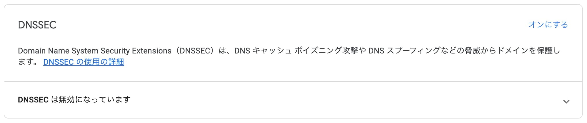
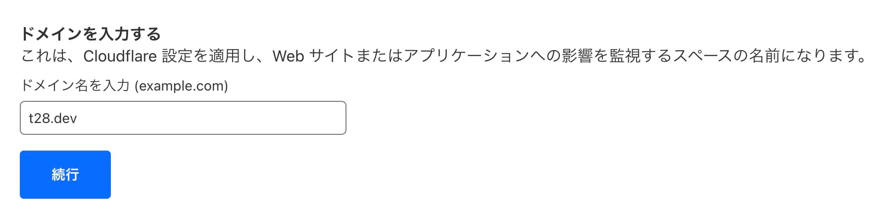
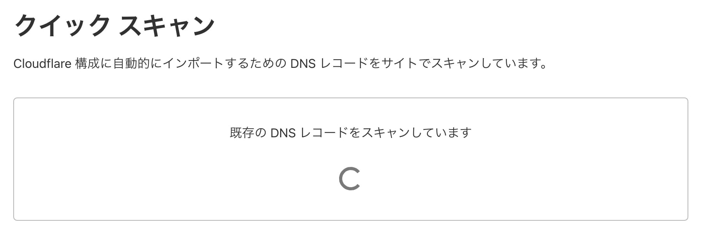
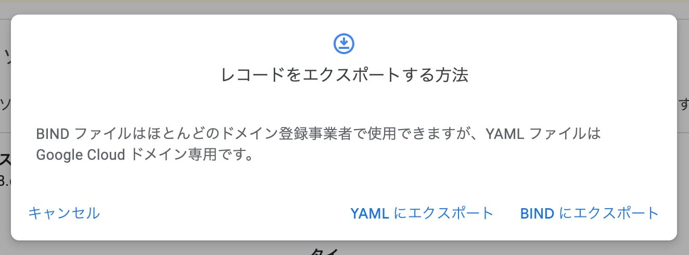
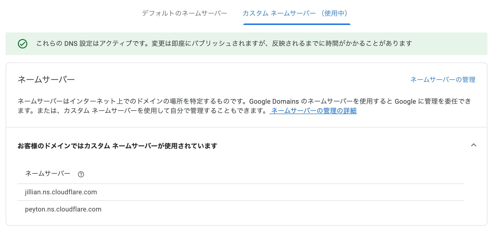
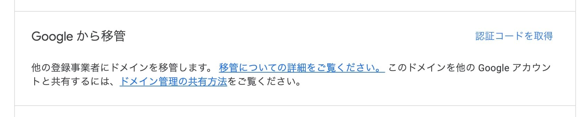
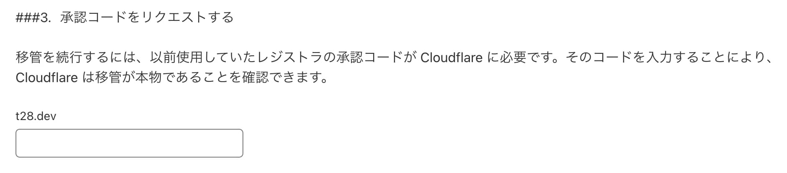
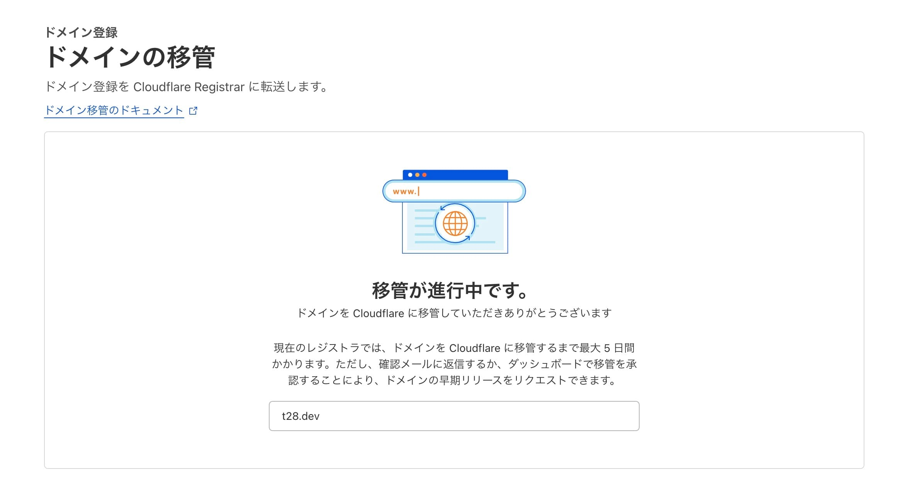
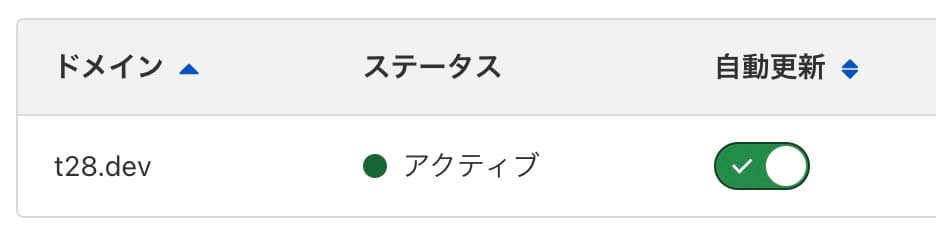

## Cloudflare のドメイン移管チェックリスト

[Squarespace が Google Domains を買収した](https://support.google.com/domains/answer/13689670?hl=ja) ので、Google Domains で管理していたドメインを[Cloudflare Registrar](https://developers.cloudflare.com/registrar/) に移管します(しました)。
Cloudflare が [ドメインを Cloudflare に移管するためのステップバイステップガイド](https://blog.cloudflare.com/ja-jp/a-step-by-step-guide-to-transferring-domains-to-cloudflare-ja-jp/) というポストで **ドメイン移管チェックリスト** を紹介していたので、これを参考に移管作業をしてみました。

> ドメインを新しいレジストラに移管することは日々行うことではありません。また、プロセスの手順を間違えるとダウンタイムや中断を招く可能性があります。そこで、今回の Speed Week でドメイン移管チェックリストをご用意しました。

SpeedWeek は [Cloudflare の新製品発表イベント](https://www.cloudflare.com/ja-jp/speed-week-2023/updates/) だけれど、あまりにもタイムリー(ポスト公開日が 2023/06/23!!)すぎる。

## 移管したいやつ

- t28.dev
  - このドメインはカスタムメールアドレスの設定も要る
- 他にもお仕事用ドメインとか

## チェックリストの流れ

ドメイン移管チェックリストは 4 つのセクションに分かれています。

- 適格性の確認
- 移管前
- 移管手続きの開始と確認
- 移管後

「移管前」までの作業によって、ネームサーバーを Google から Cloudflare に変更するので、
「Google からドメインを買って、Cloudflare で名前解決している」状態になります。

「移管手続きの開始と確認」 まで作業を行うことで、
「Cloudflare でドメインを買って名前解決している」状態 (= 移管完了) になります。

## 適格性の確認

### 1. Cloudflare のネームサーバーの利用を考えていることを確認します

> Cloudflare で登録されたドメインは、当社のネームサーバー以外を利用することはできません。

**=> Cloudflare の nameserver を設定できるので、OK!**

### 2. Cloudflare がお客様のドメインの TLD をサポートしていることを確認します

> 当社が[現在サポートしている TLD の全リストはこちら](https://www.cloudflare.com/tld-policies/)からご覧いただけます。

2023/8/3 に [Cloudflare 言及している通り](https://twitter.com/CloudflareDev/status/1686812617153593355)、 `.dev` ドメインも使えるようになった！

**=> 移管したいドメインがサポートされてる！OK!**

### 3. お客様のドメインがプレミアムドメインまたは国際化ドメイン名（IDN）でないことを確認します

`プレミアムドメイン` ?

> 文字列の希少価値が高く通常料金のドメインよりも高価格で提供している種類のドメイン
> ref: https://help.onamae.com/answer/15502

`国際化ドメイン名（IDN）` ?

> 英数字（ASCII）以外の文字を含むドメイン名
> ref: https://jprs.jp/glossary/index.php?ID=0029

**=> 使ってない！OK!**

### ドメインが過去 60 日以内に登録または移管されていないことを確認します

**=> 願う 🙏**

### WHOIS の登録者の連絡先情報が過去 60 日間に更新されていないことを確認します

**=> 願う 🙏**

## 移管前

### 現在のレジストラの資格情報を確認します

> お客様の現在のレジストラに関する資格情報がお手元にあることを確認します。何年もログインしておらず、パスワードのリセットが必要な場合があります。

**=> Google domains にはログイン出来る！ OK!**

### 現在の DNS の設定内容をメモします

> 問題が発生した場合に備えて現在の設定内容を記録しておくことをお勧めします。

**=> はーい！ 📝**

### WHOIS のプライバシーを解除します (必要な場合)

**=> エラーとか出たら考えます！ (=> 出なかった 🥰)**

### DNSSEC を無効にします

**=> 無効にしました 👋**

### ドメインの更新を 15 日以内に控えている場合、ドメインを更新します

**=> 不要！**

### ドメインのロックを解除します

**=> 解除しました 🔓**

### Cloudflare に登録します

> まだ Cloudflare のアカウントをお持ちでない方は、[こちらから登録してください](https://dash.cloudflare.com/sign-up)。

**=> あります 😘**

### お使いのドメインを Cloudflare に追加します

> [こちらの手順](https://developers.cloudflare.com/fundamentals/get-started/setup/add-site/)に従い、Cloudflare アカウントに新しいドメインを追加します。

`Web サイト` > `サイトを追加する` からドメインを入力してボタンをポチると 👈

**=> レコードの読み込みもしてくれて便利〜 ✌️**

### Cloudflare アカウントに有効なクレジットカードを追加します

**=> した！🪪**

### Cloudflare の DNS レコードを見直します

> ドメイン追加後、[Cloudflare が自動的に設定した DNS レコード](https://developers.cloudflare.com/dns/zone-setups/full-setup/setup/#review-dns-records)と現在のレジストラで使用しているレコードと照合し、漏れがないことを確認します。

`お使いのドメインを Cloudflare に追加します` パートでレコードを自動で読み込んでくれましたが、私のケースでも漏れがありました。 Google Domains 側で bind ファイル (初めて知った) をエクスポートして、 Cloudflare 側で読み込ませればバッチリ。

### DNS のネームサーバーを Cloudflare に変更します

**=> さらば Google Domains...(の、ネームサーバー) 😭**

### （オプション）Cloudflare Email Routing を設定します

> [メール転送機能](https://www.cloudflare.com/learning/email-security/what-is-email-routing/) を使用している場合、[こちらのガイドに従い、Cloudflare Email Routing に移行](https://blog.cloudflare.com/migrating-to-cloudflare-email-routing/)します。

既存の MX レコードとの競合エラーが発生していたので、 Google Domains からインポートした MX レコードを消して、 Cloudflare 用に新しいレコードを登録した。ダッシュボード上で消すべき・追加するべきレコードが勝手に表示されるから楽チン〜

### DNS の変更が反映されるまで待機します

> レジストラによるネームサーバーの更新処理は 24 時間かかることがあります。 Cloudflare がこれらの変更が反映されたことを確認すると、お客様宛にメールが届きます。このプロセスが完了するまで、ドメインの移管作業を続行することはできません。

**=> `$ dig t28.dev ns` で更新を確認した 💻**

(PC が繋げるネットワークによって新しい nameserver を確認できるタイミングがまちまちだったから、24 時間は見積もっておいた方が良いんだろうな〜)

## 移管手続きの開始と確認

### 認証コードを要求します

> Cloudflare は移管フローが承認されていることを旧レジストラに確認する必要があります。そのために、旧レジストラはお客様に認証コードを提供します。

**=> Google Domains でポチると発行できる**

### Cloudflare への移管を開始します

`ドメイン登録` > `ドメインの移管` で Web サイトとして追加済み & 移管可能なドメインが出てくる

**=> `t28.dev` がある〜**

### 移管にかかる価格を確認します

> ドメインを移管する際、有効期限を 1 年延長するための支払いが ICANN から求められます。

`t28.dev`の場合は 👇 の感じ

- 卸売コスト: $10.00
- ICANN 料金: $0.18

**=> 確認しました！**

### 認証コードを入力します

**=> `認証コードを要求します` で取得したコードをコピペした！**

### 連絡先情報の確認または入力を行います

> 移管プロセスの最終段階では、登録の連絡先情報を入力します。Cloudflare Registrar はデフォルトでこの情報を編集しますが、この登録のための正規の連絡先情報を収集する必要があります

~~チェックリストが言ってること微妙によく分からないけれど、ちゃんと入力すれば OK っしょ~~

### Cloudflare で移管を承認します

> Cloudflare で移管を承認します：移管を申請すると、 Cloudflare による移管の処理が開始され、公開されている WHOIS データベースに情報がある場合、ドメイン移管を承認する FOA（認証フォーム）メールが登録者に送信されます。

~~チェックリストが言ってること微妙によく分からないけれど、ボタンポチったらいい感じにしてくれるってことっしょ~~

### 以前のレジストラで移管を承認します

> このステップの後、以前のレジストラからも、移管リクエストに対する確認メールが送信されます。

**=> 「Google Domains からの移管リクエストを確認する」というメールが来ていたので...承認！**

### Cloudflare ダッシュボードで移管状況を確認します

**=> いぇーい ✌️😁**

## 移管後

### サイトとメールのテストを実施します

まぁ

### 何か新しいものを構築します

よしなに
