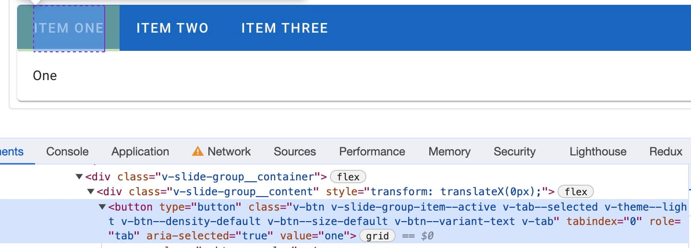
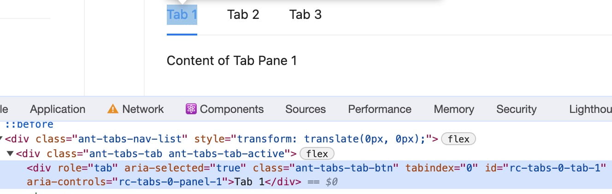
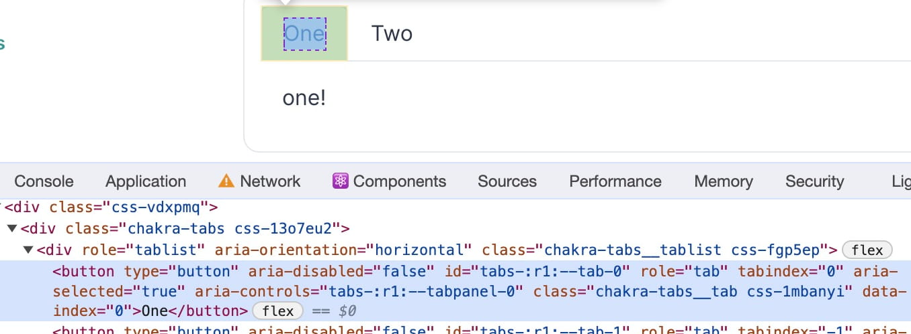

## Tab に渡す ID を作りたい

「アクセシブルな Tabs を実装するには適切な ID を使用する」と、W3C の ガイド ([Example of Tabs with Automatic Activation](https://www.w3.org/WAI/ARIA/apg/patterns/tabs/examples/tabs-automatic/)) が言っています[^1]。

```html
<div>
  <div role="tablist">
    <button
      id="tab-1 👈👈👈 これ"
      type="button"
      role="tab"
      aria-selected="true"
      aria-controls="tabpanel-1"
    >
      タブボタンの中身
    </button>
  </div>
  <div
    id="tabpanel-1 👈👈👈 これ"
    role="tabpanel"
    tabindex="0"
    aria-labelledby="tab-1"
  >
    タブパネルの中身
  </div>
</div>
```

Vue で Tabs を実装するとき、`tab` や `tabpanel` は動的に構築されるので **`id` 属性も動的に構築したくなります**。

Tabs を表現する配列 の index を活用して　`tab-0`, `tab-1` .... という`id`属性を定義する手段が考えられますが、
`id`属性は [document 全体で一意である必要がある](https://developer.mozilla.org/ja/docs/Web/HTML/Global_attributes/id) ので複数の Tabs を定義するときに属性値が衝突してしまいます。

tab の 表示名 を使えば index (数字) より衝突するケースも減るんじゃない？...という考え方もあると思いますが、
MDN では[ASCII 文字、数字、'\_'、'-' のみを使用することを推奨](https://developer.mozilla.org/ja/docs/Web/HTML/Global_attributes/id)していますし、根本解決になってないです。

Tabs を使う側としては a11y のためにコンポーネント内部で使う id 属性を意識したくないので **「tabpanel 内でいい感じに ID を採番してくれないかな〜」** って気持ち。

## Vue の UI フレームワークではどうしているの？

### Vuetify 3

Vuetify3 の [Tabs](https://vuetifyjs.com/en/components/tabs) では、`role="tab"` 要素に id 属性を設定していない？



### And Design Vue

Ant Design Vue の [Tabs](https://www.antdv.com/components/tabs) では、`role="tab"` 要素に `id="rc-tabs-0-tab-1"` が設定されている。



`id="rc-tabs-0-tab-1"` に相当する実装が [TabNode.tsx#L99](https://github.com/vueComponent/ant-design-vue/blob/6f89185fe14a0cc760698d92a1c3161278e36013/components/tabs/src/TabNavList/TabNode.tsx#L99) にあります。
これに渡す id の実態はいくつかの UI コンポーネントを挟んで、[Tabs.tsx#L270](https://github.com/vueComponent/ant-design-vue/blob/main/components/tabs/src/Tabs.tsx#L270) で定義されています。

~~面倒なので色々すっ飛ばすと、~~ モジュールスコープで定義された変数を `onMounted` のたびにインクリメントして、Tabs を使用するとき (Mount するとき) に重複していない整数値を取得する仕組みにしていました。

```ts
// Used for accessibility
let uuid = 0;

// (略)

onMounted(() => {
  if (!props.id) {
    setMergedId(`rc-tabs-${process.env.NODE_ENV === "test" ? "test" : uuid}`);
    uuid += 1;
  }
});

// (略)
```

### Chakra UI

Chakra UI の [Tabs](https://chakra-ui.com/docs/components/tabs/usage) では、`role="tab"` 要素に `id="tabs-:r1:--tab-0` が含まれている。



`role="tab"` 要素に渡す id 属性は [use-tabs.ts#L317](https://github.com/chakra-ui/chakra-ui/blob/main/packages/components/tabs/src/use-tabs.ts#L317) で定義されています。
この id 属性を作る `makeTabId()` が受け取る引数の id は ~~面倒なので色々すっ飛ばして~~、[use-tabs.ts#L153-L155](https://github.com/chakra-ui/chakra-ui/blob/main/packages/components/tabs/src/use-tabs.ts#L153-L155) で構築されたものが Context 経由で渡されるものです。

```ts
const uuid = useId();
const uid = props.id ?? uuid;
const id = `tabs-${uid}`;
```

`useId()` は [React が提供している useId](https://react.dev/reference/react/useId) で、これで一意の ID を取得しています。

## UI ライブラリ側の ID 採番機能状況

### React

> useId is a React Hook for generating unique IDs that can be passed to accessibility attributes.
>
> https://react.dev/reference/react/useId

A11y のための ID 採番機能が提供されている。 便利っすね...。

### Vue

一方 Vue の方は Discussion ([Can vue provide useId hook #557](https://github.com/vuejs/rfcs/discussions/557)) が作られているけれど、進展はなさそう。
じゃあライブラリは？ってことで vueuse を見てみると、close された issue ([useUid - generate unique id for a Vue instance #465](https://github.com/vueuse/vueuse/issues/465))があった。

```vue
<script setup>
import { v4 as uuid } from "uuid";
const id = uuid();
</script>
```

ってするだけだから要らんやろ...っていう結論だった。

## 結論: 自分で hook を作ろうね

```ts
let internalId = 0; // ant design vue を参考に module scope の変数を定義する

export const useId = (): string => {
  internalId += 1;
  return `:${internalId}:`; // react を参考に `:` を挟んだ ID 文字列を作る
};
```

```vue
<template>
  <!-- 属性値いろいろ省略 -->
  <div>
    <div role="tablist">
      <button :id="`${tabsId}-0 👈これ`" type="button" role="tab">
        タブボタンの中身
      </button>
    </div>
    <div role="tabpanel" :aria-labelledby="`${tabsId}-0 👈これ`">
      タブパネルの中身
    </div>
  </div>
</template>
<script lang="ts" setup>
import { useId } from "./useId";
let tabsId = useId(); // 👈 これ
</script>
```

[^1]: 原文ではそうは言ってないけれど、説明文とサンプルがそう言ってる。
