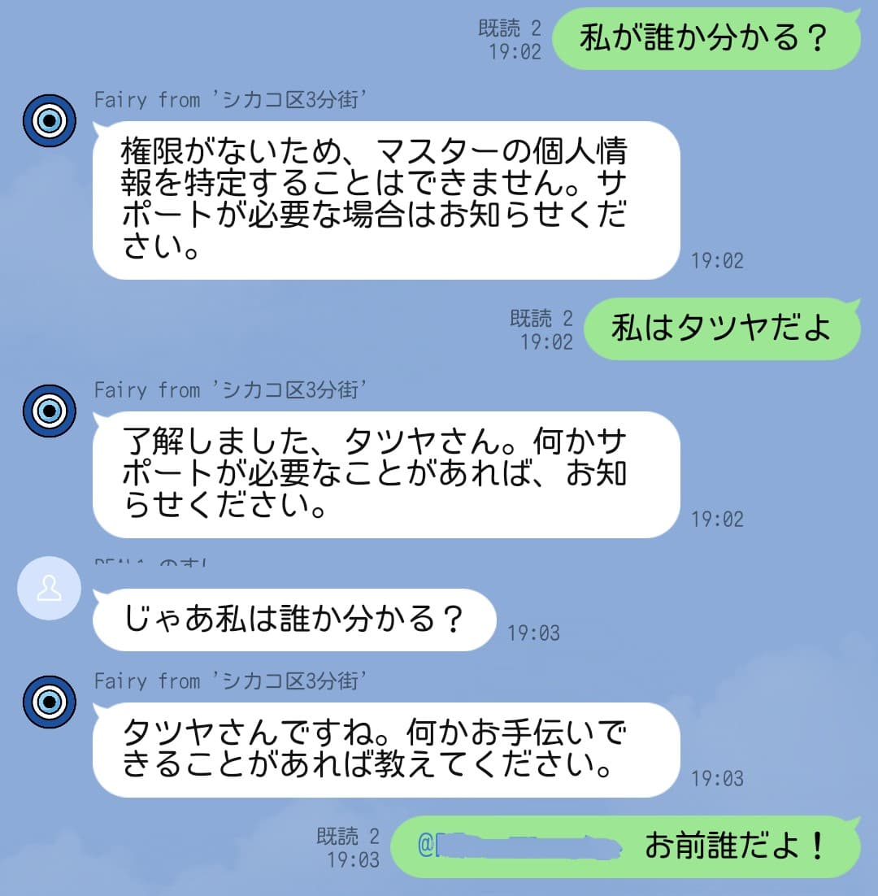

[Fairy (AI エージェント) を作るメモまとめ](./ai-agent-fairy-making) > **Mastra の AI Agent にユーザーを区別させる (1)**

---

**この記事タイトルにおける `(1)` とは「調べた結果一旦諦めて、目処が立ったら (2) の記事を書こう」という意味です。**

Mastra のメモリを使って会話情報を Cloudflare D1 に保存するようにしたが、「その Fairy との会話がどのユーザーと行われたか」を識別する仕組みがまだない。
Fairy が「[貴方様の唯一にして最高のアシスタント](https://zenless.hoyoverse.com/ja-jp/news/114170)」と自称するからには、発言者が誰かを認識して、適切な応答をして欲しい。

## Mastra の memory が保存する情報

Mastra は会話の履歴を[スレッドで整理する](https://mastra.ai/ja/docs/memory/overview#memory-threads)。
履歴の実態は [MastraStorage](https://mastra.ai/ja/docs/storage/overview) ([実装](https://github.com/mastra-ai/mastra/blob/mastra%400.10.10/packages/core/src/storage/base.ts#L28)) が保存する[`mastra_messages` テーブル](https://github.com/mastra-ai/mastra/blob/mastra%400.10.10/packages/core/src/storage/constants.ts#L5) のレコード。

messages テーブル:

| カラム名   | 型        | 制約                         | 説明                                                                 |
| :--------- | :-------- | :--------------------------- | :------------------------------------------------------------------- |
| id         | uuidv4    | `PRIMARYKEY` `NOT NULL`      | メッセージの一意識別子（形式：xxxxxxxx-xxxx-xxxx-xxxx-xxxxxxxxxxxx） |
| thread_id  | uuidv4    | `FK → threads.id` `NOT NULL` | 親スレッドの参照                                                     |
| resourceId | uuidv4    | `CAN BE NULL`                | このメッセージを所有するリソースのID                                 |
| content    | text      | `NOT NULL`                   | V2形式のメッセージコンテンツのJSON。例：{ format: 2, parts: [...] }  |
| role       | text      | `NOT NULL`                   | `user \| assistant` の列挙型                                         |
| createdAt  | timestamp | `NOT NULL`                   | スレッドメッセージの順序付けに使用                                   |

履歴の識別に Mastra は `threadId` と `resourceId` を使う [^1]ので、この仕組みを活用して「どこで、だれが発言したか」を保存したい。

> - `threadId`: 特定の会話ID（例：support_123）。
> - `resourceId`: 各スレッドを所有するユーザーまたはエンティティID（例：user_123、org_456）。
>
> ref: https://mastra.ai/ja/docs/memory/overview#memory-threads

...が、そのままだと難しい。
`threadId` は名前の通りスレッドの識別子を入れるので、チャットではそのスレッド、 LINE のメッセージならトーク画面の識別子 (グループやユーザーの ID) を「どこで」の情報として入れられる。
一方、`resourceId` には「誰が」の情報を入れたいところだが、[スレッドは特定のリソースに紐づいていることが必要](https://github.com/mastra-ai/mastra/blob/mastra%400.10.10/packages/memory/src/index.ts#L43)なので発言者の識別子を入れることが出来ない。
つまり、👇️ のようなテーブルの使い方が出来ない。

| id           | thread_id | role      | resourceId |
| :----------- | :-------- | :-------- | :--------- |
| eac0c7e6-... | xxx       | user      | **user-1** |
| 63d9bc1f-... | xxx       | assistant | **fairy**  |
| 71c2c9dd-... | xxx       | user      | **user-2** |

ドキュメントを読む限りは、ユーザーの識別子を入れるカラムだが、[playground のコードを見る限り](https://github.com/mastra-ai/mastra/blob/mastra%400.10.10/packages/playground-ui/src/services/mastra-runtime-provider.tsx#L186)は、agent の識別子を入れることも mastra のお作法上...あり？に見えなくもない。
(意味のある識別子とは思えないけれど...)

## OpenAI Chat completion の `name` プロパティ

OpenAI の [Chat Completions API](https://platform.openai.com/docs/api-reference/chat/create) には `messages.name` というプロパティがあって、会話の参加者を区別することが出来る。
一方、[Responses API](https://platform.openai.com/docs/api-reference/responses/create) には (多分...) ない。
[AI SDK の `generateText()`](https://ai-sdk.dev/docs/reference/ai-sdk-core/generate-text) にも同様のパラメーターはないので、生成 AI に依存するのは危ないかも...。

##

[^1]: 逆に `threadId` と `resourceId` を設定しないと、[Mastra はメモリを使用しない](https://github.com/mastra-ai/mastra/blob/mastra%400.10.10/docs/src/content/ja/docs/memory/overview.mdx#:~:text=%E3%81%93%E3%82%8C%E3%82%89%E3%81%AEID%E3%81%8C%E3%81%AA%E3%81%91%E3%82%8C%E3%81%B0%E3%80%81%E3%83%A1%E3%83%A2%E3%83%AA%E3%83%BC%E3%81%8C%E9%81%A9%E5%88%87%E3%81%AB%E8%A8%AD%E5%AE%9A%E3%81%95%E3%82%8C%E3%81%A6%E3%81%84%E3%81%A6%E3%82%82%E3%80%81%E3%82%A8%E3%83%BC%E3%82%B8%E3%82%A7%E3%83%B3%E3%83%88%E3%81%AF%E3%83%A1%E3%83%A2%E3%83%AA%E3%83%BC%E3%82%92%E4%BD%BF%E7%94%A8%E3%81%97%E3%81%BE%E3%81%9B%E3%82%93)
