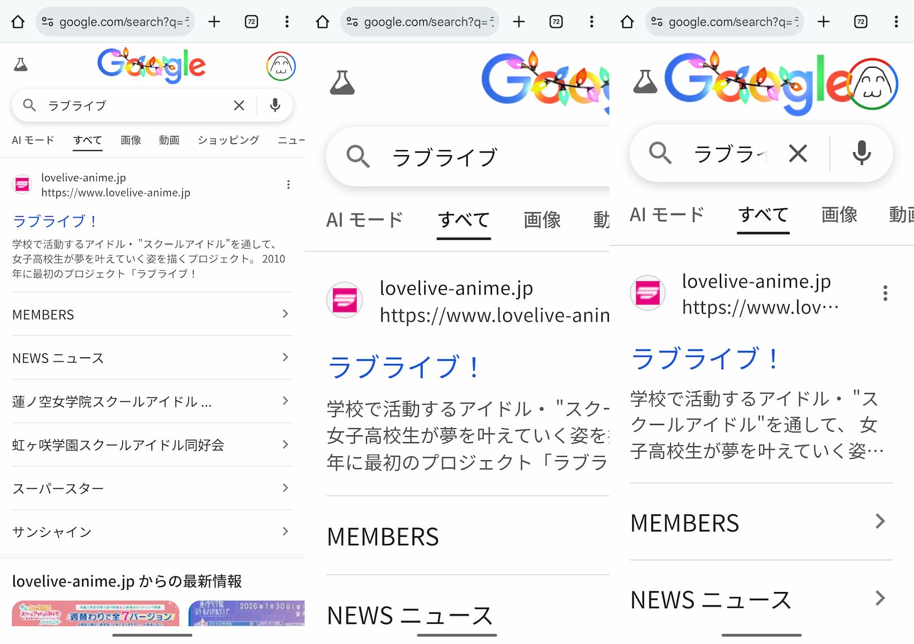

viewport っていうと...

- `<meta name="viewport" content="width=device-width, initial-scale=1">` とか
- `100vh` とか

じゃん？となるが...まー曖昧。そもそも viewport って何だ？って考えると困ったので調べた。

## Viewport

> ビューポートとは、連続メディアの初期包含ブロックを確立するために使用するユーザーエージェント機能です。
>
> ref: [MDN - ビューポートとは何か](https://developer.mozilla.org/ja/docs/Web/CSS/Guides/CSSOM_view/Viewport_concepts#%E3%83%93%E3%83%A5%E3%83%BC%E3%83%9D%E3%83%BC%E3%83%88%E3%81%A8%E3%81%AF%E4%BD%95%E3%81%8B)

...よく分からないので、単語の意味を仕様から調べる。

`連続メディア` はスクロールすれば全部が見られる表示環境[^1]のことで、例えばスマホやPCの画面のこと。

> Media that match 'none' or ['scroll'](https://www.w3.org/TR/mediaqueries-5/#valdef-media-overflow-block-scroll) are said to be **continuous media**, while those that match paged are said to be paged media
>
> ref: [Media Queries Level 5 - § 4.5. Block-Axis Overflow: the overflow-block feature](https://www.w3.org/TR/mediaqueries-5/#mf-overflow-block)

`初期包含ブロック` は `<html>` のレイアウトの基準となる矩形のこと。

> **initial containing block**
>
> The containing block of the root element. The initial containing block establishes a block formatting context. See CSS2.1§10.1 for continuous media; and [CSS-PAGE-3] for paged media for its position and dimensions.
>
> ref: [CSS Display Module Level 3 - § Appendix A: Glossary](https://www.w3.org/TR/css-display-3/#glossary)

以上のことから頑張って言い換えると、viewport とは「スクロールできる環境でページのレイアウトの基準として使われる、ブラウザが提供する矩形領域」のこと。
まだ難しい。身も蓋もないが、MDN に書いてある `文書の表示領域そのもの` で一旦納得しておく。

> ウェブブラウザーの文脈では、これは通常、 UI やメニューバーなどを除いたブラウザーウィンドウと同一です。つまり、あなたが見ている文書の表示領域そのものです。
>
> ref: [MDN - ビューポートとは何か](https://developer.mozilla.org/ja/docs/Web/CSS/Guides/CSSOM_view/Viewport_concepts#%E3%83%93%E3%83%A5%E3%83%BC%E3%83%9D%E3%83%BC%E3%83%88%E3%81%A8%E3%81%AF%E4%BD%95%E3%81%8B)

## Initial viewport と Actual viewport

document を読み込んだ後、viewport は [2つの段階を踏む](https://developer.mozilla.org/en-US/docs/Web/CSS/Guides/CSSOM_view/Viewport_concepts#initial_viewport:~:text=the%20viewport%20goes%20through%20two%20stages)[^2]:

- Initial viewport
- Actual viewport

### Initial viewport

Initial viewport はユーザーエージェントのウィンドウまたは表示領域によって指定された viewport を指し、
さらに以下の要素で上書きされる前のものである:

- ユーザーエージェントのスタイル
- HTML <meta> タグ [^3]
- 作成者のスタイル

> **initial viewport**
>
> This refers to the viewport before any UA or author styles have overridden the viewport given by the window or viewing area of the UA. Note that the initial viewport size will change with the size of the window or viewing area.
>
> ref: [CSS Viewport Module Level 1 - 2. §The viewport](https://www.w3.org/TR/css-viewport-1/#the-viewport)

`ユーザーエージェントのスタイル`による上書きが具体的に何を指すかは MDN・仕様に (多分) 書いていない。
おそらく、ブラウザが勝手に(?)に設定する viewport の幅のことだと思う。
Viewport の幅は PC ブラウザとモバイルブラウザで扱いが異なる。
PC ブラウザではウィンドウの幅がそのまま viewport の幅になる。
一方モバイルブラウザは画面よりも幅の広い仮想 viewport [^4] でレンダリングして、その結果を画面に収まるように縮小して表示する。

> Some mobile devices and other narrow screens render pages in a virtual window or viewport that is wider than the screen, and then shrink the rendered result down to fit the screen size.
>
> ref: [MDN - Viewport width and screen width](https://developer.mozilla.org/en-US/docs/Web/HTML/Reference/Elements/meta/name/viewport#viewport_width_and_screen_width)

`作成者のスタイル`による上書きも同様に書かれていない。おそらく、CSS で viewport の設定をする [`@viewport` rule](https://www.w3.org/TR/2011/WD-css-device-adapt-20110915/#the-viewport-rule) のことを指している。
しかし `@viewport` は[仕様から削除された](https://www.w3.org/TR/css-viewport-1/#since-the-29-march-2016-working-draft)ので、これは考えなくて良さそう。

### Actual viewport

Actual viewport は `<meta>` タグを処理した後の viewport を指す。

> This is the viewport you get after processing the viewport <meta> tag.
>
> ref: [CSS Viewport Module Level 1 - 2. §The viewport](https://www.w3.org/TR/css-viewport-1/#the-viewport)

今どきのウェブアプリは `<meta name="viewport" content="width=device-width, initial-scale=1.0" />` がデフォルトのようなので:

- [Vite - index.html](https://github.com/vitejs/vite/blob/v7.2.7/packages/create-vite/template-vue-ts/index.html)
- [Next.js - default-metadata.tsx](https://github.com/vercel/next.js/blob/v16.0.7/packages/next/src/lib/metadata/default-metadata.tsx#L9-L10)

`<meta>` タグの処理をして width をデバイス幅に設定された viewport が actual viewport って考えて良さそう。

## Layout viewport と Visual viewport

MDN では viewport を「[現在見えている矩形の領域](https://developer.mozilla.org/en-US/docs/Glossary/Viewport#:~:text=a%20viewport%20represents%20a%20polygonal)」としているが、
その後の[記述](https://developer.mozilla.org/en-US/docs/Web/CSS/Guides/CSSOM_view/Viewport_concepts#layout_and_visual_viewports)や[仕様](https://www.w3.org/TR/cssom-view-1/#layout-viewport:~:text=The%20visual%20viewport%20is%20a%20kind%20of%20viewport%20whose%20scrolling%20area%20is%20another%20viewport%2C%20called%20the%20layout%20viewport)は viewport を 2 つに分類している [^5]:

- Layout viewport
- Visual viewport

これらの定義的な記述は [CSSOM View Module](https://www.w3.org/TR/cssom-view-1/)や[CSS Viewport Module Level 1](https://www.w3.org/TR/css-viewport-1/) を見る限り👇️のみで、
「visual viewport のスクロール領域は layout viewport という別の viewport である」ことだけが説明されている [^6]。

> The **visual viewport** is a kind of viewport whose scrolling area is another viewport, called the **layout viewport**.
>
> ref: [CSSOM View Module - §2. Terminology](https://www.w3.org/TR/cssom-view-1/#terminology)

### Layout viewport

Actual viewport を layout viewport として扱う issue があるので、layout viewport は「`<meta>` タグを処理した後の viewport」と理解できる。

> ISSUE3 Make actual viewport the layout viewport, define visual viewport.
>
> ref: [CSS Viewport Module Level 1 - ISSUE3](https://www.w3.org/TR/css-viewport-1/#issue-44630653)

困ったことにこれ以上の説明をMDN・仕様から見つけられない。
検索結果や AI は「コンテンツをレイアウトする際の基準となる表示領域」のような説明をするが、
おそらくこれは
「[layout viewport の内部座標系は pinch-zoom の影響を受けない](https://www.w3.org/TR/cssom-view-1/#visual-viewport:~:text=does%20not%20affect%20its%20internal%20coordinate%20space)」ことを元に
勝手に考えたものだと思う。仕様にはそれに準ずる記述がない。

### Visual viewport

Visual viewport は layout viewport の現在表示されている部分。

> visual viewport is the currently visible portion of the layout viewport.
>
> ref: [MDN - Viewport concepts](https://developer.mozilla.org/en-US/docs/Web/CSS/Guides/CSSOM_view/Viewport_concepts#layout_and_visual_viewports)

pinch-zoom（[visual viewport の scale transform](https://www.w3.org/TR/cssom-view-1/#visual-viewport:~:text=The%20scale%20transform%20of%20the%20visual%20viewport%20is%20often%20referred%20to%20as%20%22pinch%2Dzoom%22)) で拡大縮小することで、
visual viewport の width/height/offset を変えることが出来る。つまり layout viewport 内のどの部分が見えるかを変えられる。

```
こんな感じ
+----------------------------------+
|         Layout Viewport          |
|   +--------------------------+   |
|   |     Visual Viewport      |   |
|   |        (zoom-in)         |   |
|   +--------------------------+   |
+----------------------------------+
```

また仮想キーボードが出ると visual viewport は縮む（height が小さくなる）

> The user is viewing a document in a mobile user agent. The document focuses an offscreen text input element, showing a virtual keyboard which shrinks the visual viewport.
>
> ref: [CSSOM View Module - EXAMPLE3](https://www.w3.org/TR/cssom-view-1/#example-cb4be61c)

## Zoom で影響を与える viewport

ズームは 2 種類ある:

- page zoom
- pinch-zoom [^7] ([scale factor](https://www.w3.org/TR/cssom-view-1/#scale-factor))

> There are two kinds of zoom, **_page zoom_** which affects the size of the initial viewport, and the visual viewport scale factor which acts like a magnifying glass and does not affect the initial viewport or actual viewport. [CSS-DEVICE-ADAPT]
>
> ref: [CSSOM View Module - 2.2. Zooming](https://www.w3.org/TR/cssom-view-1/#zooming)

`page zoom` は initial viewport のサイズを変える。
一方 `pinch-zoom` は initial viewport と actual viewport には影響を与えず、visual viewport のサイズを変える。

下の画像は左から

- 通常。
- pinch-zoom 結果。initial viewport/actual viewport に影響を与えていないので、拡大した分だけ右側が見切れている。
- page zoom 結果。initial viewport のサイズを変えているので、見切れるのではなく overflow した分が省略されたり改行されたりしている。



## まとめ

感覚的優先でまとめると:

| Viewport の種類                   | まとめ                                                                                                                  |
| :-------------------------------- | :---------------------------------------------------------------------------------------------------------------------- |
| Initial viewport                  | 何も処理をしていない最初の viewport。PC ブラウザではウィンドウ幅、モバイルブラウザでは仮想 viewport 幅 (980px ぐらい)。 |
| Actual viewport / Layout viewport | `<meta>` タグを処理した後の viewport。`width=device-width` を設定すればモバイルブラウザもウィンドウ幅 [^8] になる。     |
| Visual viewport                   | pinch-zoom や仮想キーボードに影響を受ける、実際に見えている領域                                                         |

## JavaScript から viewport を見る

`innerWidth` と `innerHeight` は viewport (具体的には[layout viewport](https://developer.mozilla.org/en-US/docs/Web/CSS/Guides/CSSOM_view/Viewport_concepts#:~:text=The%20area%20within%20the%20innerHeight%20and%20innerWidth%20is%20generally%20considered%20the%20layout%20viewport)) の大きさを取得するプロパティである。

> The innerWidth attribute must return the viewport width including the size of a rendered scroll bar (if any), or zero if there is no viewport.
>
> ```
> partial interface Window {
>     // ...
>     // viewport
>     [Replaceable] readonly attribute long innerWidth;
>     [Replaceable] readonly attribute long innerHeight;
>     // ...
> };
> ```
>
> ref: [CSSOM View Module - 4. Extensions to the Window Interface](https://www.w3.org/TR/cssom-view-1/#extensions-to-the-window-interface)

仕様にはこの viewport がどの viewport を指しているか書かれていないが、MDN 曰く、`innerWidth` と `innerHeight` は layout viewport の大きさを表している。

> The area within the `innerHeight` and `innerWidth` is generally considered the **layout viewport**.
>
> ref: [MDN - Viewport sizes are mutable](https://developer.mozilla.org/en-US/docs/Web/CSS/Guides/CSSOM_view/Viewport_concepts#viewport_sizes_are_mutable)

Visual viewport のサイズは [VisualViewport API](https://developer.mozilla.org/ja/docs/Web/API/VisualViewport) から取得することが出来る:

- Layout viewport を基準に visualViewport がどこにあるか (`offsetLeft` / `offsetTop`)
- `document` を基準に visualViewport がどこにあるか (`pageLeft` / `pageTop`)
- Visual viewport の大きさ ( `width` / `height` / `scale` )

> ```
> interface VisualViewport : EventTarget {
>   readonly attribute double offsetLeft;
>   readonly attribute double offsetTop;
>
>   readonly attribute double pageLeft;
>   readonly attribute double pageTop;
>
>   readonly attribute double width;
>   readonly attribute double height;
>
>   readonly attribute double scale;
>   // ...
> };
> ```

## CSS の単位から viewport を見る

Viewport-percentage の長さは `初期包含ブロック` のサイズを基準にしていて、`初期包含ブロック` 自体は viewport のサイズに基づいている[^9]。

> The **_viewport-percentage lengths_** are relative to the size of the initial containing block—which is itself based on the size of either the viewport (for continuous media) or the page area (for paged media). When the height or width of the initial containing block is changed, they are scaled accordingly.
>
> ref: [CSS Values and Units Module Level 4 - 6.1.2. Viewport-percentage Lengths: the *vw, *vh, *vi, *vb, *vmin, *vmax units](https://www.w3.org/TR/css-values-4/#viewport-relative-lengths)

動的に展開・縮小される [ユーザーエージェント](https://www.w3.org/TR/css-2023/#user-agent)インターフェースにおいて、viewport のサイズを 3 に分類している:

- 縮小されることを想定したサイズ -> large viewport
- 展開されることを想定したサイズ -> small viewport
- 動的に考慮されたサイズ -> dynamic viewport

これらに対応して、viewport-percentage の長さの単位は 4種類ある:

- large viewport-percentage units (`lv*`)
- default viewport-percentage units (`v*`)
- small viewport-percentage units (`sv*`)
- dynamic viewport-percentage units (`dv*`)

> There are four variants of the viewport-percentage length units, corresponding to three (possibly identical) notions of the viewport size.
>
> ref: [CSS Values and Units Module Level 4 - 6.1.2.1. The Large, Small, and Dynamic Viewport Sizes](https://www.w3.org/TR/css-values-4/#viewport-variants)

[他の単位より古くからある](https://developer.mozilla.org/en-US/docs/Web/CSS/Reference/Values/length#browser_compatibility) `v*` の default は
`18 December 2023` 時点の仕様では [large viewport を指している](https://www.w3.org/TR/css-values-4/#large-viewport-percentage-units)。
一方、`27 October 2023`時点の仕様では [UA-default viewport を指している](https://www.w3.org/TR/2023/WD-css-values-4-20231027/#ua-default-viewport-size)。
`UA-default viewport` というのはつまり、ブラウザ(実装)側でお好きにってこと (多分)。そりゃ [vh 問題とか言われる](https://www.google.com/search?q=vh+%E5%95%8F%E9%A1%8C)訳だ...。

[^1]: `A media type is a broad category of user-agent devices on which a document may be displayed.` ([§ 2.3. Media Types](https://www.w3.org/TR/mediaqueries-5/#media-types)) を読んで勝手に言い換えた。

[^2]: Initial viewport と Actual viewport をまとめて呼ぶ名前がない。

[^3]: [MDN には書かれている](https://developer.mozilla.org/en-US/docs/Web/CSS/Guides/CSSOM_view/Viewport_concepts#:~:text=user%20agent%20styles%2C-,HTML%20%3Cmeta%3E%20tags,-%2C%20or%20CSS%20styles)が、[仕様書には書かれていない](https://www.w3.org/TR/css-viewport-1/#initial-viewport)項目

[^4]: 約980px ([Chrome for Developers - 仮想ビューポートとは](https://developer.chrome.com/blog/what-the-viewport?hl=ja))

[^5]: Visual viewport と Layout viewport をまとめて呼ぶ名前がない。

[^6]: これだけで分かる人、いるの？

[^7]: [CSSOM View Module](https://www.w3.org/TR/cssom-view-1) が "pinch-zoom" はハイフンあり、"page zoom" はハイフンなしで表記している。

[^8]: 設定値は "デバイス" だけど...

[^9]: 「Viewport-percentage は viewport のサイズを基準にしている」ってほぼ説明になっていない気がする。
