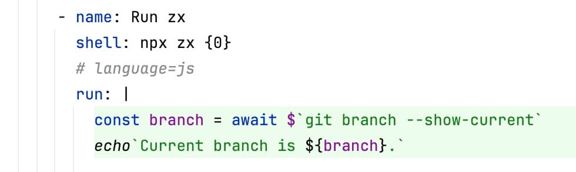
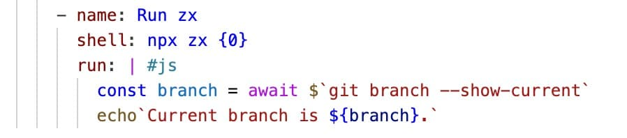

Github Actions で シェルスクリプトを書く機会がどんどん増えた結果、「書くときも、読むときも、辛すぎ...」ってなった🥺

処理の流れを把握するためにかなり細かく変数を定義したり、ロジック以外の文法に関する補足までコメントに書きまくることで、
やっと後で読み返しても困らない (辛くないとは言っていない) 状態になるのはあまりにも不便。
一番慣れている言語 (JavaScript) で書けた方が絶対良いので....書く！！

~~**シェルスクリプトに慣れろよ！っていう話は置いておいちゃう**~~

## カスタムシェル

GitHub Actions は `shell` キーワードで[内部で実行されるコマンドを制御する](https://docs.github.com/ja/actions/writing-workflows/workflow-syntax-for-github-actions#jobsjob_idstepsshell)ことが出来る。

デフォルトだと `bash -e {0}` が実行される。
公式ドキュメントの説明が見つけられないけれど、 `{0}` は `run` キーワードに記述したスクリプトが書き込まれた一時ファイルのパスが入ることが 👇️ のような step で分かる。

ref: [`Display executed script file name` step](https://github.com/TatsuyaYamamoto/gtihub-actions-custom-shell/actions/runs/11081705509/job/30793788300)

```yaml
steps:
  - name: Display executed script file name
    run: echo "$0"
# /home/runner/work/_temp/e45dc7a6-bed6-437b-9414-87a0d70764e2.sh が出力される
```

`shell` キーワードに任意のコマンドを設定する ([カスタムシェル](https://docs.github.com/ja/actions/writing-workflows/workflow-syntax-for-github-actions#custom-shell))ことで、
`run` キーワードの処理のために内部で実行されるシェルコマンドを変更することが出来る。

ドキュメントの例だと、perl を実行している。

```yaml
steps:
  - name: Display the environment variables and their values
    shell: perl {0}
    run: |
      print %ENV
```

## カスタムシェルで Node.js を実行する

`ubuntu-latest` ランナーでは Node.js が最初からインストールされているので、`shell` キーワードで `node` コマンドを実行すれば `run` キーワード内で直接 JavaScript を書くことが出来る！

```yaml
- name: Run with Node.js
  shell: node {0}
  run: |
    console.log(process.env);

# {
#   VCPKG_INSTALLATION_ROOT: '/usr/local/share/vcpkg',
#   GOROOT_1_22_X64: '/opt/hostedtoolcache/go/1.22.7/x64',
#   (略)
```

## カスタムシェルで zx を実行する

GitHub Actions 内でシェルを書くときはファイルシステムにアクセスしたり、他のコマンドを実行したりすることが多いので、
素の Node.js ではなく [zx](https://google.github.io/zx/) に実行してもらいたみが深い。

```yaml
- name: Run zx
  shell: npx zx {0}
  run: |
    const branch = await $`git branch --show-current`
    echo`Current branch is ${branch}.`

# Current branch is main.
```

## 気になったこと

### シンタックスハイライト

シェルスクリプトでも同じだけれど、YAML のブロックコンテンツに JavaScript を書くとシンタックスハイライトが効かない。
エディターによってはいい感じになるのかな？と調べてみた。

#### IDEA

標準の機能として提供されていた、さすがだ -> [言語インジェクション](https://pleiades.io/help/idea/using-language-injections.html)



#### VS Code

拡張機能があった -> [YAML Embedded Languages](https://github.com/ruschaaf/extended-embedded-languages)



IDEA と mark が違うけど...🥺

### npx で zx を毎回ダウンロードしている

速度の観点では大したことない (多分) けれど、実行の度に npx が zx をダウンロードしていることが気になっていたら、 [同じことを考えている人がいた](https://til.simonwillison.net/github-actions/npm-cache-with-npx-no-package)。
[`actions/setup-node`](https://github.com/actions/setup-node) で "npm のキャッシュ" をキャッシュするために、
キャッシュのキーとして `package-lock.json` の代わりにワークフローのファイルを使っている。

真似してやってみた。

```yaml
- uses: actions/setup-node@v4
  with:
    node-version: "22"
    cache: "npm"
    cache-dependency-path: ".github/workflows/shell.yml"
```

[1回目](https://github.com/TatsuyaYamamoto/gtihub-actions-custom-shell/actions/runs/11083172892/job/30797102224):

`setup-node` 時にキャッシュがないので、

```
npm cache is not found
```

npx 実行時にダウンロードするよ〜って言われる。

```
npm warn exec The following package was not found and will be installed: zx@8.1.8
Current branch is main.
```

[2回目](https://github.com/TatsuyaYamamoto/gtihub-actions-custom-shell/actions/runs/11083172892/job/30797117544):

キャッシュが見つかったみたい！

```
Cache restored successfully
```

キャッシュがあるので npx がダウンロードしたログを出していない ✌️

```
Current branch is main.
```

キャッシュする場合は、zx のバージョンも指定した方が良さそう。

```yaml
- name: Run zx
  shell: npx zx@8.1.8 {0}
  run: |
    const branch = await $`git branch --show-current`
    echo`Current branch is ${branch}.`
```
