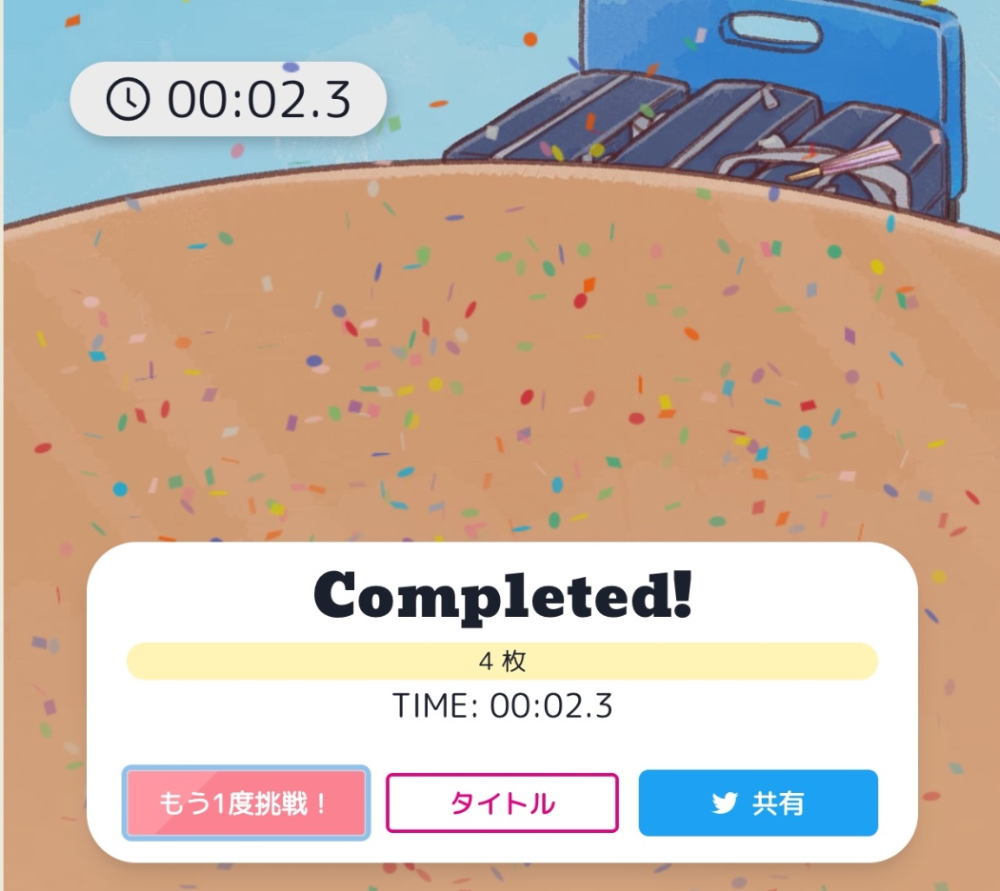
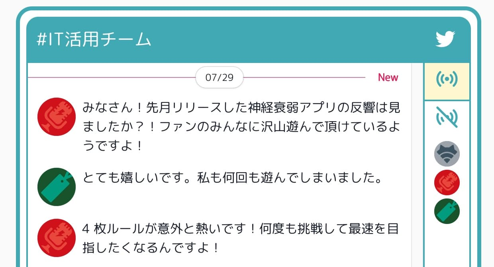

import EmbeddedTweet from "../../components/EmbeddedTweet";

[LoveLive!Days ラブライブ！総合マガジン](http://gs.dengeki.com/lovelive-magazine/)の連載企画「広がれ虹の WA！虹ヶ咲学園スクールアイドル同好会　テーマ別活動」内で IT 活用チームがリリースしたミニゲームの開発・背景音楽のお手伝いをさせて頂きました。

このミニゲームは、名前の通り、虹ヶ咲のメンバーが描かれたカードを使って行う神経衰弱です。
めくった時の爽快感、テンポよく繰り返し遊べるルール、可愛らしいイラスト・音楽の雰囲気...と、プログラミングが得意な璃奈ちゃん 📶、ゲームが大好きなせつ菜ちゃん 🎙、進捗管理が得意な栞子ちゃん 🔖 のこだわりが詰まったミニゲームです。

ちなみに成功時の紙吹雪は虹ヶ咲のメンバーカラー(12 色)で構成されていて、気分を盛り上げてくれます。

アプリのリリース後、IT 活用チームのメンバー内での神経衰弱の強さについてアンケートが行われ、そのアンケート結果が反映された対戦モードが追加された ver.2 がリリースされました。

<EmbeddedTweet
  client:visible
  html={`<blockquote class="twitter-tweet">
広がれ虹のWA! 虹ヶ咲学園スクールアイドル同好会テーマ別活動・IT活用チーム せつ菜・璃奈・栞子の中で一番神経衰弱が得意なのは誰!?　大募集中♪ -<a href="https://t.co/boPnwa0nXz">https://t.co/boPnwa0nXz</a> <a href="https://twitter.com/hashtag/%E8%99%B9%E3%83%B6%E5%92%B2?src=hash&amp;ref_src=twsrc%5Etfw">#虹ヶ咲</a> <a href="https://twitter.com/hashtag/%E3%83%8B%E3%82%B8%E3%82%AC%E3%82%AF%E7%A5%9E%E7%B5%8C%E8%A1%B0%E5%BC%B1?src=hash&amp;ref_src=twsrc%5Etfw">#ニジガク神経衰弱</a> <a href="https://t.co/TAA9P5vVev">pic.twitter.com/TAA9P5vVev</a>
&mdash; 電撃G&#39;s magazine編集部 (@gs_magazine) <a href="https://twitter.com/gs_magazine/status/1543882345589002241?ref_src=twsrc%5Etfw">July 4, 2022</a></blockquote>`}
/>

ゲームをプレイする前に、アプリリリース前後の IT 活用チームの様子をチャットログから見ることも出来ます。彼女たちのこだわりを垣間見ることで、神経衰弱による熱中できること間違いなし！

---

イラスト: 凪乃しずくさん ([@s1zu9](https://twitter.com/s1zu9))  
プロップデザイン: さんざしさん([@xxsanzashixx](https://twitter.com/xxsanzashixx))
